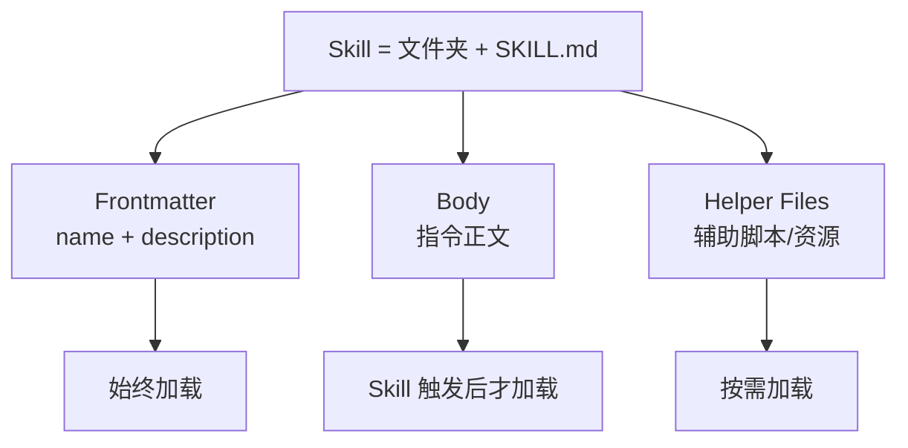
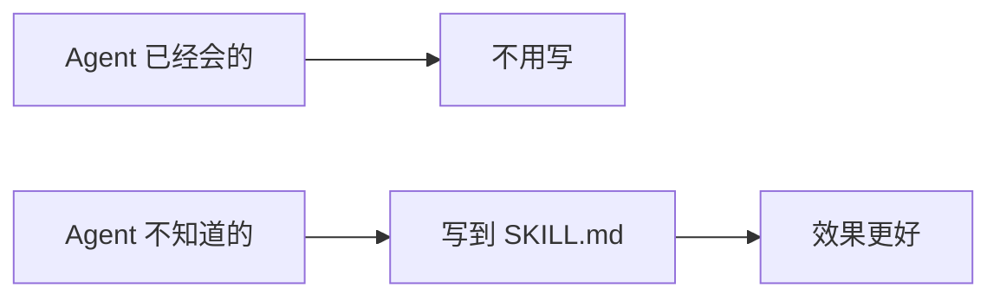
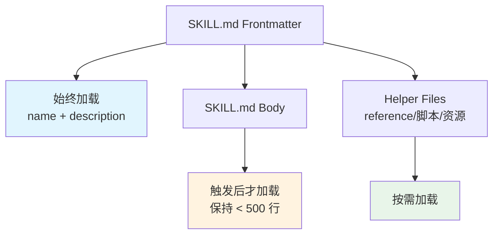
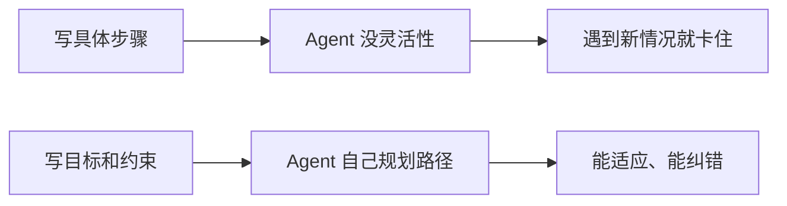
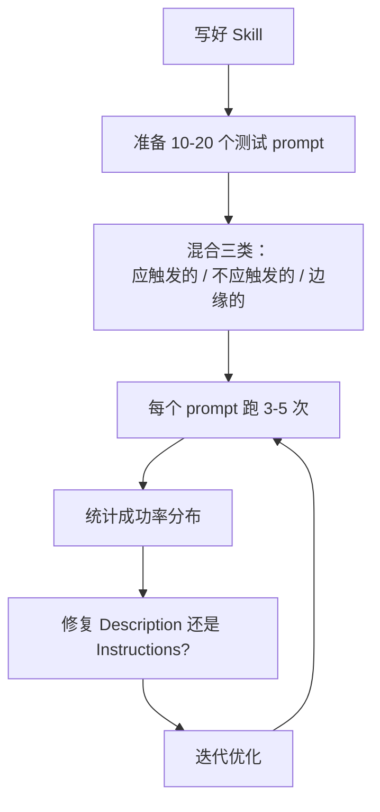

+++
date = '2026-05-05T22:00:00+08:00'
draft = false
title = '写好 Agent Skill 的8个实战技巧'
mermaid = true
+++

## 前言

Skill 是目前 Agent 最灵活的扩展方式——一个文件夹 + 一个 `SKILL.md` 文件，就能让 AI 助手获得特定能力。

但灵活性也是双刃剑：怎么写才算好？什么时候该拆 skill？什么时候该退休？

 Philipp Schmid 在实践中总结了 8 条经验，今天我们用大白话 + 实战案例把它讲透。

---

## 一、先搞清楚 Skill 到底是什么

Skill 由三层构成：



Skill 分两类：
- **Capability Skill**：赋予 Agent 原本不会的能力（比如「用 Python 操作 Excel」）
- **Guidance Skill**：规范 Agent 的行为方式（比如「代码审查规范」）

> 实战建议：如果你发现同一个 skill 里既教 Agent 做什么、又教 Agent 怎么做，十有八九该拆成两个。

---

## 二、把 Description 写成「触发器」，别写成广告语

Description 是 Agent **决定是否激活这个 Skill** 的唯一依据。写不好，skill 要么永远不触发，要么乱触发。

❌ 错误示范：
> "Helps with documents"

✅ 正确示范：
> "Create, edit, and analyze .docx files. **Use for** tracked changes, comments, formatting, or text extraction. **Do NOT use for** plain text files or spreadsheets."

好 Description 的公式：

```
Use when [具体场景] + Do NOT use when [禁忌场景] + what it does [做什么]
```

> 实战经验：光把 Description 写精准，有些 Skill 的效果就能提升 50%。

---

## 三、Instructions 要「点菜式」，不要「流水席」

很多人写 Skill 的最大误区：**把 Skill 写成一篇说明书**。

研究已经证明：上下文越长、越详细，Agent 的表现反而越差。Agent 很聪明，你的 job 不是告诉它所有事，而是告诉它**它不知道的事**。



**正确示范**：只写约束和目标，不写执行路径。

❌ 啰嗦版：
```
Step 1: Read the file
Step 2: Parse the JSON
Step 3: Extract the "name" and "version" fields
Step 4: Update the version number
```

✅ 简洁版：
```
Goal: Bump the version field in package.json.
Constraint: Follow semver format (major.minor.patch).
```

> 如果这件事「步骤顺序不能乱，换了顺序就坏」，这不是 skill 的问题，这是脚本的场景——直接写脚本，别用 skill。

---

## 四、分层加载：让 Skill 保持苗条

不要把所有东西都塞进一个 `SKILL.md`。Agent 加载内容是分层的：



如果你的 Skill 覆盖多个主题（比如同时覆盖 AWS 和 GCP），**拆成独立的 reference 文件**，Agent 只读它需要的那个。

小技巧：reference 文件超过 500 行？加个目录 + 行号提示，Agent 可以跳读。

---

## 五、给 Agent「自由度」，别当「保姆」

这是最容易犯的错误：把 Skill 写成一步步的 workflow。

当你写「Step 1 做什么，Step 2 做什么」的时候，你其实是在**剥夺 Agent 的适应能力和纠错能力**。



核心原则：**告诉 Agent 你想要什么结果，别教它怎么走路。**

---

## 六、想清楚「什么时候不该触发」

这是被 90% 的人忽略的一点。

如果一个 Skill 的 Description 写「适用于所有编码任务」，那它会 hijack 每一个请求——Agent 会把它用在不该用的地方。

```python
# 正面案例：明确边界
description = """
Use when working with PDF files.

Do NOT use for:
- General document editing
- Spreadsheets  
- Plain text files
"""
```

测试的时候，**不仅要测「应该触发」的场景，还要测「不应该触发」的场景**。不然你只会优化一个方向。

---

## 七、发布前必须测试，别赌概率

Agent 的输出是非确定性的（nondeterministic）——同一个 prompt，跑 3 次可能有 3 个结果。

所以：
- **单次测试不够**，至少跑 10-20 个不同的 prompt
- **多次试验**：每个 prompt 跑 3-5 次，看结果的分布，不只看一次成功与否
- **隔离环境**：每次跑之前清空 context，context 污染会掩盖真实问题



验收标准要**可量化**，不要「看起来对了」：
- 输出能编译吗？
- 调用了正确的 API 吗？
- 遵循了指定的步骤吗？

> 大多数问题其实在 Description，不在 Instructions。测试时先检查触发是否精准。

---

## 八、知道什么时候该让 Skill「退役」

这是最反直觉的一点：**当模型已经把 Skill 的价值「学到」了，这个 Skill 就该退休了。**

尤其是 Capability Skill——模型每年都在变强，原来需要 skill 才能做的事，模型可能已经内化了。

```
验证方法：
1. 跑一次 eval，不加载这个 Skill
2. 如果 eval 通过 → Agent 已经掌握了 → 退休这个 Skill
```

保留 Skill 的成本其实不低：维护、更新、context 占用。当它不再贡献价值，就果断让它退出。

---

## 总结：8 条清单

| 序号 | 核心要点 | 一句话 |
|------|---------|--------|
| 1 | 搞清 Skill 三层结构 | Frontmatter / Body / Helpers 分层加载 |
| 2 | Description 是触发器 | 写「什么时候用」+「什么时候不用」|
| 3 | Instructions 要精简 | 只写 Agent 不知道的，别写成说明书 |
| 4 | 保持苗条 | 超过 500 行就拆分 reference 文件 |
| 5 | 给 Agent 自由度 | 写目标 + 约束，不写步骤 |
| 6 | 考虑负面场景 | 测试「应该触发」+「不应该触发」|
| 7 | 测试要充分 | 10-20 个 prompt × 3-5 次，统计分布 |
| 8 | 知道何时退休 | eval 通过就退役，别舍不得 |

---

## 参考链接

> 原文：[8 Tips for Writing Agent Skills](https://www.philschmid.de/agent-skills-tips) by Philipp Schmid，2026 年 4 月 13 日

---

> 欢迎关注收藏我，获取更多硬核技术干货！
