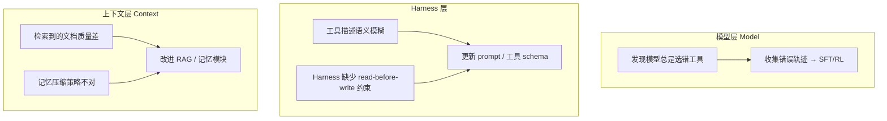
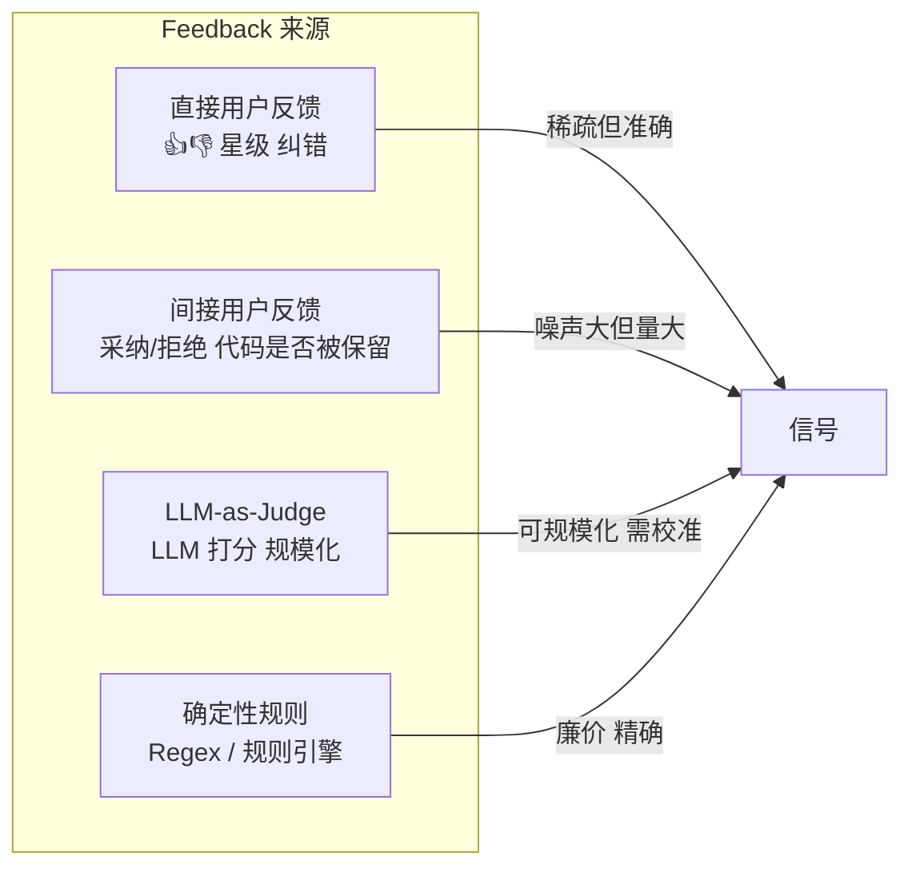
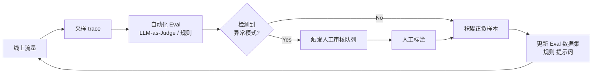
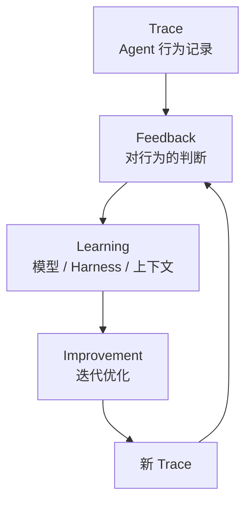

+++
title = "Agent 终于不是黑盒了：可观测性 + 反馈 = 持续进化"
date = 2026-05-07T22:00:00+08:00
draft = false
tags = ["AI Agent", "可观测性", "LangChain", "LLM"]
categories = ["AI"]
+++

大多数团队一开始把可观测性（Observability）当成调试工具——出问题了，去 trace 里翻一翻，看看 Agent 哪步决策搞砸了。这很有用，但格局小了。

可观测性的真正价值，是为整个 Agent 系统构建**学习循环**：模型该怎么做、Harness 怎么引导、上下文怎么给、哪些 failure mode 在重复、哪些行为真正对用户有效。而 trace 本身，只是这个循环的原材料。

LangChain CEO Harrison Chase 最近写了一篇深度长文，把这个问题讲透了。本文就来掰开揉碎，用大白话 + 图表，把核心逻辑捋清楚。

<!--more-->

## 为什么「看 trace」只是第一步

一个 trace 告诉你**发生了什么**——Agent 调了什么工具、见了什么上下文、返回了什么答案。

但它不告诉你这件事**到底对不对**。

举个例子：

- 一个任务 Agent 跑了 40 步，但隔壁团队用 6 步就搞定了
- Agent 自信满满给了答案，但用户直接关掉页面走了
- 工具选对了，参数却传错了

以上全是 trace 能记录、但 trace 自己无法评判的场景。

**Feedback（反馈）才是把 trace 变成学习信号的关键。** 没有反馈，你有一堆轨迹日志；有了反馈，你才能问出有用的问题：

- 哪些是成功轨迹？
- 哪些是失败轨迹？失败原因是模型、Harness 还是上下文？
- 哪些失败值得做成 eval？
- 哪些行为在变好、哪些在变差？

## Agent 能在三个层面「学习」

Harrison 指出，Agent 系统的学习发生在三个不同层面：

### 模型层：让模型本身变好

当你发现模型在某些场景下持续判断错误——选错工具、不遵守 policy、分类失误——这些轨迹可以直接用来做 SFT（监督微调）或 RL（强化学习），从权重层面更新模型能力。

这是最「重」的学习方式，成本最高，但也是从根本上解决问题。

### Harness 层：优化 Agent 的「脚手架」

Harness 是什么？简单说就是模型周围的一切：prompt、工具 schema、权限校验、控制流、记忆更新逻辑、路由、重试策略、Guardrails……

一个典型场景：模型其实有能力做对，但 Harness 给错了约束。比如工具描述写得太模糊，Agent 自然会选错。这时候改的不是模型，而是 prompt 或 schema。

### 上下文层：给 Agent 喂对信息

Agent 对上下文极度敏感——检索来的文档质量差、记忆模块存的太乱、历史对话窗口塞太多无关内容，都会导致模型「看到错误的信息，做出合理的判断」。

这种情况的学习方向是：改进 RAG 策略、压缩记忆、更新上下文选择逻辑。

## 四种 Feedback 来源，各有优劣

反馈不一定非得是用户手动打分。Harrison 把反馈来源分成四类：

### 1. 直接用户反馈

最直觉：用户点了👍还是👎，留了文字纠错。这种信号清晰易懂，但**稀疏**——大多数用户不会主动反馈。

### 2. 间接用户反馈

不用用户主动打分，而是看行为：

| Agent 类型 | 间接反馈信号 |
|-----------|-------------|
| 编程 Agent | 代码被接受率、Diff 被回滚次数、修改后测试是否通过 |
| 客服 Agent | 用户是否重新开了工单 |
| 研究 Agent | 用户是否复制了答案，还是追问同一问题 |

这些信号噪声更大，但**量大**，更能反映真实偏好。

### 3. LLM-as-Judge

用一个 LLM 做裁判，给 Agent 输出打分：是否 helpful、是否遵守 policy、轨迹是否有异常。

优势是**可规模化**，尤其是对线上流量做持续 evaluation。缺点是需要校准，不能直接当 ground truth。

### 4. 确定性规则（被严重低估）

正则表达式和业务规则，是最被低估的反馈信号。

一个经典案例：Claude Code 曾经用 regex 检测用户提示中的 frustration 词汇（"wtf"、"this sucks" 等），一旦匹配到就触发特殊处理。这个检测完全不需要 LLM 推理，一个正则就搞定。

Harrison 的建议：**能用 cheap rule 解决的，别上模型。** 把省下来的 token 预算花在真正需要推理的地方。

## 实战：把反馈和 trace 绑定存储

大多数团队踩的坑是：trace 存在 Tracing 系统里，反馈存在另一个表格或 Analytics 系统里，两个东西对不上。

正确的做法是：**反馈必须和 trace 强绑定，挂在同一条记录上。**

这样做的好处：

- 随时按反馈类型过滤 trace
- 对比好坏轨迹的差异
- 从真实失败案例中构建 eval 数据集
- 追踪每次改动是否改善了真正重要的行为

LangSmith 的做法是：每条 feedback 都关联到一个具体的 run/trace/thread，而不是游离在外部。

## 自动化：让反馈自己「流」起来

纯手工 review 只适合低流量、单 Agent 场景。一旦规模上去，必须自动化反馈循环：

自动化的核心不是「让 Agent 自我改进」，而是**自动识别哪些 trace 值得关注**，并把它们转化成结构化的反馈信号。

## 核心结论：可观测性 ≠ 记录，Feedback = 学习

Harrison 这篇文章的核心观点就一句话：

> **没有 Feedback 的可观测性，只是日志；有 Feedback 的可观测性，才是学习系统。**

两个关键指标必须同时存在：

1. **Trace**：记录 Agent 看到了什么、做了什么
2. **Feedback**：判断 Agent 做的事到底对不对、好不好

两者合一，才是让 Agent 系统持续进化的飞轮：

## 参考

- [Agent observability needs feedback to power learning - LangChain Blog](https://www.langchain.com/blog/agent-observability-needs-feedback-to-power-learning)

---

**欢迎关注收藏我，获取更多硬核技术干货！**
