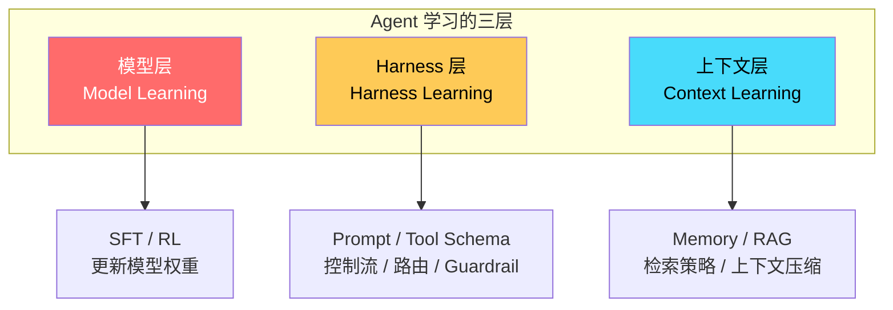
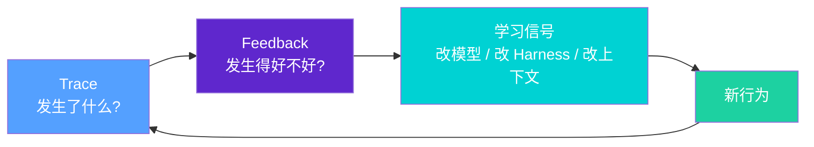
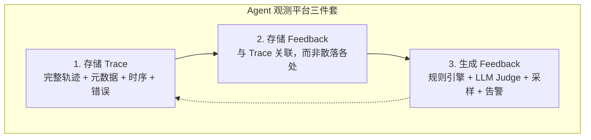

+++
title = "Agent 观测的秘密：为什么只有 Trace 你永远学不会"
date = 2026-05-06T22:00:00+08:00
draft = false
description = "大多数团队把 Agent 观测当成调试工具——出了问题再看 Trace。但这只是冰山一角。真正的深度是：观测必须驱动学习。本文拆解模型层、Harness 层、上下文层三层学习闭环，手把手教你用 Trace + Feedback 构建真正的 Agent 迭代飞轮。"
tags = ["AI Agent", "Observability", "LangChain", "LLM", "评测"]
categories = ["AI", "工程实践"]
toc = true
+++

## 开篇：Trace 打完了，然后呢？

很多团队部署 Agent 之后，第一件事就是装一个 tracing 工具——OpenTelemetry、LangSmith、Breadcrumb……然后呢？

> "我们能看到 Agent 干了啥，但不知道怎么让它下次干得更好。"

这是我在跟很多 AI 团队聊观测时听到的共同困惑。Trace 本身是一个执行记录，它告诉你**发生了什么**，但它不告诉你**发生得对不对**。

今天这篇文章，我来讲清楚一件事：**Agent 观测的真正目标不是调试，而是驱动学习**。而学习需要的不只是 Trace，还需要 Feedback——两者缺一不可。

---

## 什么是 Agent 学习？不止模型训练

一提到"学习"，很多同学第一反应是：SFT（监督微调）或 RL（强化学习）——改模型权重。

但对于生产环境中的 AI Agent 系统，学习发生在**三个层面**：



### 模型层：LLM 本身需要进化

你在 Trace 里发现：模型总是把"查询库存"错误地路由到"产品搜索"工具，或者在特定业务场景下忽略了一条政策规则。

这些例子可以被收集起来，用来：
- **SFT（监督微调）**：构造一批"正确行为"的数据，让模型在这些示例上重新微调
- **RL（强化学习）**：设计奖励信号，让模型在交互中学习更好的策略

模型层学习的本质是：**通过真实的错误案例，改进模型本身的能力上限**。

### Harness 层：脚手架决定 Agent 表现

Harness 是模型之外的一切"支撑结构"——系统 Prompt、工具描述（Tool Schema）、权限校验、控制流、重试逻辑、内存更新策略、路由规则、Guardrail……

看一个真实场景的 Trace：

```
步骤 12: Agent 调用了 delete_user(id=42)
结果: 操作成功，但没经过二次确认
```

问题是 Agent 能力不够吗？不，模型本身知道要确认——是 Harness 没有配置 `require-approval-before-destructive-actions` 这条规则。

Harness 层学习的本质是：**通过 Trace 看到模型"明明能做到但没做到"，反思脚手架哪里出了问题**。

### 上下文层：给 Agent 喂对信息

Agent 对上下文极度敏感。有时候模型"判断错误"不是因为它不够聪明，而是**上下文里少了关键信息，或者多了噪声**。

Trace 可能显示：

```
用户问: "我的订单到哪了？"
Agent 回答: "请联系客服"（错误）
原因: Agent 的 memory 里没有该用户的最新订单状态
```

这时候的学习循环不是改 Prompt，而是改进**记忆系统（Memory）或 RAG 检索策略**——让正确的上下文在正确的时机出现。

---

## 为什么只有 Trace 不够？Feedback 是关键

这是文章最核心的观点：**Trace 记录行为，Feedback 评价行为**。两者结合才能形成学习闭环。



### 一个具体的反例

一个 Agent 花了 40 步完成了一个本该 6 步解决的任务——但它最终返回了"成功"。如果你只看 Trace，你会觉得它完成了。

加上 Feedback 呢？

- **步骤数 Feedback**：40 步 >> 预期 6 步 → 效率过低，需要优化
- **用户接受度 Feedback**：用户复制粘贴了答案 → 说明最终结果有用，但过程浪费
- **置信度 Feedback**：Agent 对答案很自信，但用户后来手动修正了 → 过度自信问题

没有 Feedback，你只有一堆轨迹（trajectory）日志。有了 Feedback，你才能问有意义的问题。

---

## Feedback 从哪来？四种来源

Feedback 不一定非得是用户打分。五种实际可行的来源：

| 来源 | 形式 | 优点 | 缺点 |
|------|------|------|------|
| **直接用户反馈** | 👍/👎 / 星评分 / 纠错文字 | 意图明确 | 极度稀疏（大多数用户不给反馈） |
| **间接用户反馈** | 代码 diff 保留率 / 测试通过率 / 工单重开率 | 数据量大 | 有噪声，需要清洗 |
| **LLM-as-Judge** | AI 评分（帮助性/合规性/效率） | 可规模化 | 需要校准，不完全可靠 |
| **确定性规则** | Regex / 规则引擎检测特定模式 | 零成本、快速 | 只覆盖已知模式 |

### 实战案例：Claude Code 的 frustration 规则

举一个具体案例。Claude Code 曾经被发现用了一个正则表达式来检测用户 frustration：

```typescript
// 简化示意（来自 userPromptKeywords.ts）
const frustrationPatterns = [
  /wtf/i, /this is awful/i, /horrible/i, /this sucks/i, /seriously\?/i
];
```

这个规则的逻辑是：如果用户在 prompt 里表现出 frustration，Claude Code 会调整行为（比如更保守、更多确认）。

> 这不是什么 LLM 推理，这是一个**确定性 Feedback 规则**——便宜、快速、可靠。

关键启示：**不是所有有用的 Feedback 信号都需要模型调用**。如果一个简单规则能捕捉有效信号，就用规则。

---

## 你的观测平台需要三件事

如果观测的目标是驱动学习，那你的平台必须支持：



### 1. Trace 存储：完整的执行轨迹

不只是记录最终输出，要记录：
- 每次 LLM 调用的输入/输出
- 工具调用（名称、参数、结果）
- 中间状态和分支决策
- 时间戳、Token 消耗、错误信息

**最好能跨框架接入**：LangSmith 支持 30+ 框架的 Trace 接入，也支持 OpenTelemetry 协议——这意味着不管你用 LangChain、LlamaIndex 还是自建 Agent，都能统一观测。

### 2. Feedback 存储：紧耦合而非散落

> Feedback 不应该躺在另一个电子表格里。

Feedback 必须**直接绑定到对应的 Trace/Run/Thread** 上，才能：
- 按 Feedback 类型过滤 Trace
- 对比好的轨迹 vs 差的轨迹
- 从真实失败案例构建训练数据集
- 追踪某个改动是否改善了关键指标

### 3. Feedback 生成：自动化比手动高效

人工 review Trace 是有效的，但对于高流量生产系统，这是不可扩展的。

实用的自动化 Feedback 生成方式：

```python
# 示例：基于规则的 Feedback 生成
def generate_feedback(trace: Trace) -> Feedback:
    # 确定性规则
    if re.search(r"DELETE|DROP|TRUNCATE", trace.tool_calls) \
       and not trace.has_approval_step:
        return Feedback(
            type="security",
            score=0,
            signal="destructive_tool_no_approval",
            severity="high"
        )
    
    # LLM-as-Judge
    judge_score = llm_judge.evaluate(
        goal=trace.goal,
        trajectory=trace.steps,
        outcome=trace.final_output
    )
    
    return Feedback(
        type="quality",
        score=judge_score,
        signal="llm_judge_quality"
    )
```

---

## 总结：Trace × Feedback = 学习飞轮

很多团队在第一步就停了：**装了 Tracing，看 Trace，结束**。但真正的价值在第三步之后。

```
观测 → 记录行为（Trace）
    ↓
评价行为（Feedback）
    ↓
判断要改模型 / Harness / 上下文（诊断）
    ↓
执行改动（优化）
    ↓
新行为验证（回到 Trace）
```

Feedback 是把观测从**被动日志**变成**主动学习系统**的关键。

具体建议：
1. **现在就开始收集 Feedback**：哪怕只是一个正则规则，也比没有强
2. **Feedback 和 Trace 必须绑定**：不要让它们各存各的
3. **从间接反馈入手**：代码 diff 保留率、工单重开率——这些你可能已经有了
4. **自动化 Feedback 生成**：LLM-as-Judge + 规则引擎组合，比纯人工 review 可规模化 100 倍

---

> 📖 原文：[Agent observability needs feedback to power learning](https://www.langchain.com/blog/agent-observability-needs-feedback-to-power-learning) — LangChain Blog，2026年5月5日

---

**欢迎关注收藏我，获取更多硬核技术干货！** 🚀
