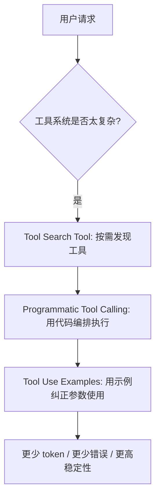
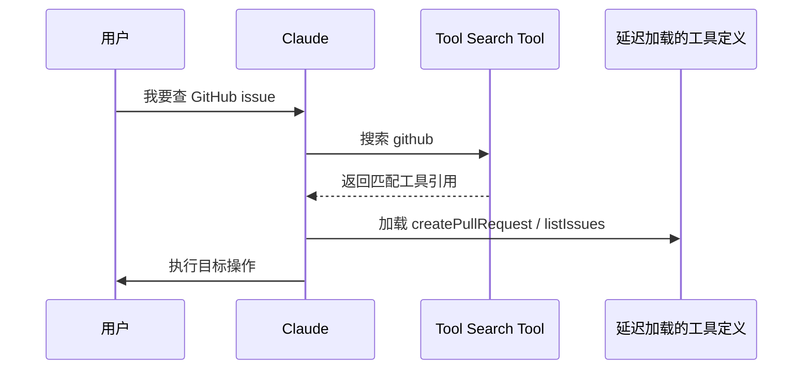
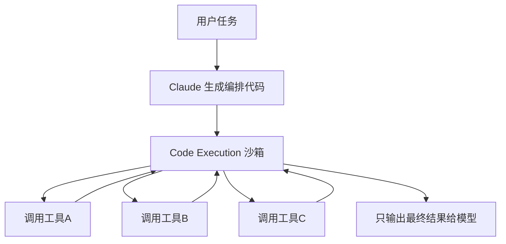

+++
title = "Anthropic 新版工具调用方案：Tool Search、Programmatic Tool Calling、Tool Use Examples 一次讲透"
date = 2026-05-16T22:02:19+08:00
draft = false
categories = ["AI Agent", "工具调用"]
tags = ["Anthropic", "Claude", "MCP", "工具调用", "AI Agent"]
+++

如果你的 Agent 已经接上了几十个工具，你大概率会遇到同一个问题：
**模型不是不会用工具，而是工具太多、上下文太挤、参数太容易写错。**

Anthropic 这篇新文章讲得很实在：真正成熟的 Agent，不是“把工具都塞进去”，而是要学会三件事：

1. 先找到对的工具，再加载进来。
2. 复杂编排不要全靠自然语言，让代码来做一部分。
3. 不能只给 schema，要给模型看得懂的使用示例。

这三件事分别对应：

- Tool Search Tool
- Programmatic Tool Calling
- Tool Use Examples

<!-- more -->

## 先看结论：问题不在模型，而在工具层

大多数 Agent 项目一开始都很顺：

- 工具少，效果不错
- 任务简单，调用也正常
- prompt 看起来也不复杂

但一旦进入真实业务，工具数量开始膨胀，问题就来了：

- MCP server 一多，工具定义本身就吃掉大量 token
- 相似名字的工具很多，模型经常选错
- 一连串工具调用会把中间结果全部塞回上下文
- JSON schema 只能约束结构，约束不了“怎么用才对”

Anthropic 这篇文章本质上是在说：**工具调用要从“函数调用”升级成“工具编排系统”。**

## 总览：三层能力分别解决什么



你可以把这三层理解成一个递进关系：

- **Tool Search Tool** 负责“找工具”
- **Programmatic Tool Calling** 负责“怎么跑流程”
- **Tool Use Examples** 负责“到底该怎么传参数”

它们不是互相替代，而是分别补上三个不同的短板。

## 1. Tool Search Tool：先发现，再加载

这部分解决的是最现实的问题：**工具太多，不能一股脑全塞进上下文。**

Anthropic 举了一个很典型的例子：
如果一个 Agent 要连 Slack、GitHub、Google Drive、Jira、数据库和多个 MCP server，
那光是工具定义就可能在请求开始前吃掉几万 token。

### 核心思路

传统方式是：

- 所有工具一次性加载
- 模型自己在上下文里“看”所有定义
- 再决定调用哪个

Tool Search Tool 的方式是：

- 先只加载少量高频工具
- 其余工具标记为 `defer_loading: true`
- 需要时通过搜索找出来，再展开完整定义

### 工作流



### 它到底省了什么

省的不只是 token，更多是两件事：

- **上下文污染更少**：模型不会被一大堆无关工具干扰
- **选错工具的概率更低**：只把相关工具拿出来，搜索空间更小

Anthropic 给出的内部数据很夸张：

- 传统方式下，工具定义可能在请求前就消耗 50K+ token
- Tool Search Tool 可以显著压缩这部分开销
- 在 MCP 评测里，启用后准确率也明显提升

### 什么时候最值得用

- 工具库很大，且持续增长
- 绝大多数请求只会用到少量工具
- 工具名字相似，模型经常选错
- 你在做企业级 MCP 或大型 Agent 平台

### 一个简化配置示意

```json
{
  "name": "github.createPullRequest",
  "input_schema": {
    "type": "object",
    "properties": {
      "repo": { "type": "string" },
      "title": { "type": "string" }
    }
  },
  "defer_loading": true
}
```

一句话总结：**Tool Search Tool 的本质不是“更聪明地调用工具”，而是“更聪明地加载工具”。**

## 2. Programmatic Tool Calling：让代码负责编排

第二个问题更像工程问题：
**当流程里有循环、分支、聚合、重试、并行时，纯自然语言 tool calling 会越来越别扭。**

如果每一步都要模型先想、再调、再把结果塞回上下文，流程一长就会变慢，也会更脆。

Anthropic 的答案是：把编排逻辑放进代码里。

### 它解决了什么

- 复杂控制流更清晰
- 可以把循环和条件写成显式逻辑
- 中间结果不必全部进入模型上下文
- 更适合数据处理、批量计算、复杂工作流

### 工作方式



你可以把它理解成：

- 以前是模型一边想一边调工具
- 现在是模型写一段“工作脚本”
- 脚本在沙箱里跑，模型只看最终结论

### 为什么这很重要

对于很多业务任务，中间数据根本不该进入模型上下文。

比如预算检查、批量报表、仓库扫描、日志聚合，这类任务的原始数据一旦回流，就会把上下文撑爆。

Anthropic 给出的一个例子是：

- 原始费用数据可能有 2000+ 行
- 直接回流会让模型处理大量无关细节
- 用 Programmatic Tool Calling 后，模型只看到最终超预算的那几个人

这就是典型的“把中间态留在程序里，把结论留给模型”。

### 什么时候该用

- 任务里有明显的循环、条件判断、聚合、重试
- 你要批量处理很多结构化数据
- 你在做表格、报表、审计、数据清洗类 Agent
- 你希望减少模型反复 round-trip

### 简化版思路

```python
def check_budget(team_members):
    results = []
    for member in team_members:
        expenses = get_expenses(member)
        total = sum(expenses)
        if total > member.q3_budget:
            results.append(member.name)
    return results
```

真实系统当然更复杂，但核心思想就是这样：
**把“怎么跑”交给代码，把“看什么结果”交给模型。**

## 3. Tool Use Examples：不给示例，模型就容易瞎猜

第三个问题很常见，也最容易被低估。

很多团队只给工具 schema，觉得结构清楚就够了。实际不是。

因为 schema 只能告诉模型：

- 哪些字段合法
- 哪些字段必填
- 枚举值有哪些

但它告诉不了模型：

- 什么时候该填可选字段
- 哪些字段组合更常见
- 业务上默认值怎么选
- 一个“正常”的调用长什么样

### Tool Use Examples 的作用

Anthropic 的思路很直接：
**给模型看几个真实示例，让它从“知道规则”变成“知道习惯”。**

### 示例对比

只有 schema 时，模型可能会这样猜：

```json
{
  "title": "Login page returns 500 error",
  "priority": "critical"
}
```

有示例之后，模型更容易学到：

- 高优先级问题通常要带标签
- 需要 reporter 信息
- 某些场景下要填写 escalation
- 简单工单可以只保留最小字段

### 它长什么样

```json
{
  "name": "create_ticket",
  "input_schema": {
    "type": "object",
    "properties": {
      "title": { "type": "string" },
      "priority": { "enum": ["low", "medium", "high", "critical"] },
      "labels": { "type": "array", "items": { "type": "string" } }
    },
    "required": ["title"]
  },
  "input_examples": [
    {
      "title": "Login page returns 500 error",
      "priority": "critical",
      "labels": ["bug", "production"]
    },
    {
      "title": "Update API documentation"
    }
  ]
}
```

### 什么时候最值得加示例

- 工具参数比较多
- 可选字段很多，组合也多
- 业务规则不容易只靠 schema 表达
- 你发现模型经常“字段填得合法，但业务上很怪”

Anthropic 文章里的结论很明确：
**schema 管结构，示例管习惯。**

## 三者怎么搭配

这三种能力真正的价值，来自组合使用。

| 问题 | 更优先的能力 | 解释 |
|---|---|---|
| 工具太多，加载成本太高 | Tool Search Tool | 先发现，再加载 |
| 任务流程复杂，控制流很多 | Programmatic Tool Calling | 用代码跑流程 |
| 参数经常写错，业务习惯不稳定 | Tool Use Examples | 用示例修正调用模式 |

如果要把它们串成一条链，最佳思路通常是：

1. 先用 Tool Search Tool 把工具库瘦身
2. 再用 Programmatic Tool Calling 把复杂编排交给代码
3. 最后用 Tool Use Examples 提升参数命中率


## 我会怎么落地

如果你正在搭一个真实 Agent，我的建议很简单：

- **工具少于 10 个**，先别急着上搜索层
- **流程简单**，别一开始就写代码编排
- **参数很单一**，示例不一定非加不可
- **一旦工具库、流程和参数都复杂起来**，这三层就开始变得必要

真正成熟的 Agent 不是“会调工具”，而是“知道什么时候加载什么工具、怎么执行、怎么避免胡传参数”。

## 最后总结

Anthropic 这篇文章本质上解决的是同一个问题：
**当 Agent 进入真实业务后，工具调用不能只盯着模型能力，还要重视工具系统本身的架构。**

你可以把这三点记成一句话：

- **Tool Search Tool** 解决“工具太多”
- **Programmatic Tool Calling** 解决“流程太复杂”
- **Tool Use Examples** 解决“参数总是用错”

如果你的 Agent 还停留在“直接塞一堆工具定义”的阶段，这篇文章基本就是下一步该补的课。

参考：<https://www.anthropic.com/engineering/advanced-tool-use>
