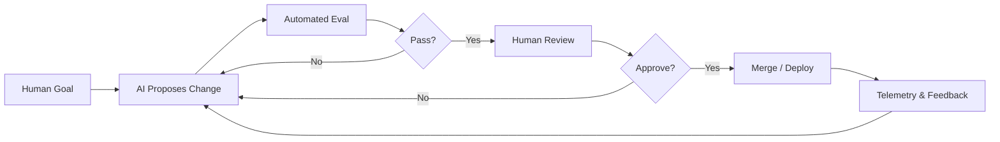

+++
date = 2026-06-07T22:51:21+08:00
draft = false
title = "AI 已经开始构建自己了吗？从 Anthropic《When AI builds itself》看递归自我改进的临界点"
+++

> Anthropic 这篇《When AI builds itself》不是在卖弄“AI 要接管世界”的老梗，而是在认真讨论一件更现实的事：**AI 已经开始参与构建 AI 自己了**。它给出的信号很明确，但结论并不粗暴。真正值得工程师关注的，不是“会不会失控”这种空泛问题，而是“我们该如何设计一个可控、可评估、可回滚的自我改进回路”。

<!--more-->

## 这篇文章到底在说什么

这篇 Anthropic Institute 的长文，核心不是炫耀模型能力，而是把一个概念从科幻词典里拉回工程现场：**recursive self-improvement，递归自我改进**。

简单说，就是 AI 系统不只是帮人写代码、写文档、跑测试，而是开始介入下一代 AI 系统的开发、优化和训练。它不是“一个模型突然变聪明了”，而是“模型开始反过来加速模型研发”。

Anthropic 这次最值得注意的点有三个：

1. 他们公开了内部数据，说明 AI 已经在加速 AI 开发流程。
2. 他们把“AI 写代码”推进到了一个更具体的工程维度，而不是停留在 demo。
3. 他们同时提醒：这种趋势越快，越需要保留暂停、审查和边界控制的能力。

这是一篇典型的“能力展示 + 风险提醒”双线叙事文章。

## 最重要的信号：AI 已经不是辅助工具那么简单

文中最有冲击力的一个数据是：**Anthropic 工程师现在平均每季度产出的代码量，是 2021 到 2025 年的 8 倍**。另一个更夸张的说法是，**超过 80% 的合并生产代码由 Claude 撰写**。

这两个数字单独看都很猛，但放在一起更关键。

它们说明的不是“Claude 终于会写代码了”，而是：

- 人类工程师的角色正在从“逐行编码”转向“定义问题、审查结果、构建约束”
- AI 不再只是生产力插件，而是进入了研发流水线的核心位置
- 代码生成的瓶颈，开始从“写出来”转移到“验证对不对”

再往前一步，Anthropic 还提到他们的某些模型在 ML 优化任务上获得了显著加速。这个信号更重要，因为它触碰到一个临界点：

> 当 AI 开始实质性提高下一轮 AI 开发效率时，递归自我改进就不再只是概念讨论。

## 递归自我改进，不等于“AI 失控”

很多人看到这个词，第一反应是“是不是马上要 AGI 了”。这个反应太快，也太粗。

递归自我改进真正值得讨论的地方，不是神秘主义，而是工程闭环：

1. AI 提出改进方案
2. 系统自动或半自动地评估方案
3. 人类或上层策略决定是否采纳
4. 采纳后，系统能力进一步提升
5. 这又反过来提升下一轮改进效率

这个闭环如果做得足够好，增长会很快。但它离“完全自主、自我复制、自我主导”还有很长一段距离。

原因很简单：

- 目标函数仍然是人定义的
- 数据和评测仍然需要人设计
- 训练资源和部署权限仍然受控
- 现实世界的约束并不会因为模型变强而消失

换句话说，模型可以加速研发，但不等于研发规则被模型接管。

## 真正的难点：不是会不会写，而是能不能被约束

如果把这件事抽象成一个工程系统，你会发现问题不在“AI 会不会产出代码”，而在下面这条链路是否完整：

这张图里最重要的不是 AI，而是中间那几个“刹车片”：

- 自动评测
- 人工审查
- 合并门禁
- 线上反馈

没有这些，AI 只能算“高产写手”。有了这些，它才有资格进入“自我改进系统”。

## 工程师应该怎么看这篇文章

我建议把它当成三个层面的提醒。

### 1. 研发范式正在变化

过去我们讨论 AI，重点是“能不能帮我写点东西”。现在应该改成：

- 它能不能帮我缩短一次迭代？
- 它能不能帮我找到一个更优的实现路径？
- 它能不能在受控条件下自己改进自己？

这个问题一旦成立，团队的组织方式、代码审查方式、测试策略都会变。

### 2. 评测体系会变得更重要

当 AI 成为开发流程的一部分，评测不是附属品，而是主系统。

你要评的不只是模型输出质量，还要评：

- 改动是否真的提升了系统指标
- 是否引入了隐蔽回归
- 是否扩大了风险面
- 是否把错误传播到了更深的链路里

如果没有稳定的 eval，所谓“AI 自我改进”很容易变成“AI 自我放大错误”。

### 3. 权限边界必须前置设计

AI 越强，越不能默认它拥有全部自由。

最实用的做法反而很朴素：

- 小权限起步
- 沙箱执行
- 只读默认
- 变更必须可回滚
- 高风险路径必须人工确认

这不是保守，这是把系统做成工程，而不是神话。

## 一个更现实的结论

Anthropic 这篇文章最有价值的地方，不是宣称“AI 马上就会无限自我进化”，而是把一件事说透了：

**AI 已经开始进入“构建 AI 自己”的链条，但真正决定上限的，仍然是人类给它设计的边界、评测和治理结构。**

这对工程师的启发很直接：

- 不要把 AI 只当成 Copilot
- 也不要把它想成脱离控制的魔法盒子
- 要把它看成一个需要 Harness、Eval 和 Guardrail 的强力生产系统

真正先进的不是“让模型自由奔跑”，而是“让模型在可控边界内持续变强”。

## 写在最后

如果你正在搭建 Agent、自动化研发流程，或者只是想判断一家团队到底有没有把 AI 用到核心链路，这篇文章都值得一读。它提醒我们的不是未来有多玄，而是现在的工程栈已经开始变了。

下一步最该补的，不是更炫的 prompt，而是更强的评测、更稳的权限模型和更清晰的回滚机制。

参考资料：

- [When AI builds itself - Anthropic](https://www.anthropic.com/institute/recursive-self-improvement)
- [Anthropic Institute](https://www.anthropic.com/institute)

欢迎关注收藏我，获取更多硬核技术干货
