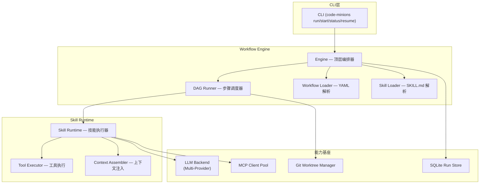
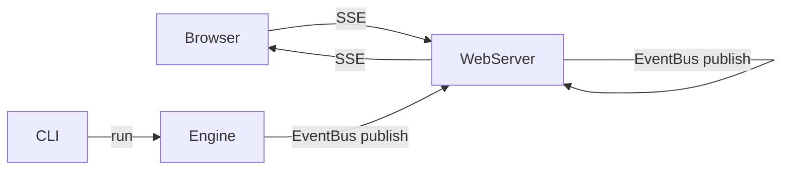

+++
date = '2026-05-05T16:38:19+08:00'
draft = false
title = 'code-minions：一个用 YAML 编排 AI 研发流程的工作流引擎'
mermaid = true
+++


## 痛点：AI 工具散落成孤岛，团队研发流程靠"人肉"串

过去两年，AI 辅助编程工具爆发式增长——Code Review 有 AI Review，任务管理有 Jira AI Bot，代码生成有 Copilot……但把它们真正串联成一条**可自动化、可复用、可审计**的研发链路？

大多数团队的选择是：写一堆脚本，人肉约定执行顺序，然后祈祷不会出 bug。

`code-minions` 正是为了解决这个问题而生的。它的核心理念只有三句话：

> 用 **YAML 定义工作流**，用 **Skill 装配能力**，用 **MCP 对接外部系统。

今天我们从架构设计到源码实现，把它的每一个核心模块讲透。

---

## 一、整体架构：五层分层



五大核心环节（对应 PRD → 工单 → 代码 → TDD → AI Code Review）：

1. **`parse-prd`** — 解析 PRD，提取结构化需求
2. **`plan-tasks`** — 任务拆解，生成工单列表
3. **`implement-with-tdd`** — TDD 循环写代码 + 自愈 self-heal
4. **`ai-code-review`** — AI Code Review，发现 blocker/major 问题
5. **`compile-report`** — 生成验收报告

---

## 二、DAG Runner：拓扑排序 + for_each 展开

`engine/dag_runner.py` 是工作流的执行引擎。它的职责：**按依赖顺序执行每一步，支持失败后 resume，支持 for_each 并发展开**。

### 2.1 拓扑排序执行

```python
def _topo_order(self) -> list[WorkflowStep]:
    by_id = {s.id: s for s in self._wf.steps}
    visited: set[str] = set()
    visiting: set[str] = set()
    order: list[WorkflowStep] = []

    def visit(sid: str) -> None:
        if sid in visited:
            return
        if sid in visiting:
            raise DAGRunnerError(f"cycle detected involving {sid}")
        visiting.add(sid)
        step = by_id[sid]
        for dep in step.depends_on:
            visit(dep)
        visiting.remove(sid)
        visited.add(sid)
        order.append(step)

    for s in self._wf.steps:
        visit(s.id)
    return order
```

> **实战建议**：如果你的 workflow 出现循环依赖，错误会精确到 `cycle detected involving <step-id>`。排查时先检查 `depends_on` 是否有环。

### 2.2 for_each 展开

`for_each` 将一个步骤展开为多个并行实例（实际执行顺序是串行的，但每个实例有独立的 step_id）：

```python
def _run_for_each(self, step: WorkflowStep, outputs: dict[str, dict[str, Any]]) -> dict[str, Any]:
    items_value = self._resolve_value(step.for_each, outputs)
    collected: list[dict[str, Any]] = []
    for idx, item in enumerate(items_value):
        scratch = {"__item__": item, "__index__": idx}
        per_iter = {
            k: self._resolve_with_scratch(v, outputs, step.as_, scratch)
            for k, v in step.inputs.items()
        }
        sub_id = f"{step.id}[{idx}]"
        # 支持 resume：跳过已成功的 iteration
        if sub_id in outputs:
            result = outputs[sub_id]
        else:
            result = self._run_single_step(step, sub_id, per_iter, outputs, detail=...)
        collected.append(result)
    return {"items": collected}
```

生成的 `sub_id` 形如 `implement[0]`、`implement[1]`……Resume 时，`preloaded_outputs` 已经包含了每个已成功的 sub-step，所以重启不会重复执行已成功的迭代。

### 2.3 变量引用解析

支持 `$inputs.xxx` 和 `$steps.<id>.output.<path>` 两种引用：

```python
def _resolve_ref(self, ref: str, step_outputs: dict[str, dict[str, Any]]) -> Any:
    parts = ref[1:].split(".")   # strip leading $
    root = parts[0]
    if root == "inputs":
        return self._walk(self._inputs, parts[1:], ref)
    if root == "steps":
        step_id = parts[1]
        return self._walk(step_outputs[step_id], parts[3:], ref)
```

---

## 三、Skill Loader 与 SKILL.md 规范

### 3.1 SKILL.md 的 frontmatter 规范

每个 Skill 是一个目录，必含 `SKILL.md`，frontmatter 格式如下：

```yaml
---
name: parse-prd
description: 解析 PRD 并提取结构化交付契约
allowed-tools:        # 仅允许使用的内置工具（空=仅 LLM）
  - Read
required-mcps:       # 必须启动的 MCP server
  - github
entrypoint-script:   # 确定性脚本路径（相对路径）
  scripts/run.py
inputs:
  prd_file: {type: string, required: true}
  delivery_stack_id: {type: string}
outputs:
  structured_prd: {type: object}
  delivery_profile: {type: object}
llm:
  max_iterations: 15
  temperature: 0.1
  max_tokens: 4096
policies:
  max_tasks: 50        # 最大输出任务数限制
  self_heal_max_rounds: 3
  reviewer_max_rounds: 2
hooks:
  post_run:
    - lint            # skill 返回后执行 lint hook
invokes-skills:
  - ai-code-review   # 当前 skill 可调用其他 skill
---

# Skill 主体说明（LLM 会看到这部分）
```

> **设计亮点**：frontmatter 里 `entrypoint-script` 存在时走**确定性脚本路径**，不存在时走 **LLM Agent 路径**。两种模式共存，互不干扰。

### 3.2 加载流程

```python
def load_skill(directory: Path) -> Skill:
    md = d / "SKILL.md"
    raw, body = _split_frontmatter(md.read_text())
    # 支持 kebab-case 别名（invokes-skills -> invokes_skills）
    raw = _normalize_frontmatter_keys(raw)
    meta = SkillMeta.model_validate(raw)
    return Skill(meta=meta, instructions=body.strip(), directory=d)
```

---

## 四、Context Assembler：AGENTS.md 注入机制

LLM 在执行 skill 时，需要同时知道**项目约定**和**skill 指令**。`ContextAssembler` 负责拼装 system prompt：

```python
BASE_PROMPT = """You are a code_minions skill executor. Work inside the given run workspace.
Use the provided built-in local tools to read files, edit files, write files, and run local commands.
Use MCP tools only for external systems such as Jira or GitHub.
When finished, reply with a JSON object matching the skill's declared outputs.
Do not add narration outside the JSON in your final message."""

def build_system_prompt(self, skill_instructions: str, step_summary: str) -> str:
    parts = [BASE_PROMPT.strip()]
    parts.append("## Project (AGENTS.md)\n" + agents)
    parts.append("## Skill (SKILL.md)\n" + skill_instructions.strip())
    if step_summary.strip():
        parts.append("## Current step\n" + step_summary.strip())
    return "\n\n".join(parts)
```

拼装后的 system prompt 顺序：**Base 规则 → AGENTS.md（项目约定）→ SKILL.md（技能指令）→ 当前 step 上下文**。这保证了 LLM 在执行每一步时都能感知项目级别的约定（比如代码风格、禁止的模式等）。

---

## 五、MCP Client Pool：外部系统的即插即用

`mcp/client.py` + `mcp/pool.py` 实现了 MCP (Model Context Protocol) 客户端的连接池管理：

```python
class MCPClientPool:
    def __init__(self, config: MCPConfig, allowed_servers: list[str] | None = None):
        self._config = config
        self._allowed = set(allowed_servers) if allowed_servers is not None else None
        self._clients: dict[str, MCPClient] = {}

    def start(self) -> None:
        for name, server_cfg in self._config.servers.items():
            if self._allowed is not None and name not in self._allowed:
                continue
            client = MCPClient(server_cfg)
            client.start()
            self._clients[name] = client
```

Skill 中声明 `required-mcps: [github]`，运行时 MCP Pool 只启动被 skill 需要的 server，避免资源浪费。

调用工具时，Skill Runtime 自动将 `mcp__github__create_issue` 这样的 wire name 路由到正确的 server：

```python
tool_to_server: dict[str, str] = {}
for server_name, srv_tools in ctx.mcp_pool.list_tools().items():
    for t in srv_tools:
        wire_name = f"mcp__{server_name}__{t['name']}"
        tools.append(LLMTool(name=wire_name, ...))
        tool_to_server[wire_name] = server_name
```

---

## 六、LLM 多 Provider 抽象

`llm/base.py` 定义了 `LLMBackend` Protocol：

```python
class LLMBackend(Protocol):
    name: str
    def chat(
        self,
        messages: list[Message],
        tools: list[Tool] | None = None,
        model: str | None = None,
        temperature: float = 0.2,
        max_tokens: int = 4096,
    ) -> Response: ...
    def supports_tool_use(self) -> bool: ...
```

`llm/litellm_backend.py` 是实际实现，通过 `litellm` 统一接入 Anthropic、OpenAI、DeepSeek、MiniMax、Ollama 等所有 litellm 支持的 provider：

```python
class LiteLLMBackend:
    name = "litellm"
    def chat(self, messages, tools=None, model=None, temperature=0.2, max_tokens=4096) -> Response:
        full_model = f"{self._provider}/{model or self._default_model}"
        raw = completion(model=full_model, messages=sdk_msgs, tools=[...], ...)
        return self._from_sdk_response(raw)
```

> **实战建议**：如果你想接入新 provider，只需要确认 litellm 支持该 provider，然后配置 `provider` + `default_model` + `api_key` 三参数即可。`engine.py` 的 `_llm_display()` 能自动从 backend 属性中提取 provider/model 信息。

---

## 七、Git Worktree 隔离执行

每个需要改代码的 workflow，都在一个独立的 `git worktree` 分支中执行：

```python
class WorktreeManager:
    def create(self, worktree_path: Path, branch: str, base: str = "HEAD") -> WorktreeInfo:
        result = subprocess.run(
            ["git", "worktree", "add", "-b", branch, str(worktree_path), base],
            cwd=self._repo, capture_output=True, text=True,
        )
        if result.returncode != 0:
            raise WorktreeError(f"git worktree add failed: {result.stderr}")
        return WorktreeInfo(path=worktree_path, branch=branch)
```

工作目录约定：`.devflow/runs/<run-id>/worktree`，每个 run 有独立分支 `code-minions/<run-id>`。验收完成后手动 merge 回 main，workflow 不负责合并逻辑（避免强制覆盖用户代码）。

---

## 八、Run Store 持久化：SQLite + Resume

`store/run_store.py` + `store/schema.py` 用 SQLAlchemy Core 管理 SQLite：

```python
runs = Table("runs", metadata,
    Column("id", String, primary_key=True),
    Column("workflow", String, nullable=False),
    Column("status", String, nullable=False),
    Column("llm", String, nullable=True),
    Column("started_at", DateTime, nullable=False),
    Column("ended_at", DateTime, nullable=True),
    Column("input_json", Text, nullable=False),
)

steps = Table("steps", metadata,
    Column("run_id", String, nullable=False),
    Column("step_id", String, nullable=False),
    Column("status", String, nullable=False),
    Column("detail", Text, nullable=True),
    Column("output_json", Text, nullable=True),
    Column("error", Text, nullable=True),
    UniqueConstraint("run_id", "step_id", name="uq_run_step"),
)
```

`get_successful_outputs()` 支持按 step_id 恢复已成功的步骤输出，实现精准 resume：

```python
def get_successful_outputs(self, run_id: str) -> dict[str, dict[str, Any]]:
    result: dict[str, dict[str, Any]] = {}
    for s in self.list_steps(run_id):
        if s["status"] == "success" and s["output_json"]:
            result[s["step_id"]] = json.loads(s["output_json"])
    return result
```

> **注意**：for_each 场景下 sub-step id 形如 `implement[0]`，resume 机制会跳过已成功的单个 iteration，而非整个 step。

---

## 九、Coder ↔ Reviewer 自愈回环

最精彩的设计之一在 `implement-with-tdd` skill 内部的双层循环：

```mermaid
sequenceDiagram
    participant Outer as Reviewer Loop
    participant Inner as Self-Heal Loop
    participant LLM as LLM (Coder)
    participant Shell as Test Runner
    participant Reviewer as ai-code-review

    Outer ->> Inner: for each self_heal_max_rounds
        Inner ->> LLM: write tests + implementation
        LLM ->> Shell: run tests
        Shell -->> LLM: test result
        alt tests green
            Inner ->> Outer: break
        else tests red
            Inner ->> LLM: feed error back, self-heal
        end
    end
    Outer ->> Reviewer: run ai-code-review
    Reviewer ->> Outer: blocker/major issues?
    alt no blockers
        Outer ->> Done: approved
    else has blockers
        Outer ->> LLM: feed issues back to coder
    end
```

`implement-with-tdd` 的 SKILL.md policy 字段控制行为：

```yaml
policies:
  self_heal_max_rounds: 3   # 自愈轮数
  reviewer_max_rounds: 2      # Reviewer 轮数（0=不需要 review）
```

`ai-code-review` 输出的结构化 `issues` 数组，按严重等级分为 `blocker`（阻止合并）、`major`（逻辑 bug）、`minor`（可读性）、`nit`（格式）。只有 `approved: true`（无 blocker/major）才会跳出循环。

---

## 十、Event Bus + Hooks

`engine/event_bus.py` 实现了内存 pub/sub，Phase C 会替换为 Redis/WebSocket：

```python
class EventBus:
    def __init__(self) -> None:
        self._subs: list[Callable[[Event], None]] = []
        self._lock = Lock()

    def publish(self, event: Event) -> None:
        with self._lock:
            subs = list(self._subs)
        for fn in subs:
            with contextlib.suppress(Exception):
                fn(event)
```

`engine/hooks.py` 实现了 skill 级别的 post-run hook。`SkillMeta.hooks.post_run` 里声明的 hook 在 skill 成功返回后自动触发：

```python
# skill SKILL.md 中声明：
hooks:
  post_run:
    - lint

# engine.py 中执行：
if self._hook_registry is not None:
    for hook_name in skill.meta.hooks.get("post_run", []):
        self._hook_registry.run(hook_name, HookContext(...))
```

内置 `lint` hook 会检查 `ruff` 是否在 PATH 上，运行 `ruff check`。

---

## 十一、Web Dashboard：FastAPI + SSE

`web/app.py` 暴露了 run 列表、状态查询、表单发起 workflow 等接口，并支持 **SSE (Server-Sent Events)** 实时推送 step 状态：



当前 Web 限制：仅面向本机无鉴权使用，CLI 发起的 run 不跨进程实时推送。

---

## 十二、实战：一分钟跑通 hello-world

```bash
# 1. 安装
git clone https://github.com/malu/code-minions.git
cd code-minions && pip install -e .

# 2. 初始化（不需要 LLM）
cd your-project
code-minions init .

# 3. 运行 hello-world 验证基础能力
code-minions run hello-world --input name=world

# 4. 查看状态
code-minions list-runs
code-minions status <run-id>

# 5. 完整 PRD → commit 工作流（需要 LLM key）
code-minions run prd-to-commit --input prd=./my-prd.md
```

---

> 欢迎关注收藏我，获取更多硬核技术干货！