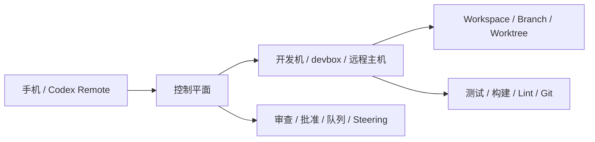
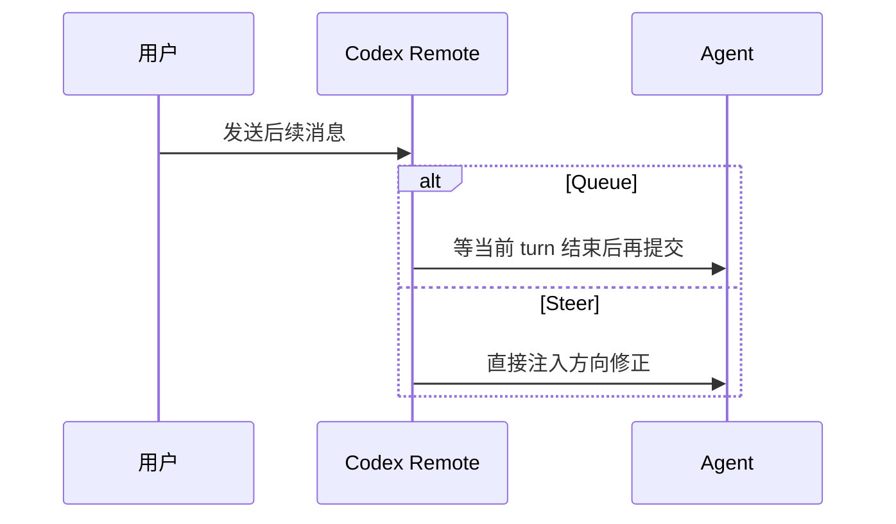
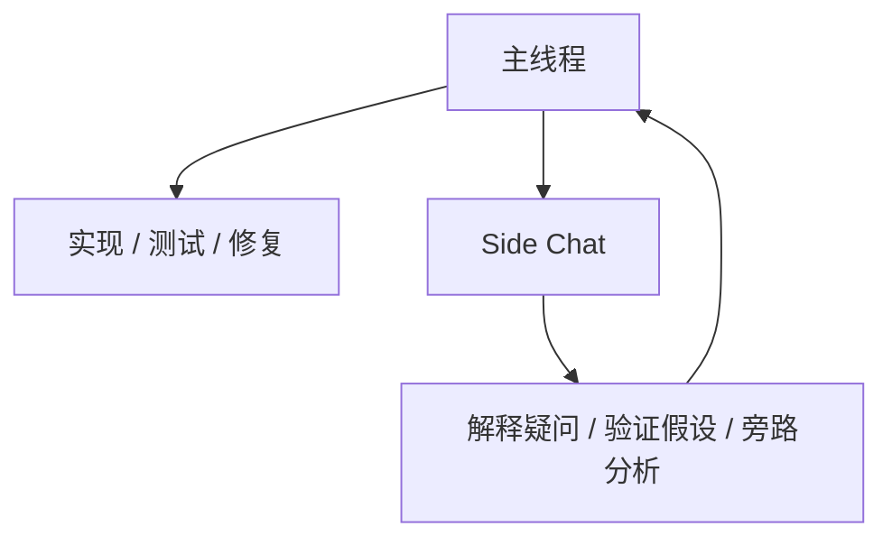
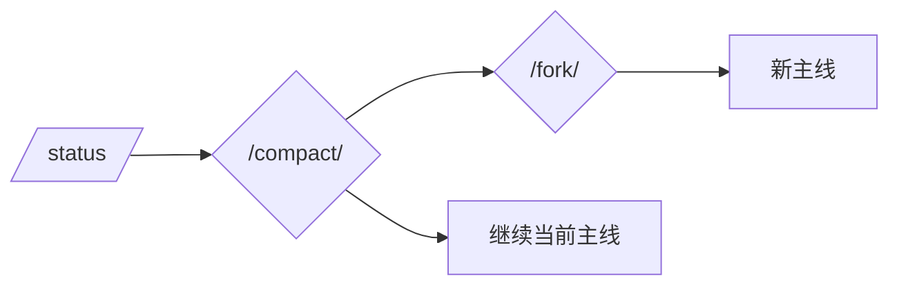

+++
date = 2026-06-23T22:14:13+08:00
draft = false
title = "Codex Remote 实战：把手机变成代码任务控制台"
description = "拆解 OpenAI Codex Remote 的工程视角：手机不是迷你终端，而是控制平面。围绕 Queue、Steer、Side Chat、Plan、Goal、Review、权限和上下文管理建立高效远程工作流。"
tags = ["OpenAI", "Codex", "Agent", "远程开发", "工程实践"]
categories = ["AI Agent"]
+++

很多人第一次看 Codex Remote，会下意识把它理解成“手机上的远程终端”。

这个理解只对了一半。更准确地说，Codex Remote 不是把 iPhone 变成一个缩小版 shell，而是把手机变成一个<strong>工程控制平面</strong>：代码仍然在你的开发机、工作区、分支和工具链上跑，手机负责做决策、下指令、审查结果和切换上下文。

这个区别很重要。

- 终端强调“执行命令”
- 控制平面强调“管理任务”
- 前者适合敲命令，后者适合跑 Agent 工作流

如果你把 Codex Remote 用成远程桌面，大概率会累；如果你把它当成控制台，它就会非常顺手。

## 一句话先说结论

Codex Remote 的核心不是“在手机上编码”，而是把这些高价值动作搬到手机上：

- 选对主机和工作区
- 选对分支或 worktree
- 决定当前提示是排队还是直接改道
- 用 side chat 处理旁路问题
- 用 Plan 和 Goal 管理长任务
- 直接在手机上审 diff、留评论、做批准
- 用 <code>/status</code>、<code>/compact</code>、<code>/fork</code> 控制线程生命周期

## 心智模型：手机是控制面，机器才是执行面

原文最值得记住的一句话可以概括成：

> 代码仍然运行在你的 Mac、Windows 机器、devbox 或其他连接主机上，Codex Remote 负责把控制权做成一个原生界面。

这意味着手机不是“输出终点”，而是“调度入口”。

换句话说，你不是在手机上“写代码”，而是在手机上“指挥代码工作”。

这会直接改变你的操作习惯：

- 先想清楚任务边界，再发起执行
- 先决定上下文，再让 Agent 开跑
- 先审结果，再决定要不要继续

## 先把边界选对，后面会轻很多

Codex Remote 的第一步不是打字，而是选执行上下文。

原文提到几个很实用的动作：

- 选连接的 host
- 选 workspace
- 选当前 branch 或新 worktree
- 让环境初始化先跑起来
- 需要的话再附加文件、照片、截图、技能或插件

这背后的工程逻辑很朴素：<strong>上下文一旦错了，后面的每一步都在帮你补锅。</strong>

比如：

- 一个只想做临时修复的任务，不该先污染当前 checkout
- 一个风险高的改动，应该直接开新 worktree
- 一个需要截图或日志才能说明白的问题，应该把证据先挂进去
- 一个能调用特定 skill 的任务，应该在第一轮就显式点名

我自己的理解是：

> 10 秒钟把执行边界选对，通常比 10 分钟后回来清理 Git 状态更划算。

## Queue 和 Steer，不是一个层级的选择

这是整个产品里最容易被忽略，但实际最有价值的设计之一。

Codex Remote 允许你在当前任务运行时，决定接下来的提示是：

- <code>Queue</code>：等当前回合结束后再发下一条
- <code>Steer</code>：直接干预正在进行的工作

这两个动作看起来都叫“继续说”，本质完全不同。

### Queue 适合什么

Queue 是默认更安全的选择，适合：

- 追加第二个独立任务
- 补一个测试请求
- 给后续步骤排队
- 不想打断当前思路

### Steer 适合什么

Steer 适合成本正在上涨的场景，也就是“再不改方向就要继续错下去”的时候：

- 别重构共享渲染层，先把问题限制在 mobile package
- 先检查 resume 路径，不要继续追 live path
- 别再盯 UI 了，看看是不是 server 已经删了对象

我的建议很明确：

- 默认用 <code>Queue</code>
- 只有在“方向错了继续跑会更贵”时才用 <code>Steer</code>

这能显著降低误操作成本。

## Side Chat：把旁路问题从主线程里切出去

长线程最怕什么？

不是信息少，而是信息太多。

如果每个问题都塞进主线程，Agent 会越来越难聚焦，人在回看时也会越来越难理解“当前主线到底是哪一个”。

<code>side chat</code> 就是为了解决这个问题。

适合放到 side chat 的问题包括：

- 这条架构选择为什么成立
- 这个错误信息到底是什么意思
- 这个行为和桌面端是否一致
- 这段实现应该怎么写成 release note
- 在批准命令前还需要核对什么

它的价值不是“多一个聊天窗口”，而是把信息分层：

- 主线程负责推进工作
- Side chat 负责解释工作

这个设计特别适合调试和审查阶段。

因为很多时候，主线不需要被打断，只需要一个小问题被单独问清楚。

## Plan 和 Goal，解决的是两类不同问题

很多人会把 Plan 和 Goal 混着用，但它们其实不是一回事。

### Plan 解决“怎么做”

Plan 适合任务还不够清晰、风险较高、可能会碰多个系统的时候。

它的作用是先把路径提出来，再决定要不要真的动手。

### Goal 解决“做到什么算完成”

Goal 是持久的，它更像任务契约：

- 我要把这个问题解决掉
- 我要把这个修复做完
- 我要把这个 release 跑通
- 我要把这次审查意见收完

一个实用流程是：

1. 先用 Plan 看实现路径
2. 再把接受的目标固化成 Goal
3. 让 Codex 持续推进、测试、回滚、清理
4. 不用每轮都重新描述一次目标

这套组合很适合长任务，因为它把“方法”和“终点”分开了。

## 手机上看 diff，不代表把手机当显示器

Codex Remote 真正强的地方，在于审查闭环。

原文里提到的审查路径很完整：

- 先看 changed-file summary
- 再打开 diff
- 必要时展开源码
- 可以折叠或展开区块
- 可以在相关行直接留 inline comment
- 也可以把 review 上下文重新送回 Codex

这让手机上的 review 不再只是“看个大概”，而是可以形成真正的反馈环。

<pre class="mermaid">
sequenceDiagram
  participant A as Agent
  participant P as 手机端审查
  participant D as Diff / 文件
  participant R as 下一轮修复

  A->>P: 完成实现
  P->>D: 查看 changed files
  P->>D: 打开 diff / 源码
  P->>R: 留 inline comment
  R->>A: Agent 按评论修正
</pre>

这才是关键。

手机当然不适合替代大屏做深度阅读，但它非常适合完成这几件事：

- 快速判断改动是否偏题
- 找到真正需要纠正的那两行
- 在等人、通勤、会议间隙把 review 往前推一步

## 权限和上下文，都是工作流的一部分

远程工作要能跑，控制就不能丢。

Codex Remote 会把这些请求显式摆出来：

- 命令执行批准
- 文件变更批准
- 网络访问批准
- 连接工具批准

这里最重要的不是“全部放行”，而是<strong>按需给最小权限</strong>。

经验上可以这么选：

- 已经很熟的命令，给当前 chat 范围的批准就够了
- 来源不明、影响不清晰、作用范围大的命令，只批准一次
- 敏感仓库里，宁可多问一句，也不要默认全开

上下文管理也是同样的逻辑。

Codex Remote 提供了这些生命周期工具：

- <code>/status</code>：看会话、workspace、上下文和限额
- <code>/compact</code>：压缩过长线程
- <code>/fork</code>：把当前历史分叉成新主线
- archive：把已经结束的线程收起来

实战里最容易踩的坑是把 side chat 和 fork 混为一谈：

- side chat 是围绕当前工作做一个轻问题
- fork 是把当前历史继承到一条新的主线

前者是旁路问答，后者是分支工作流。

## 适合手机上的四种工作流

原文最后给了几个很实用的使用方式，我把它们翻成更工程化的说法。

### 1. Release captain

适合发布负责人。

操作方式：

- 检查当前分支和 CI
- 看 review feedback
- 发现阻塞时再 steer
- release 结束后归档线程

### 2. Interrupt-driven bug fix

适合那种“先来一张截图/日志，再慢慢修”的故障。

操作方式：

- 上传证据
- 先诊断，不急着改
- 用 side chat 盯住最可疑的错误
- 明确根因后回到主线程修复

### 3. Mobile reviewer

适合碎片时间审查 PR。

操作方式：

- 先看 changed-file summary
- 再点到具体 diff
- 用 inline comment 提出精确问题
- 让 Agent 只修这些评论

### 4. Long-running objective

适合跨多轮的长期目标。

操作方式：

- 先定义完成条件
- 用 Goal 持续推进
- 通过通知和 status 跟踪进度
- 只在偏航时 steer

## 最后总结

Codex Remote 的价值不在于“手机也能干活”，而在于它把远程开发重新设计成了一个<strong>可调度、可审查、可分叉、可恢复</strong>的 Agent 工作流。

最值得带走的几个原则是：

- 手机是控制平面，不是迷你终端
- 先选对执行边界，再开始任务
- 默认 Queue，谨慎 Steer
- Side chat 管旁路，主线程管主线
- Plan 负责路径，Goal 负责终点
- Review、权限、上下文管理，都是工作流本身的一部分

如果你已经在用 Codex 或类似的 Agent 工具，这篇文章最实用的启发其实很简单：

> 不要只想着“让 Agent 干活”，要想着“如何让 Agent 在正确的上下文里、以正确的节奏、朝正确的目标干活”。

参考资料：[Mastering Codex Remote for engineering](https://developers.openai.com/blog/mastering-codex-remote-for-engineering)
