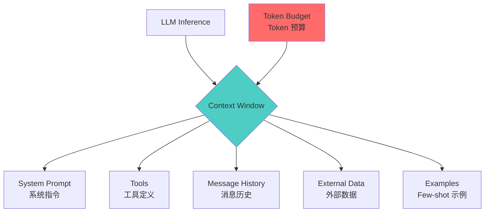
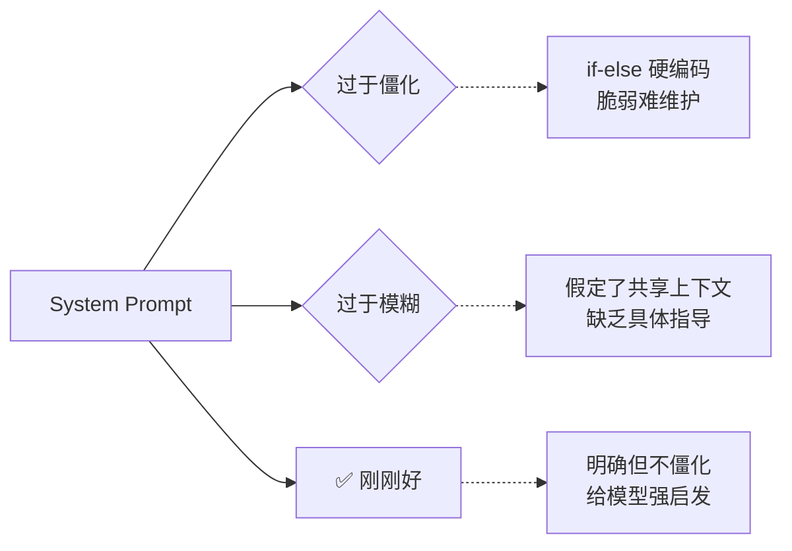
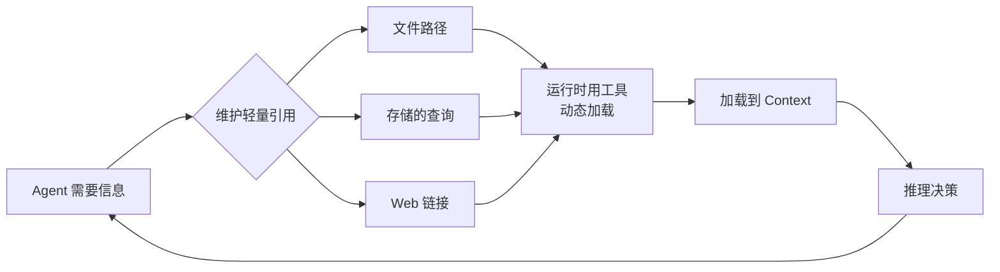
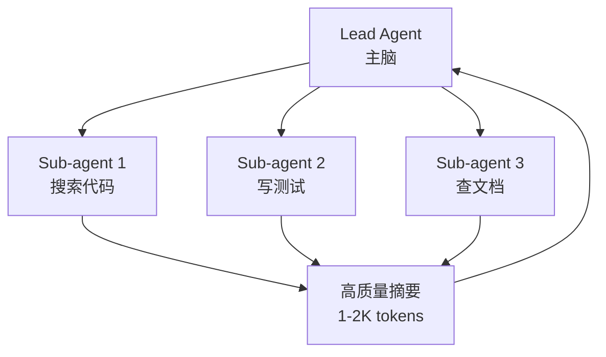

+++
date = 2026-05-13T22:00:00+08:00
draft = false
title = "上下文工程：让 AI Agent 不再「记性不好」的技术实战"

+++

## 前言

老哥们，最近 AI Agent 火得一塌糊涂，但你有没有这种感觉——

花大价钱做了一个 Agent，跑着跑着就开始「失忆」：前面做过的操作不记得了，给的上下文越多反而越容易出错，做个长任务聊着聊着就「断片」了。

这不能怪模型太笨，这是因为 **LLM 的注意力是有限的**。

今天咱们来聊一个这两年特别火的概念——**Context Engineering（上下文工程）**，就是来解决这个问题的。Anthropic 前两天发了一篇硬核文章，讲得特别清楚，我结合自己的理解，给你掰开揉碎了讲一遍。

---

## 目录

- [上下文工程的本质：不是写提示词，是管 context](#上下文工程的本质不是写提示词是管-context)
- [为什么 Agent 必须做上下文工程](#为什么-agent-必须做上下文工程)
- [有效上下文的组成结构](#有效上下文的组成结构)
- [运行时动态上下文检索](#运行时动态上下文检索)
- [长时任务的三板斧：压缩、笔记、子 Agent](#长时任务的三板斧压缩笔记子-agent)
- [实战建议](#实战建议)

---

## 上下文工程的本质：不是写提示词，是管 Context

先来理清两个概念：**Prompt Engineering** 和 **Context Engineering**。

**Prompt Engineering**（提示词工程）的核心是「怎么写」——措辞、格式、顺序、例子，追求的是把 instruction 写得更清楚、更有效。

**Context Engineering**（上下文工程）的核心是「塞什么进去」——系统指令、工具定义、MCP 数据、消息历史、外部知识等，这些全部加起来才是 context，而 context 的量是有限的。



**为什么现在 context 工程变得比提示词本身更重要？**

因为 Agent 要在多轮对话、长时间跨度上工作，context 会不断膨胀。你塞进去的信息越多，模型就越容易「分心」——这就是大名鼎鼎的 **Context Rot（上下文腐烂）**。

---

## 为什么 Agent 必须做上下文工程

LLM 基于 **Transformer 架构**，每个 token 都可以 attend 到 context 里的所有其他 token。

这意味着 n 个 token 之间有 **n² 个配对关系**。context 越长，每个 token 能分到的注意力就越少。

做个不精确的类比：LLM 的注意力就像人的工作记忆。你可以在大脑里同时处理 5 件事，但如果让你同时处理 20 件事，效率肯定下降，还容易出错。

另外，模型的训练数据里短序列远比长序列常见，所以模型天然更擅长处理短 context。位置编码插值虽然能扩展 context 长度，但精度会有所损失。

这带来一个残酷的现实：**Context 是有限资源，边际收益递减**。

| Context Token 数 | 信息召回率 | 推理质量 |
|-----------------|-----------|---------|
| 1K-2K | 高 ✅ | 优秀 |
| 4K-8K | 中等 | 良好 |
| 16K-32K | 下降 📉 | 尚可 |
| 64K+ | 明显下降 📉📉 | 吃力 |

这也就是为什么——精心挑选塞进去的高价值信息，比海量原始数据更有用。

---

## 有效上下文的组成结构

一个好的 context 应该包含哪些部分？Anthropic 给出了一个清晰的框架：

### 1. System Prompt：给 Agent 定「人设」和边界

System prompt 不是越长越好，而是要在两个极端之间找到 **Goldilocks Zone（刚刚好的区间）**：



好的实践：
- 用 **XML 标签或 Markdown 标题** 分区：`<background_information>`、`<instructions>`、`## Tool guidance`、`## Output description`
- 起始用**最小 prompt + 最强模型**测试，再根据失败 case 补充

### 2. Tools：定义 Agent 的「手和脚」

工具设计有三个核心原则：

1. **Self-contained（自包含）**：每个工具做一件事，做完整
2. **Robust to error（容错）**：出错时给清晰反馈，不崩
3. **Minimal overlap（不重叠）**：功能不要重叠，减少决策歧义

> 一个常见反模式：塞进去 20 个工具，覆盖大量重叠功能，然后问「为什么 Agent 不知道用哪个」。

**工具的输入参数**也很关键：描述要清晰无歧义，充分利用模型的强项。

### 3. Few-shot Examples：AI 的「图例」

一个好的例子胜过一千句文字描述。但要注意别塞一堆边界 case，而是选 **diverse、canonical 的示例**，覆盖核心行为模式。

---

## 运行时动态上下文检索

这是 context 工程里最有趣的部分——**「恰好需要」策略（Just-in-time）**。

传统做法：把数据库里所有相关内容一股脑塞进 context
新做法：Agent 持有**轻量引用**（文件路径、查询语句、链接），运行时按需加载



这种模式有几个好处：

1. **元数据本身就是信号**：文件在 `tests/` 还是 `src/core_logic/`，命名风格、时间戳，都向 Agent 传递了信息
2. **渐进式发现**：Agent 通过探索逐步理解信息版图，不需要一上来就拥有全部
3. **避免过期索引问题**：传统的预计算 embedding 索引会有 stale 问题，运行时探索则不存在

Claude Code 就用了这个混合策略：
- `CLAUDE.md` 文件默认加载进 context
- 用 `glob`、`grep` 等工具按需探索文件

**但要注意**：运行时探索比预加载慢，而且需要给 Agent 足够的工具和启发来避免「迷路」。

---

## 长时任务的三板斧：压缩、笔记、子 Agent

当任务横跨数十分钟到数小时，context window 迟早会被填满。这时候你有三个武器：

### 1. 压缩（Compaction）

当 context 快要满了，**总结历史消息，清空重开，用摘要续上**。

```
原始 context（即将溢出）：
用户 → 模型 → 工具调用 → 工具结果 → 模型 → 工具调用 → 工具结果 → ...（重复数十轮）

压缩后：
[摘要] 前 50 轮对话中，我们完成了 X 模块的迁移，发现了 Y bug，正在处理 Z 问题
+ 最近 5 个文件的文件内容
```

Claude Code 的压缩逻辑：保留架构决策、未解决的 bug、实现细节，但丢掉冗余的工具调用输出。

**最佳实践**：
1. 从**最大召回**开始，确保摘要不遗漏重要信息
2. 逐步迭代，删掉明显冗余的内容（比如历史工具结果）
3. 最轻量的版本：只清除工具调用结果（tool call clearing）

### 2. 结构化笔记 / Agentic Memory

让 Agent 把重要信息**写到 context 外部的文件**，需要时再读回来。

```python
# Agent 的笔记示例：NOTES.md
## 当前进度
- 完成了用户认证模块的测试用例编写
- 发现 JWT 刷新有 bug，正在排查

## 下一步
- [ ] 修复 JWT refresh token 过期逻辑
- [ ] 编写订单模块的集成测试
```

这个技术有多强？Claude 玩 Pokémon 时，能在**数千步游戏操作**中维持目标追踪，靠的就是笔记。它会精确记录「过去 1234 步我在 Route 1 训练皮卡丘，已经升了 8 级，距离目标 10 级还差 2 级」。

### 3. 子 Agent 架构（Sub-agent Architectures）

不再让一个 Agent 维护整个项目的 state，而是**拆分专业化**：



每个子 Agent 可以探索数万个 token，但**只返回 1-2K 的蒸馏摘要**给主脑。这样主脑的 context 永远干净，细节被隔离在子 Agent 里。

| 策略 | 适用场景 | 优点 | 缺点 |
|------|---------|------|------|
| 压缩 | 对话历史过长 | 保留核心上下文 | 有丢失细节风险 |
| 结构化笔记 | 跨 session 任务 | 持久化记忆 | 需要工具支持 |
| 子 Agent | 复杂多维度任务 | 并行探索，context 干净 | 通信 overhead |

---

## 实战建议

1. **把 context 当成珍贵资源**：每次决定往 context 里塞东西时，问自己「这个 token 对当前决策有多大贡献？」

2. **从最小可用 context 开始**：先用最强模型 + 最少 context 跑一次，根据失败 case 补充，不要一开始就塞满

3. **工具设计是 context 工程的核心**：好的工具 schema + 清晰的描述，比什么都强

4. **长任务优先考虑笔记策略**：对于横跨多天、多 session 的任务，NOTES.md 就是 Agent 的「外接硬盘」

5. **混合策略最稳**：预加载关键信息 + 按需探索 + 定期压缩，三管齐下

6. **监控 context rot**：跑长任务时注意观察模型表现是否下降，这是 context 太多的信号

---

## 总结

Context Engineering 的本质就一句话：**找到能最大化目标收益的最小高价值 token 集**。

它不是某个具体的技巧，而是一种思维方式——从「怎么写 prompt」升级到「怎么管理 Agent 的注意力资源」。

随着模型越来越强，Harness 会持续进化，但**把 context 当成有限资源来精心管理**这个原则，不会过时。

---

**参考资料：** [Effective context engineering for AI agents - Anthropic Engineering](https://www.anthropic.com/engineering/effective-context-engineering-for-ai-agents)