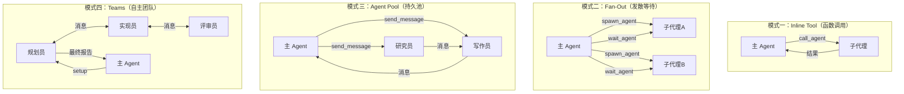
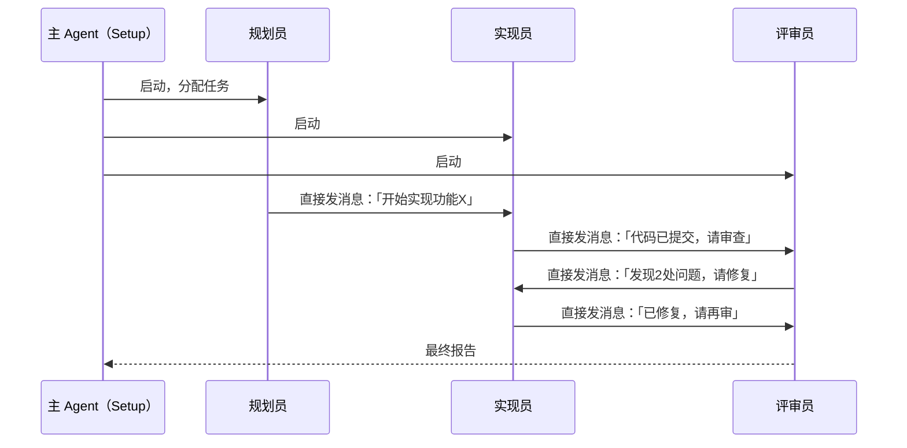
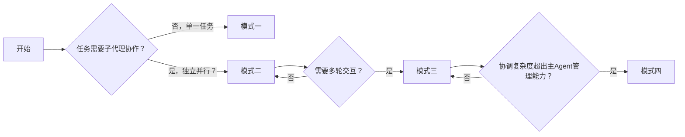

+++
title = "Agent 也需要管理者：深入解析四种 Subagent 编排模式"
date = 2026-05-08T22:00:00+08:00
draft = false
+++

> 如果你用过 AI Agent 处理复杂任务，你大概率遇到过这个问题：单个 Agent _context 污染_、工具太多导致混乱、长流程下可靠性骤降。Subagent（子代理）是一种被广泛采用的解决方案，但真正的问题不是「要不要用子代理」，而是「主 Agent 怎么管理这些子代理」。今天我们拆解四种编排模式，从最简单的函数调用到自主团队协作，帮你选对架构。

<!--more-->

## 为什么需要 Subagent？

在聊模式之前，先快速搞清楚为什么需要这玩意儿。

当一个 Agent 要同时处理多件事时，它的上下文（context window）会被各种工具调用、中间结果、临时状态填满。模型开始「遗忘」最初的任务，或者在第 50 步之后开始乱来。

解决方案很简单：**把任务拆出去，交给独立的子代理**。每个子代理有自己的指令、工具和上下文，主 Agent 只负责协调。

但拆出去之后，谁来管这些子代理？这就是今天要聊的核心问题。

## 四种编排模式全景图

我们先上一张总览图，后文逐个拆解。



> **图注**：从模式一到模式四，控制权逐级下放，复杂度逐级上升。

---

## 模式一：Inline Tool —— 子代理当函数调

### 原理

最简单直接的模式。**主 Agent 调用一个工具，这个工具内部启动子代理并返回结果**。从主 Agent 的视角看，调用子代理和调用 `read_file`、`run_command` 完全一样。

核心工具是 `call_agent`，传入任务描述，得到结果。子代理运行在自己独立的上下文里，有自己的工具和指令集。

```python
# 同步调用示例
tool_calls = [
    {
        "name": "call_agent",
        "arguments": {
            "task": "Review PR #42 for security issues. Focus on auth changes.",
            "agent": "security-reviewer",
            "tools": ["read_file", "search_code"]
        }
    }
]
# 主 Agent 收到工具响应：
# "Found 2 issues: 1) Auth token not validated..."
```

### 同步 vs 异步

这个模式内部有同步/异步的区分：

**同步模式**：工具调用阻塞，主 Agent 的回合暂停，直到子代理完成。结果作为普通工具响应返回。

**异步模式**：工具立即返回一个 Agent ID，不阻塞主 Agent。主 Agent 可以继续做其他事情，子代理完成后，结果以通知消息的形式注入对话。

```python
# 异步调用示例
tool_calls = [
    {"name": "call_agent", "arguments": {"task": "Review PR #42", "background": True}},
    {"name": "read_file", "arguments": {"path": "ci/logs/latest.txt"}}  # 主 Agent 继续干活
]
# 稍后收到通知：
# "<notification agent_id='agent-x1' status='completed'>Found 2 issues...</notification>"
```

### 适用场景

- 研究查询、代码审查、文件分析、测试生成
- **任何自包含的独立任务**

### 局限

- 子代理只能接收一次任务，没有机会接收后续指令
- 如果子代理理解错了任务，你只能在结果返回后才知道
- 无法中途取消或检查进度

---

## 模式二：Fan-Out —— 发出去，等结果

### 原理

模式一的问题在于「调用和结果在一起」，主 Agent 无法控制收集时机。**模式二把「启动」和「收集」拆成两步**。

核心工具：
- `spawn_agent`：立即返回，不阻塞主 Agent
- `wait_agent`：阻塞，直到一个或多个子代理完成

主 Agent 可以：
1. 同时 spawn 多个子代理
2. 做自己的其他工作（比如读文件）
3. 稍后调用 `wait_agent` 统一收集结果

```python
# 主 Agent 同时启动两个子代理 + 做自己的事
tool_calls = [
    {"name": "spawn_agent", "arguments": {"task": "Refactor auth module", "agent": "backend-engineer"}},
    {"name": "spawn_agent", "arguments": {"task": "Update auth tests", "agent": "test-writer"}},
    {"name": "read_file", "arguments": {"path": "docs/auth-spec.md"}}  # 主 Agent 并行工作
]
# 主 Agent 决定时机后调用 wait_agent
tool_calls = [
    {"name": "wait_agent", "arguments": {"timeout": 300}}
]
# 收到：2 agents completed: agent-a (auth.ts, middleware.ts, config.ts), agent-b (12 tests)
```

### 为什么比模式一更灵活？

模式一本质上还是同步的——你 spawn 一个 agent，立刻等结果。**模式二让模型自己决定什么时候等**。

模型可以：
- 同时 spawn 5 个子代理
- 做自己的文件读取
- 再调用 `wait_agent`

这个「交错执行」能力是模式二的核心价值。

### 适用场景

- **多个相互独立的任务，可以并行运行**
- 主 Agent 需要在等待期间做自己的事情

### 局限

- 模型需要正确判断「什么时候该等」。一个模型每次 spawn 后立刻调用 wait，那就退化成了模式一
- 结果是批量收集的，仍然是「fire-and-forget」——无法中途发指令纠偏

---

## 模式三：Agent Pool —— 持久化子代理，可交互

### 原理

模式二还是「fire-and-forget」，子代理跑完就结束。**模式三引入了持久化：子代理跨多次交互存活，主 Agent 可以随时发消息、查状态、协调工作**。

核心工具集（比模式二多两个）：
- `spawn_agent`：启动子代理
- `send_message`：向指定子代理发消息
- `wait_agent`：等待下一个响应
- `list_agents`：查看当前存活的子代理
- `kill_agent`：终止子代理

这意味着子代理是有状态的——它记得自己被分配了什么任务，上下文跨多次交互保留。

### 实战示例

主 Agent 协调一个研究员和一个写作员完成一篇博客：

```python
# 启动两个持久子代理
spawn_agent(role="researcher", tools=["web_search", "read_url"])
spawn_agent(role="writer", tools=["write_file", "read_file"])

# 并行发任务
send_message(to="agent-r", message="Research WebAssembly performance benchmarks")
send_message(to="agent-w", message="Outline blog post structure")

# 写作员先完成，大纲就绪
wait_agent()  # 返回：agent-w: Outline ready

# 研究员稍后返回，找到了 5 个信源
wait_agent()  # 返回：agent-r: Found 5 sources

# 主 Agent 把研究结果转发给写作员
send_message(to="agent-w", message="Fill in outline using these sources...")

# 写作员完成初稿
wait_agent()  # 返回：agent-w: Draft complete

# 事实核查：把草稿发给研究员
send_message(to="agent-r", message="Fact-check this draft...")
wait_agent()  # 返回：2 corrections needed

# 把修正发回写作员，终止研究员
send_message(to="agent-w", message="Apply corrections...")
kill_agent(agent_id="agent-r")
```

### 为什么更好？

**信息路由**。研究员找到的原始资料，需要通过主 Agent 才能到达写作员。主 Agent 在这里扮演「信息中枢」的角色，把子代理的产出路由给需要的其他子代理。

### 适用场景

- **多步骤协作流程**，子代理之间需要信息传递
- 任务中间需要调整方向，主 Agent 可以动态发指令

### 局限

- 主 Agent 需要追踪多个子代理状态，决定什么时候发消息、什么时候等
- 小模型容易「丢状态」——忘记哪个子代理在处理什么，或者忘记调用 `kill_agent`
- 一般能较好地管理 2-4 个子代理，再多就容易乱

---

## 模式四：Teams —— 子代理自主协作，主 Agent 退居幕后

### 原理

模式三里，主 Agent 仍然是「中央枢纽」——所有消息都要经过它。**模式四让子代理之间直接对话，主 Agent 只负责初始Setup，然后退居幕后**。

核心区别：每个子代理的工具集里都有 `send_message`，可以**直接Addressing其他子代理**，不需要经过主 Agent。

### 架构示意



主 Agent 的对话非常短：
1. 启动团队（规划员 + 实现员 + 评审员）
2. 发一条启动消息给规划员，告诉它团队成员和最终目标
3. 等待最终报告

中间的所有协调——规划员分配任务、实现员提交代码、评审员提意见——全部发生在子代理之间的直接对话中，**主 Agent 完全看不见这些内部消息**。

### 适用场景

- **大型任务，协作逻辑超出了单个主 Agent 能逐步管理的范围**
- 需要多个专业角色深度协作

### 局限（非常重要）

> ⚠️ 这个模式对模型能力要求极高，不是每个团队都用得起。

1. **每个子代理都需要前沿级（Frontier-Class）模型能力**：不只是主 Agent 需要强，每个团队成员都要独立决策什么时候发消息、发给谁、什么时候报告完成。
2. **基础设施挑战**：循环等待检测（A 等 B，B 等 A）、冲突解决（两个子代理同时编辑同一个文件）、关闭协调。
3. **调试困难**：子代理之间的消息链很难追踪，一个环节出问题，失败会级联传播。

---

## 四种模式对比速查

| 维度 | Inline Tool | Fan-Out | Agent Pool | Teams |
|------|-------------|---------|------------|-------|
| **工具** | `call_agent` | `spawn_agent`, `wait_agent` | `spawn`, `send`, `wait`, `list`, `kill` | 以上全部 + 跨Agent `send_message` |
| **主 Agent 角色** | 调用者（Caller） | 分发器（Dispatcher） | 协调器（Coordinator） | 监督者（Supervisor） |
| **子代理生命周期** | 单任务 | 单任务 | 多轮交互 | 持久 |
| **模型能力要求** | 任意支持工具调用的模型 | 能判断「什么时候等」 | 能追踪多Agent状态 | **每个Agent都需要前沿级模型** |
| **结果收集** | 内联（工具响应） | 批量（wait_agent） | 增量（每条消息返回） | 只在Agent显式报告时返回 |

---

## 怎么选？

这个问题没有标准答案，但有一个经验法则：

> **先用模式一。只有当模式一明显不够用了，才升级到模式二，以此类推。**



**模式一**适合大多数场景。很多你以为需要多代理系统的场景，一个精心设计的 Prompt + 模式一的 inline tool 就够了。

**模式二**适合真正独立的并行任务——比如同时改三个模块、跑三个分析。主 Agent 在等待期间需要做自己的事情。

**模式三**适合有信息路由需求的场景——研究员产出内容，路由给写作员；写作员草稿路由给评审员核实。中间需要动态调整。

**模式四**适合协调逻辑本身就已经非常复杂的场景。**但强烈建议先评估团队模型能力**——如果你连模式三都管不好 3 个子代理，模式四会让你陷进无尽的调试地狱。

---

## 实战建议

1. **从小开始**：先用模式一实现你的核心逻辑，跑通之后再评估要不要升级。升级是有代价的——复杂度上升，调试难度上升。

2. **工具设计优先**：不管哪种模式，子代理的工具集设计都是最重要的。原子化、可组合的工具，比大而全的工具更可靠。

3. **始终留 kill 机制**：不管是哪种模式，都要给主 Agent 留一个「终止子代理」的手段。没有退出机制的系统，最终都会因为僵尸子代理积累而崩溃。

4. **模式四是最后的选择**：它的能力最强，但成本（模型能力要求、基础设施、调试难度）也最高。在你确定「协调逻辑真的超出了单个主 Agent 能管理的范围」之前，不要用它。

5. **结果收集方式决定架构**：如果你只需要「一个任务跑完给我结果」，模式一就够了。如果需要「分阶段收集中间结果并动态调整」，至少需要模式三。

---

## 写在最后

Multi-Agent 系统不是一个银弹。**模式一能解决 80% 的问题，剩下的 20% 里，又有一半其实用模式二就能搞定**。

升级模式是有代价的——你需要更强大的模型、更复杂的基础设施、更耐心的调试。很多团队在还没充分挖掘模式一/二的潜力之前，就过早地进入了模式三/四的复杂度陷阱。

今天的模型能力在飞速提升。上个月需要四个子代理配合才能完成的任务，下个月可能一个更好的模型就能独立搞定。**你的架构要能随时「删除」今天写的「聪明」逻辑**。

记住 Rich Sutton 那个苦涩的教训（The Bitter Lesson）：通用方法终将打败手写的特化逻辑。保持你的 Harness（编排框架）轻量、可替换，别在手写的编排逻辑上越走越深。

---

**核心 takeaways：**

- 模式一（Inline Tool）：子代理当函数调，最简单，用得最多
- 模式二（Fan-Out）：启动和收集分离，支持真正的并行交错
- 模式三（Agent Pool）：持久化子代理 + 消息路由，适合多步骤协作
- 模式四（Teams）：子代理直接对话，主 Agent 退居幕后，能力最强但成本最高
- **选型原则**：从模式一开始，逐级升级，不要过度设计

---

*欢迎关注收藏我，获取更多硬核技术干货。*

参考：[How Agents Manage Other Agents: Four Subagent Patterns in 2026](https://www.philschmid.de/subagent-patterns-2026)
