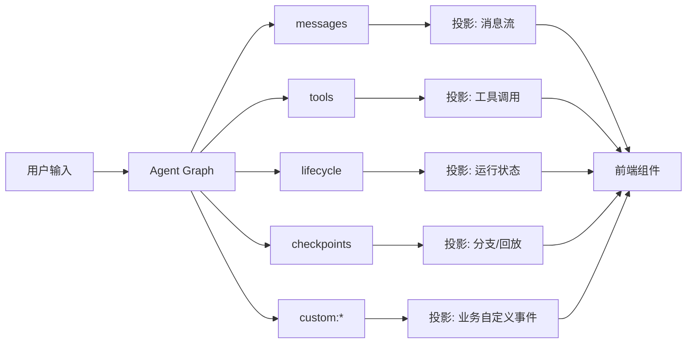

+++
date = 2026-05-23T22:05:17+08:00
draft = false
title = "从 Token Streams 到 Agent Streams：LangChain 为什么要重做流式输出"
+++

如果你还把 Agent 的流式输出理解成“模型一边吐 token，一边前端顺手显示”，那这篇 LangChain 的文章其实是在提醒你：这个时代已经过时了。

今天的 Agent 不只是聊天。它会调用工具、派生子 Agent、等待人工审批、产出结构化状态，甚至输出图片、音频和视频。把这些东西硬塞进一条纯文本 token 流，结果通常只有两个字：别扭。

LangChain 这篇 From Token Streams to Agent Streams 的核心观点很直接：流式系统要从“传 token”升级成“传事件”。前端要订阅的，不是字符片段，而是有类型、有作用域、有层级的 Agent 事件。

## 先说结论

这次改造的重点，不是“让流更快”，而是“让流更像应用层接口”。

它解决的不是一个小优化，而是三个老问题：

- 纯 token 流只能表达文本，表达不了工具调用、状态变化和审批事件。
- 所有内容混在一起，前端必须自己拼装、排序、重连，复杂度很高。
- Agent 一旦有子 Agent 或分支图，整条流就会变成噪音，根本没法局部订阅。

换句话说，LangChain 想做的是把流式能力从“日志传输”提升成“产品协议”。

## 为什么 token 流不够用了

单轮聊天模型的流式输出很简单：模型逐个 token 吐字，前端逐个 token 显示。

但 Agent 的执行路径不是线性的，它更像一棵树：

1. 先规划。
2. 再调用工具。
3. 再看工具结果。
4. 必要时分派子 Agent。
5. 中途还可能暂停，等待人工确认。

如果你还用 token 流来表达这一切，就会遇到几个直接的工程问题：

- 你不知道当前输出属于哪个子任务。
- 你不知道这是文本、工具参数，还是状态更新。
- 你不知道应该在前端哪个组件里渲染它。
- 刷新页面后，很难无损重连到“刚才那条任务链”。

所以问题本质上不是“有没有流”，而是“流的语义够不够表达 Agent”。

## 新架构长什么样

LangChain 的思路可以概括成一句话：把一个模糊的流，拆成可订阅、可投影、可定位的事件流。



这里有两个关键词很重要。

### 1. Typed events：事件先分类型

新的流不是“我吐了一段字符串”，而是：

- 这是一个 messages 事件。
- 这是一个 lifecycle 事件。
- 这是一个 checkpoints 事件。
- 这是一个 custom:* 事件。

这样做的好处很现实：前端不用再靠正则或字符串约定猜语义，后端也不用把所有东西降级成文本。

### 2. Projections：前端拿到的是视图，不是原始噪音

你不一定要消费整条协议流，应用通常只关心其中某一类视图：

- messages：显示回答正文。
- tool calls：显示工具执行过程。
- subagents：显示子任务状态。
- custom extensions：显示业务自己的实时事件。

这和数据库视图有点像。底层数据可能很复杂，但应用拿到的是它真正需要的那份投影。

## Scoped subscriptions 的价值

这是这篇文章里最值得工程师警惕的一点。

以前很多流式实现默认是“全量广播”：不管前端有没有在看，所有 token 都往外推。

问题是 Agent 复杂起来后，这会非常浪费：

- 一个主 Agent 下挂 3 个子 Agent。
- 每个子 Agent 都在跑工具。
- 每个工具又会产出状态和中间结果。

如果每个组件都被迫接收全部流，带宽、渲染和状态管理都会一起炸。

LangChain 的做法是让客户端只订阅自己关心的那一部分，比如：

```ts
const thread = client.threads.stream({ assistantId: "research-agent" });

await thread.subscribe({
  channels: ["messages", "tools", "values", "lifecycle"],
  namespaces: [["researcher"]],
  depth: 2,
});
```

这段代码传达的意思很明确：

- 我只看 researcher 这个命名空间。
- 我只要两层深度。
- 其余内容别往我这里送。

这就是生产级 Agent UI 和玩具 Demo 的分界线。

## 对前端开发者意味着什么

这套设计对前端最大的好处，不是“多了几个 API”，而是组件可以按职责拆得更干净。

你可以把界面拆成三层：

- 主聊天区只订阅 messages。
- 右侧面板只订阅子 Agent 状态和工具调用。
- 调试面板订阅原始事件和自定义扩展。

这样做之后，组件不再互相抢流，也不需要自己维护一堆“已经收到多少 token”的脏逻辑。

LangChain 文章里提到的 React、Vue、Svelte、Angular SDK，本质上也是在做同一件事：把“事件流”包装成框架原生的响应式数据源。

## 一个更接近工程现实的理解方式

如果把旧模式和新模式对比一下，差别会很直观：

| 维度 | Token Stream | Agent Stream |
|---|---|---|
| 表达对象 | 文本片段 | 事件、状态、工具、子任务 |
| 前端消费方式 | 拼字符串 | 订阅投影 |
| 扩展能力 | 很弱 | 可以加 custom:* |
| 多任务支持 | 容易混线 | 通过 namespace 隔离 |
| 断线重连 | 麻烦 | 可以按事件重放 |

你可以把它理解成一次协议升级：

- 从“打印输出”升级成“实时事件总线”。
- 从“终端思维”升级成“应用思维”。

## 实战建议

如果你自己在做 Agent 平台，我建议直接按这三个原则设计：

1. 先定义事件类型，再写 UI。不要先写前端，再回头补字符串协议。
2. 让子任务有自己的命名空间。没有 namespace 的 Agent 流，迟早会乱。
3. 把“投影”当成一等公民。不要让每个组件自己解析原始流。

如果你还在做单一聊天框，那 token 流够用。

但只要你开始做多 Agent、长任务、审批流、可视化调试，事件流就是迟早要补的那一层。

## 总结

LangChain 这篇文章真正有价值的地方，不是“又发布了一个 streaming API”，而是它把问题讲对了。

Agent 的实时输出，不应该再被当成一串连续字符，而应该被当成一组可订阅、可投影、可分层的事件。

一旦你接受这个前提，前端架构、运行时设计、重连策略、子任务可见性，都会顺很多。

这就是从 Token Streams 到 Agent Streams 的真正区别。

参考资料：[From Token Streams to Agent Streams](https://www.langchain.com/blog/token-streams-to-agent-streams)
