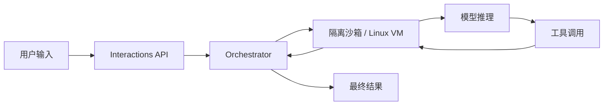

+++
date = 2026-06-11T22:04:34+08:00
draft = false
title = "Managed Agents 是怎么工作的：5 行代码背后的执行循环、沙箱与环境持久化"
+++

很多人第一次看到 Managed Agents 的 demo，都会以为这只是一次普通的模型调用。

但原文真正讲清楚的事情是：API 在后台帮你启动了一个完整的执行环境，模型不是“回答完就结束”，而是在循环里不断思考、调用工具、读取结果、继续执行，直到任务完成。

## 核心结论

Managed Agents 不是更长的 prompt，而是一个更完整的运行时。

它至少包含四个层面：

1. 创建隔离环境
2. 把模型放进执行循环
3. 让工具调用在沙箱里完成
4. 把状态持久化，方便下次继续跑

## 1. 一次调用背后，是一整套执行循环

原文里最关键的一句是：`interactions.create()` 做的不只是发 prompt，而是触发 orchestration。



这意味着，Managed Agents 解决的不是单轮问答，而是多轮任务执行。

```python
from google import genai

client = genai.Client()

interaction = client.interactions.create(
    agent="antigravity-preview-05-2026",
    input="Analyze the latest lego set data and create a PDF report with charts",
    environment="remote",
)

print(interaction.output_text)
```

这段代码很短，但背后已经包含环境创建、模型调度、工具路由和结果收集。

## 2. 沙箱不是附属品，而是 agent 的工作现场

原文提到，每个 interaction 都有自己的隔离 Linux 容器，可以安装依赖、运行脚本、读写文件、访问网络。

这带来的价值很直接：

- 任务隔离，不容易互相污染
- 能跑长任务，不必每次重来
- 出错时更容易复现和恢复
- 代码、数据、图表、报告都能放在同一个工作目录里

如果没有沙箱，agent 很容易退化成“会调用工具的聊天机器人”。

有了沙箱，它才真正具备做工程活的能力。

## 3. 真正值钱的是环境持久化

Managed Agents 最实用的设计之一，是环境可以跨 interaction 持久化。

原文给了一个很关键的例子：第一次创建环境，第二次复用同一个 `environment_id`，文件和状态都还在。

```python
i1 = client.interactions.create(
    agent="antigravity-preview-05-2026",
    input="Install pandas and create analysis.py",
    environment="remote",
)

i2 = client.interactions.create(
    agent="antigravity-preview-05-2026",
    input="Run analysis.py on the Q1 data",
    environment=i1.environment_id,
    previous_interaction_id=i1.id,
)
```

这件事的重要性，往往比“模型更大”还高。

因为真实任务通常不是一问一答，而是装依赖、下载数据、生成中间产物、继续分析、最后导出结果。

如果每次调用都要重来一次，agent 的效率会被状态搬运拖垮。

所以你可以把 `environment_id` 理解成“agent 的工作台编号”。

## 4. 从 demo 到生产，差别在配置层

原文把用法分成三层，这个划分很有启发。

临时调用适合快速验证：

```python
client.interactions.create(
    agent="antigravity-preview-05-2026",
    input="Write a Python script that prints hello world",
    environment="remote",
)
```

当你要约束行为时，就该把系统指令和技能一起放进去。

当流程稳定后，再把它注册成一个可复用的 agent ID。

这一步的意义，是把“实验性流程”变成“可运营的系统”。

## 5. 你该怎么把它学到自己的项目里

如果你要做类似系统，我建议直接记住三件事：

1. **把状态放到环境里，不要全塞进 prompt**
2. **把任务拆成可验证的中间步骤**
3. **把稳定流程固化成 runtime，而不是临时脚本**

换句话说，真正决定 agent 上限的，不只是模型能力，而是你有没有给它一个靠谱的工作环境。

## 总结

Managed Agents 的核心，不是“更会聊天”，而是“更会干活”。

它把模型、沙箱、工具和状态管理拆成独立层，让 agent 能在受控环境里持续执行复杂任务。

如果只记住一句话，那就是：

**agent 不是 prompt 的增强版，agent runtime 才是。**

参考资料：[How Managed Agents Work](https://www.philschmid.de/how-managed-agents-work)
