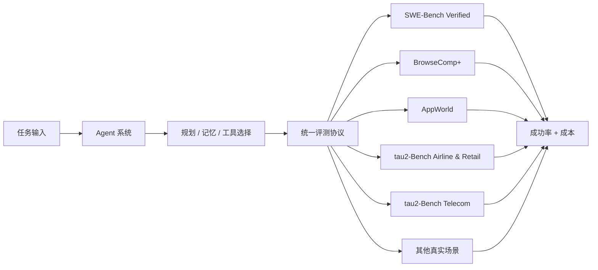
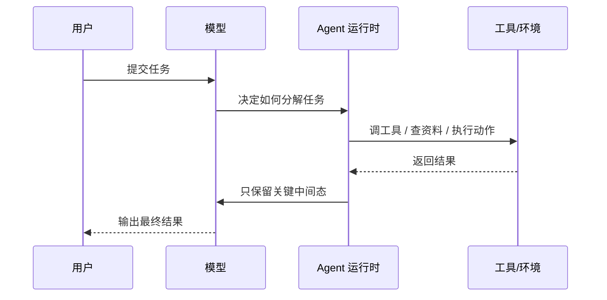
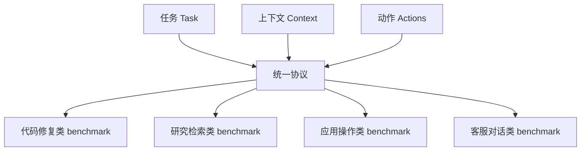
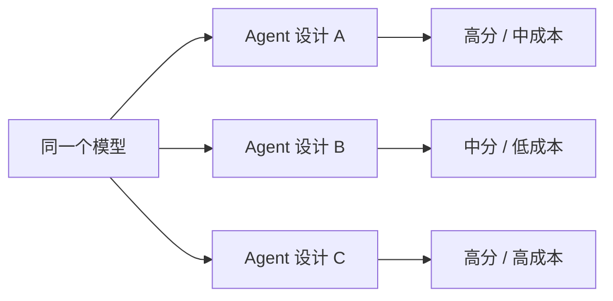

+++
date = 2026-05-20T22:03:16+08:00
draft = false
title = "Hugging Face Open Agent Leaderboard：为什么评测 Agent 不能只看模型分数"
+++

最近 Hugging Face 发布了 [The Open Agent Leaderboard](https://huggingface.co/blog/ibm-research/open-agent-leaderboard)。这篇文章最值得看的，不是“谁排第一”，而是它把一个很关键的事实讲透了：Agent 的能力，不只取决于模型本身，还取决于它周围那套系统设计。

如果你只盯模型分数，很容易得出一个错误结论：换个更强的模型，Agent 就会自动变好。现实里不是这样。工具怎么选、上下文怎么管理、失败怎么恢复、成本怎么控制，都会显著影响最终效果。

这篇文章用更通俗的方式，把这个 leaderboard 的设计、评价方式和工程意义拆开讲清楚。

## 先看大图

这套 leaderboard 的核心，不是简单跑分，而是把一个 Agent 拆成“系统”来评估。

它想回答的问题也很直接：

- 这个 Agent 在不同任务里到底能不能工作。
- 它是“真能做事”，还是只在单一 benchmark 上表现好看。
- 它的成功是不是靠堆成本换来的。

## 为什么要重新定义评测

传统模型榜单通常只看一个结果：模型在某个任务上的分数。

但 Agent 不一样。部署一个 Agent 时，你拿到的不是一个模型，而是一整套系统：

- 它能用哪些工具。
- 它如何规划步骤。
- 它如何保留和压缩上下文。
- 它出错后怎么恢复。
- 它每一步会花多少 token 和时间。

同一个模型，换一套 Agent 设计，表现可以差很多。

这个图里，真正影响结果的，不止模型。

Agent 运行时才是很多性能差异的来源。它决定了：

- 任务会不会被切成合适的步骤。
- 工具调用会不会过多。
- 失败后会不会继续烧钱。

## 这套 leaderboard 到底测了什么

Hugging Face 这次把 6 个 benchmark 放到一起，试图覆盖更接近真实工作的场景：

- SWE-Bench Verified，真实代码仓库里的 bug 修复。
- BrowseComp+，复杂网页研究。
- AppWorld，跨应用的个人助理任务。
- tau2-Bench Airline & Retail，客服类、流程约束强的任务。
- tau2-Bench Telecom，技术支持类任务。

这里最重要的不是 benchmark 名字有多酷，而是它们被统一成了同一种协议。

原文把它抽象成三件事：

- task，要做什么。
- context，要知道什么。
- actions，允许做什么。

这样做的好处很现实：不同 benchmark 的交互方式被抹平了，Agent 不需要“学每个题库的方言”，而是面对同一种接口。

## 统一协议的意义

如果你做过多 Agent 集成，就会知道最烦的不是模型，而是接口不一致。

有的 benchmark 偏代码修复，有的偏网页研究，有的偏多轮对话，有的偏应用操作。每个系统都带着自己的假设、输入格式和动作空间。

统一协议的价值，就是让这些差异尽可能收敛成一层公共抽象。

这意味着两件事：

- benchmark 仍然保留自己的真实任务特征。
- Agent 只需要面对一套共同的输入输出结构。

对工程团队来说，这比“每个 benchmark 单独调一套 prompt”靠谱得多。

## 如何读 leaderboard

这篇文章最值得抄走的，不是榜单名字，而是读法。

每一行代表的不是“某个模型”，而是“某个 Agent 系统 + 某个模型”的组合。

所以你看到的是：

- 平均成功率。
- 平均成本。
- 每个 benchmark 的细分结果。

这就能看出一个经常被忽略的事实：

> 同一个模型，换不同 Agent 设计，分数和成本都可能完全不一样。

换句话说，模型只是底座，Agent 才是把底座变成产品的那层系统工程。

### 一个更直观的理解

这也是为什么只看模型榜单会误判：

- 你以为是模型强，其实是 Agent 管得好。
- 你以为是模型差，其实是工具选择和恢复策略差。
- 你以为成本高是模型贵，其实是失败路径太长。

## 这次公开了哪些结论

文章里有几个很关键的结论，值得直接记下来。

### 1. 通用 Agent 已经开始接近专用系统

在一些任务上，没做 benchmark 特化调优的通用 Agent，已经能追上甚至超过专用系统。

这件事的意义很大：Agent 不一定非要做成“一个任务一套逻辑”的碎片化形态，通用能力正在变得更可行。

### 2. 失败也要算成本

原文提到，失败的运行往往比成功运行贵 20% - 54%。

这句很扎心，但很真实。

很多团队只看成功率，不看失败时烧了多少 token、跑了多少步、试了多少次。结果就是：

- 表面上分数还行。
- 线上成本却失控。

### 3. 模型仍然重要，但 Agent 架构已经开始显著影响结果

文中一个很有价值的点是 tool shortlisting。简单说，就是让 Agent 先缩小可用工具范围，而不是面对一大坨工具自己慢慢翻。

这个优化在所有测试模型上都带来了收益，还把一些原本会失败的配置拉回了可用区间。

这说明一件事：

> 不是只有更大的模型能带来收益，Agent 架构本身也能改结果。

## 对工程实践有什么启发

如果你在做 Agent，这篇文章给出的其实是很明确的工程方向。

- 不要只做模型替换，先把 Agent 运行时拆清楚。
- 工具别一股脑全塞给模型，先做 shortlist。
- 成功率之外，一定加上失败成本指标。
- 评测不要只跑单 benchmark，要看跨场景稳定性。
- 要把 planning、memory、tool use、error recovery 当成独立模块看待。

如果再往前一步，真正值得落地的不是“更聪明的提示词”，而是这类能力：

- 让 Agent 的决策路径可观测。
- 让失败路径可分析。
- 让评测结果可复现。

## 我自己的判断

这篇文章最有价值的地方，不是它宣布了一个 leaderboard，而是它把 Agent 评测从“模型竞赛”拉回到了“系统工程”。

这很重要，因为 Agent 真正进入生产之后，用户不会问你“这个模型多强”，只会问：

- 任务能不能稳定完成。
- 失败时会不会乱花钱。
- 换一个场景还能不能用。

所以如果你现在在做 Agent 产品，我建议把这篇文章当成一条提醒：

模型分数只是入口，系统设计才决定最后能不能上线。

## 参考资料

参考：[The Open Agent Leaderboard](https://huggingface.co/blog/ibm-research/open-agent-leaderboard)
