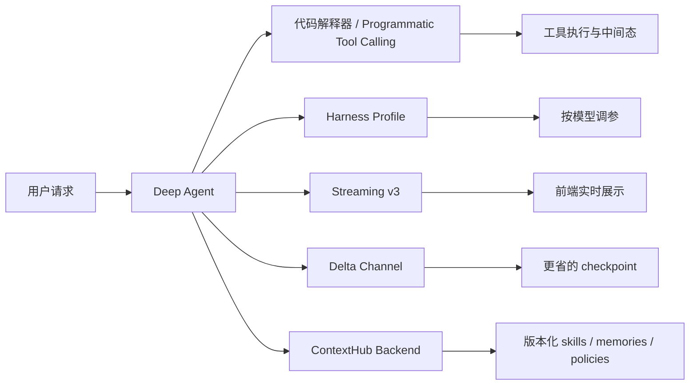
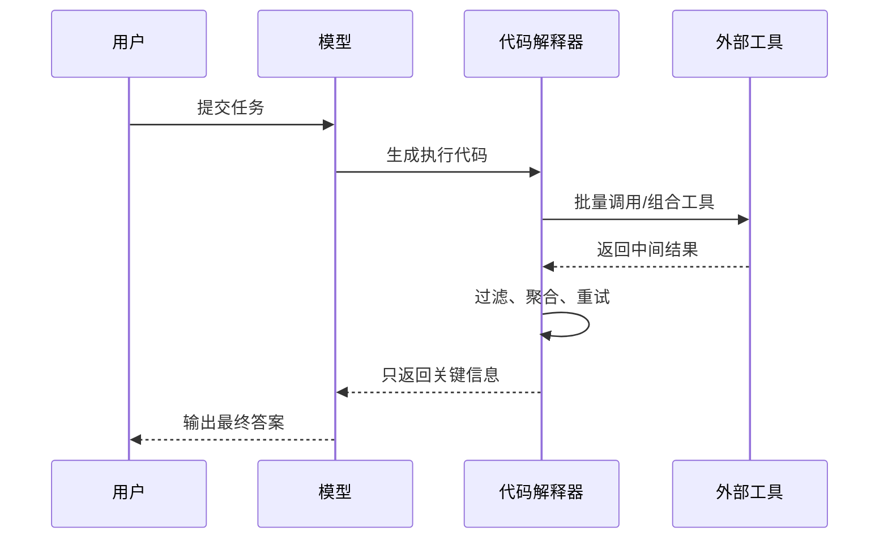
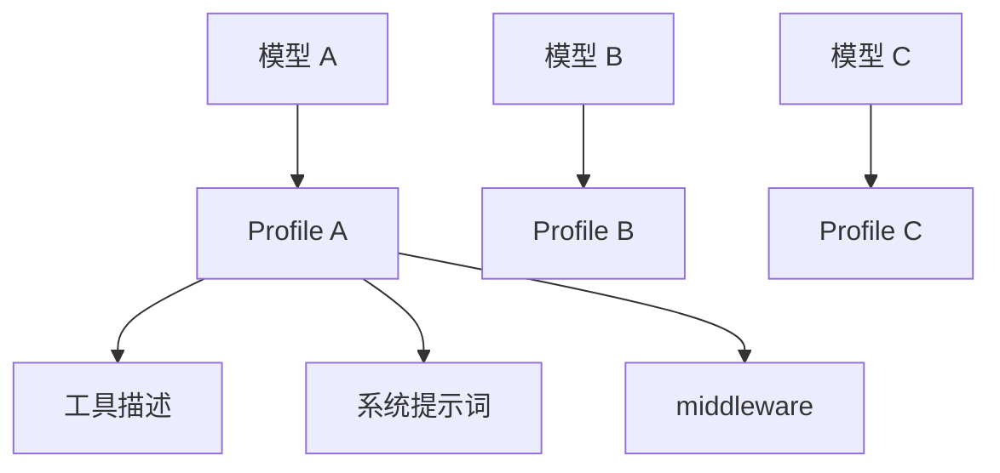
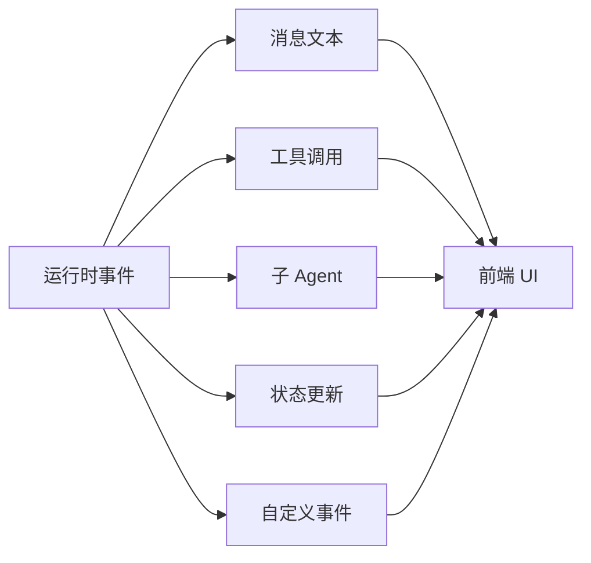
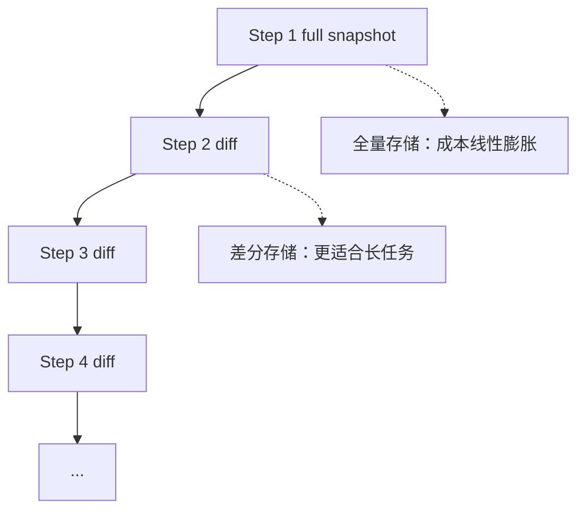
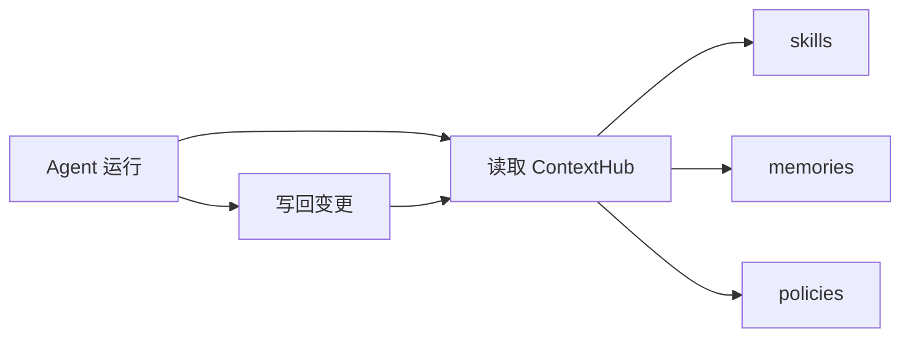

+++
date = 2026-05-17T22:05:20+08:00
draft = false
title = "LangChain Deep Agents v0.6：让 Agent 更快、更省、更稳的四个升级"
+++

LangChain 最近发布的 `Deep Agents v0.6`，不是“又加了几个 API”的那种常规更新，而是一次很明确的方向收敛：把 Agent 真正跑起来时最痛的四个问题，拆开逐个优化。

这四个问题分别是：

- 工具调用太慢，模型每一步都要来回转一次。
- 不同模型的工具风格不一样，换模型就掉性能。
- Agent 的执行过程不透明，前端很难优雅地展示。
- 长任务越跑越重，checkpoint 存储和上下文成本越来越高。

这篇文章不做新闻播报，直接把这四个升级翻译成工程语言。你会看到它们各自解决什么问题、适合放在什么架构里，以及为什么它们合在一起，才像一个真正能落地的 Agent 运行时。

## 先看总图

你可以把 `v0.6` 理解成一套“Agent 基础设施补课”：

- `代码解释器` 负责把一些中间计算留在运行时里，不必每一步都回到模型。
- `Harness profile` 负责让不同模型吃到不同的提示词、工具描述和 middleware 配方。
- `Streaming v3` 负责把运行过程变成结构化事件流。
- `Delta channel` 负责把长任务的 checkpoint 从“全量快照”改成“增量差分”。
- `ContextHubBackend` 负责把技能、记忆、策略这类上下文资产版本化。

这不是锦上添花，而是 Agent 从“能 demo”走向“能生产”的关键。

## 1. 代码解释器：把工具调用从“模型回合制”改成“运行时执行”

传统 Agent 的问题很典型：

1. 模型想调用工具。
2. 工具返回结果。
3. 结果塞回上下文。
4. 模型再决定下一步。

如果一个任务要连续调用十几个工具，这种“模型回合制”会很慢，而且中间结果会把上下文撑得很脏。

Deep Agents v0.6 里的代码解释器，思路很直接：让模型先写代码，再由运行时去执行这些工具编排逻辑。这样，很多中间结果可以留在解释器内部，不必每次都回灌给模型。

这背后的价值有三个：

- 少一次模型往返，就少一次延迟。
- 中间态不进上下文，就少一点 token 浪费。
- 解释器能做过滤、重试、聚合，就比纯 prompt 编排更稳。

原文里给了一个很有代表性的例子：模型不是一条条地请求工具，而是在解释器里写循环、并发、筛选逻辑，然后只把最终有效信息交还给模型。这类模式特别适合：

- 资料检索后再二次筛选。
- 批量工具调用后做聚合。
- 子任务递归展开、再逐层收敛。

工程上可以把它理解成：**把 Agent 的“思考”拆成模型思考和运行时思考两层**。模型负责意图和决策，运行时负责机械执行和状态管理。

## 2. Harness profiles：别让所有模型都吃同一份提示词

很多团队做 Agent 时会犯一个隐蔽错误：把 prompt、工具描述、middleware 逻辑都写死，然后指望所有模型都能跑得一样好。

现实不是这样。

不同模型对工具格式、系统提示词、输出约束的敏感度差异很大。你把一个为闭源前沿模型调好的 harness，直接丢给开源模型，效果经常会掉一截。

Deep Agents v0.6 的 `harness profile`，本质上是在说：

- 不同模型，应该有不同的 harness 配方。
- 这个配方要可版本化、可 diff、可切换。
- 模型升级时，harness 也要跟着升级，而不是从头再试一轮玄学 prompt。

这件事对生产环境很重要，因为 Agent 不是单模型玩法，而是“模型 + harness”的组合体。

如果你只盯着模型分数，不盯着 harness，常见后果就是：

- 模型换了，工具调用格式不对。
- 多轮执行时，模型总是偏离预期。
- 明明模型没换，效果却因为 prompt 微调差很多。

从实践角度看，`harness profile` 更像“模型适配层”：

- 开源模型一套 profile。
- 闭源模型一套 profile。
- 代码解释器模式再单独一套 profile。

这比“一个 prompt 统治所有模型”靠谱得多。

## 3. Streaming v3：把 Agent 的中间过程变成结构化事件

Agent 的输出不是一段纯文本，它通常包含：

- 普通回复文本。
- 工具调用。
- 子 Agent 结果。
- 状态更新。
- 自定义事件。

如果前端只拿到一串裸流文本，最后通常会写出一堆脆弱的解析器。今天这个 chunk 是文字，明天那个 chunk 是工具调用，后天又混进 reasoning block，维护成本很快失控。

`Streaming v3` 的价值就在这：把流从“字符串流”升级成“typed event stream”。

这样前端就能按需订阅：

- 只渲染文本。
- 单独展示工具调用卡片。
- 让子 Agent 的进度和主 Agent 分开显示。
- 为多模态、重连、回放留出统一协议层。

这部分的意义，不只是“更好看”，而是让 Agent 的可观测性和 UX 结构化了。

如果你要做一个真正可用的 Agent 产品，用户最讨厌的不是慢，而是“慢得不知道在干什么”。结构化流正好解决这个问题。

## 4. Delta channel：长任务不能每一步都存全量快照

Agent 跑得越久，checkpoint 越重，这是所有长任务系统都会碰到的问题。

如果每一步都把完整状态存一遍，任务一长，存储成本就会爆炸。更要命的是，这种做法还会拖慢写入和恢复。

Deep Agents v0.6 的 `delta channel`，就是把存储策略从“全量快照”切成“增量差分”。

原文给了一个很直观的实验：

- 同样是 200 轮的持续任务。
- 全量 checkpoint 会到 5.27 GB。
- Delta channel 后只剩 129 MB。

这类差异不是小优化，而是运行方式的分水岭。

如果你的 Agent 具备下面任意一种特征，就该认真看 delta channel：

- 长对话。
- 多文件编辑。
- 多轮检索和推理。
- 需要频繁恢复和回放。

它本质上是在告诉你：**长任务场景里，存储是 Agent 可靠性的一部分，不是纯运维细节。**

## 5. ContextHubBackend：把 skills、memory、policy 变成可版本化资产

最后一个升级，我认为是最容易被低估的。

很多 Agent 项目都会把知识、记忆、策略散落在：

- prompt 里。
- 配置文件里。
- 代码仓库里。
- 临时目录里。

结果就是，改一次 prompt 像在拆炸弹，谁也说不清这次优化到底影响了什么。

`ContextHubBackend` 的思路是把这些内容收束到一个版本化后端里，让 agent 行为相关的上下文变成可管理资产。

这意味着什么？

- 技能可以版本化。
- 记忆可以复用。
- 策略可以审查和回滚。
- staging 和 production 的上下文可以分离。

对做生产 Agent 的团队来说，这一步非常关键，因为它把“Agent 学到了什么”从一次性临时状态，变成了可持续演进的知识资产。

## 这版更新真正想解决什么

如果把这次 v0.6 的升级压缩成一句话，那就是：

**LangChain 试图把 Deep Agents 从“会跑”推进到“跑得像生产系统”。**

四个升级分别补的是四块短板：

- 解释器解决执行效率。
- Harness profile 解决模型适配。
- Streaming v3 解决可观测性和前端体验。
- Delta channel 解决长期运行成本。
- ContextHubBackend 解决上下文资产管理。

它们合起来，才像一套完整的 Agent 运行底座。

## 我会怎么用这套思路

如果是我做一个面向生产的 Agent 项目，我会按这个顺序落地：

1. 先把工具调用和中间态拆进运行时，减少模型回合。
2. 给每个主模型准备单独的 harness profile。
3. 用结构化 streaming 做前端。
4. 长任务一开始就考虑 delta 存储。
5. 把 skills、memory、policy 统一放到可版本化后端里。

这样做的好处是，后面你换模型、加工具、扩上下文，系统不会一夜之间变成一团 prompt 债。

## 总结

Deep Agents v0.6 不是“更大的模型”或者“更长的上下文”这种单点提升，而是一次非常工程化的补强。

它承认了一个事实：Agent 真正的瓶颈，往往不在模型本身，而在运行时、流式协议、存储、上下文治理这些基础设施层。

这也是为什么我会把这次更新看成一句话：

**Agent 的下一阶段，不是更会说，而是更会跑。**

参考资料：[LangChain Blog - New in Deep Agents v0.6](https://www.langchain.com/blog/deep-agents-0-6)
