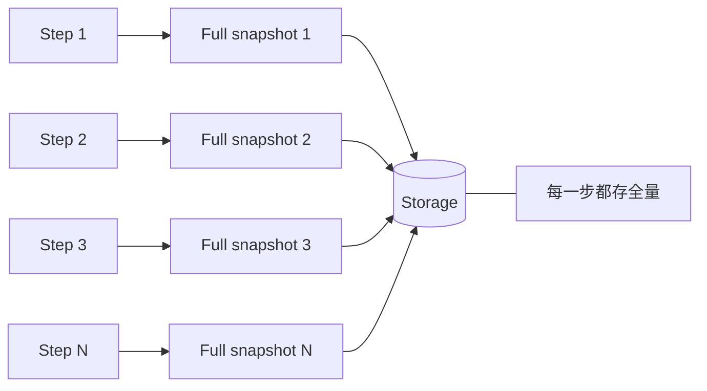
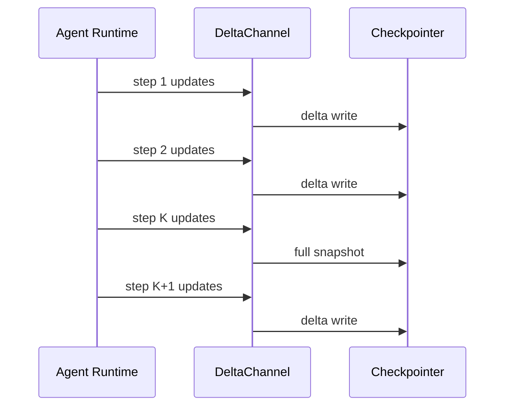
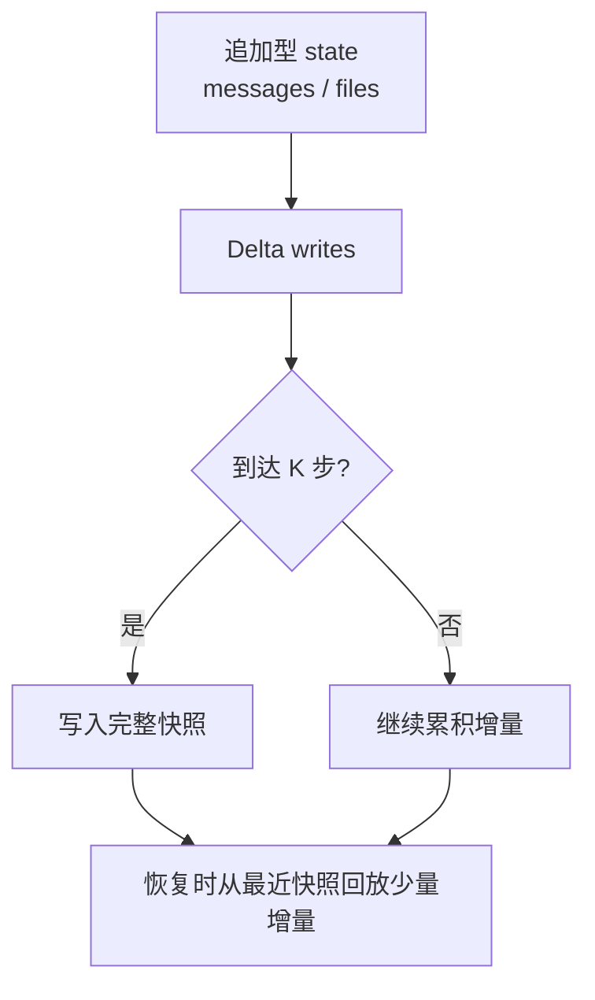

+++
date = 2026-05-19T22:03:08+08:00
draft = false
title = "LangChain Delta Channels：让长生命周期 Agent 的状态检查点从 O(N²) 变成近似线性"
+++

长生命周期 Agent 真正贵的，往往不是模型推理本身，而是“状态怎么存、怎么恢复”。  
一旦一个 Agent 跑上几十轮、几百轮，再叠加消息历史、文件上下文、人工介入和可恢复性，传统的“每一步都存全量快照”就会开始失血。

LangChain 这篇最新文章讲的就是这个问题：**Delta Channels**。  
它不是在模型层做文章，而是在运行时层把状态检查点的存储方式改成“先记增量，定期落全量快照”，把长会话下的 checkpoint 成本压下来。

这篇文章我用更直白的方式拆一遍：

- 为什么全量快照在长会话里会炸
- DeltaChannel 到底改了哪一层
- `reducer` 为什么要满足 batching-invariant
- `snapshot_frequency` 怎么影响恢复延迟和存储成本
- 这套机制为什么对 coding agent 特别有用

## 先说结论

LangGraph 早期的默认检查点模型很简单：**每一步都把完整 state 存下来**。  
对短任务没问题，但对长任务会出现两个典型问题：

1. 状态越来越大，写入越来越慢
2. 历史检查点越来越多，总存储量近似按二次增长

Delta Channels 的思路更像日志系统：

- 每一步只写本步新增的差异
- 每隔 `K` 步写一次完整快照
- 恢复时只需要回放最近一次快照之后的少量增量

结果就是：

- 存储从“越跑越贵”变成“更接近线性增长”
- 恢复延迟被 `K` 约束住，不会无限放大
- 现有线程可以直接升级，不需要数据迁移

## 问题出在哪

Deep Agents 这类系统的 state 不是一个简单对象，通常至少包含两类会持续增长的数据：

- `messages`：消息历史
- `files`：文件和上下文片段

这两类字段有一个共同点：**都是追加型的**。  
也就是说，前面步骤产生的数据不会被后面覆盖，而是会一直累积下去。

如果每一步都把整个 state 重新序列化一遍，成本会这样增长：

- 第 1 步写 1 份
- 第 2 步写 2 份
- 第 100 步写 100 份

把所有 checkpoint 加总后，总量就不再是线性，而是接近 `1 + 2 + ... + N` 这种二次级别的膨胀。



对于只跑几步的 Agent，这点开销不明显。  
但对于一个会持续工作半小时、几个小时，甚至跨多个交互轮次的 coding agent，这种增长会很快变成系统成本。

## DeltaChannel 怎么做

DeltaChannel 的关键变化就一句话：**检查点不再存“整块状态”，而是存“本步增量”**。

它的机制可以理解成两层：

- 普通步骤：只写本步新增的 delta
- 周期性步骤：每隔 `snapshot_frequency = K` 步写一次完整快照

这样做的好处很直接：

- 绝大多数步骤写入更小
- 恢复时不用从头回放所有历史，只要回到最近快照
- 写入成本和恢复成本之间可以通过 `K` 做平衡



文章里给出的 benchmark 很直观：

- 200 turn 的 coding agent 场景下，全量快照累计到约 `5.3 GB`
- Delta Channels 压到约 `129 MB`
- 也就是大约 `41x` 的减少

这不是“省一点点”的优化，而是运行时结构级别的变化。

## 这个 API 最容易踩坑的点

如果你自己定义 DeltaChannel，最重要的不是“怎么写 reducer”，而是**reducer 是否满足 batching-invariant**。

旧模型里，reducer 常常是“接收旧值和单个新值，然后合并”：

```py
def reducer(existing, update):
    return existing + update
```

DeltaChannel 的新约束更强：它会把一段时间内累积的所有 writes 一次性传给 reducer。  
所以 reducer 必须满足：

```py
reducer(reducer(state, [w1, w2]), [w3, w4]) == reducer(state, [w1, w2, w3, w4])
```

也就是说，**你不能依赖“分几次喂进来”这件事改变最终结果**。  
如果你的 reducer 不是这种性质，delta 和 full snapshot 的结果就可能分叉，而且这种 bug 往往只会在跨快照边界的长会话里出现，特别阴。

### 一个更容易理解的类比

把 reducer 想成“把一叠便签装进档案袋”的工人：

- 旧模型：每次来一张便签，就装一次
- 新模型：可能一次给你一沓便签，你要保证按一沓处理，和一张一张处理，最后归档结果一致

如果你处理顺序敏感，档案就会乱。

## `snapshot_frequency` 不是越大越好

`snapshot_frequency` 决定多久写一次完整快照。  
它其实是在做一个很现实的工程权衡：

- `K` 小：快照更频繁，恢复更快，但写入更重
- `K` 大：写入更省，但恢复时需要回放更多 delta

LangChain 在 Deep Agents 里默认用了 `50`。  
这个值不是数学常数，而是工程折中：既避免恢复过长，又把存储成本压到可接受范围。

可以把它理解成：

- 存储成本和恢复延迟，是一对跷跷板
- `snapshot_frequency` 就是调平衡的旋钮

## 为什么对 Agent 特别关键

很多人讨论 Agent 时只盯着“模型会不会推理”，但真正落地时，**长运行、可恢复、可观测、可中断**才是决定生产可用性的核心。

Delta Channels 解决的就是这条链路里的基础设施问题：

- Agent 跑久了，状态还能不能稳住
- 人工介入后，能不能无损恢复
- 文件上下文越来越多时，存储会不会爆
- 运行时开销会不会把收益吃掉

这也是为什么它对 coding agent、research agent、长任务工作流特别有价值。  
这些场景的状态不是“一个答案”，而是“一个会持续生长的工作现场”。

## 如果你要自己实现类似方案

可以把设计目标压成三条：

1. 写入路径尽量只记录增量
2. 恢复路径必须有界，不能无上限回放
3. reducer 必须保证 batch 合并前后语义一致

如果你在做自己的 Agent runtime，可以先按下面这个思路拆：

| 目标 | 设计选择 |
|---|---|
| 降低写入量 | 记录 delta，而不是每步全量快照 |
| 控制恢复成本 | 每 `K` 步写一次完整快照 |
| 保证一致性 | reducer 满足 batching-invariant |
| 平滑升级 | 兼容旧线程的存量状态 |

这套思路不只适用于 LangGraph。  
只要你的系统里存在“持续增长的追加型 state”，都可以考虑类似的 checkpoint 分层策略。

## 一个最小化理解图



这张图其实就概括了 Delta Channels 的本质：

- 平时轻量写
- 定期做校准点
- 恢复时只补最近一段历史

## 总结

Delta Channels 不是一个“更聪明的提示词技巧”，而是 Agent runtime 层的存储策略升级。  
它的价值很实际：让长生命周期 Agent 的状态检查点从二次增长，变成更接近线性、可控、可恢复的工程形态。

如果你在做的系统也有这些特征：

- 状态会持续追加
- 会话会很长
- 需要断点恢复
- 需要人工介入

那就值得认真看这种“增量检查点 + 周期快照”的设计。

参考资料：[Delta Channels: How We’re Evolving our Runtime for Long-Running Agents](https://www.langchain.com/blog/delta-channels-evolving-agent-runtime)
