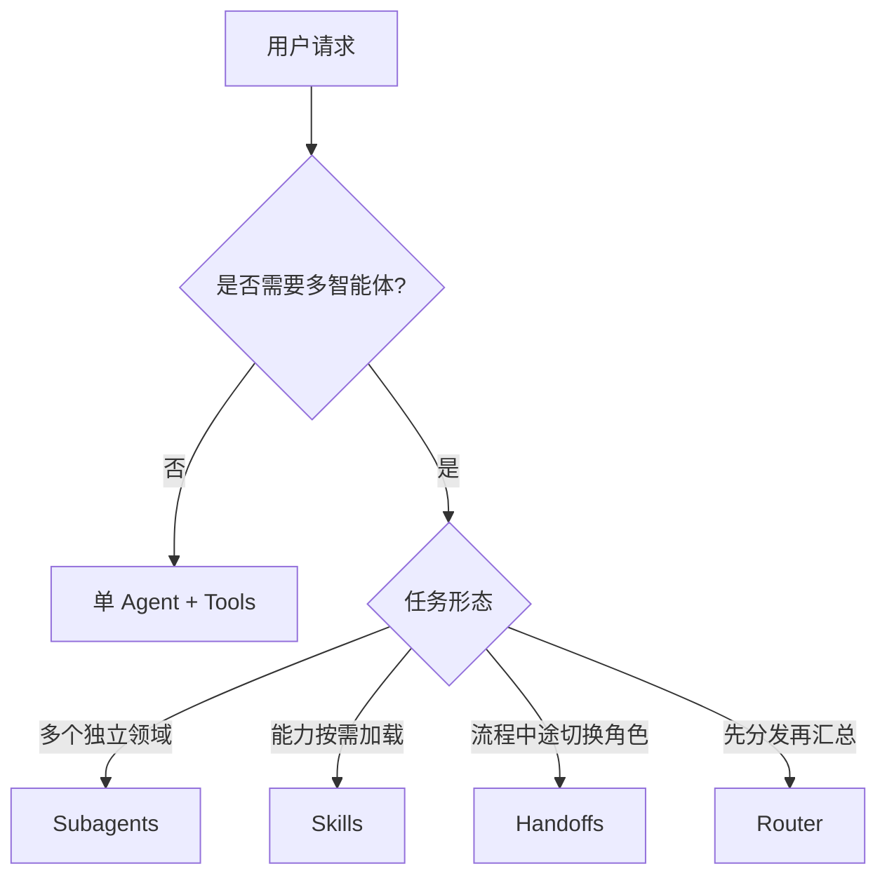
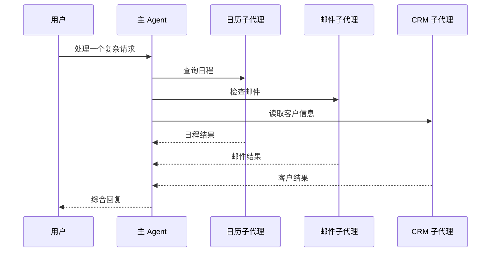
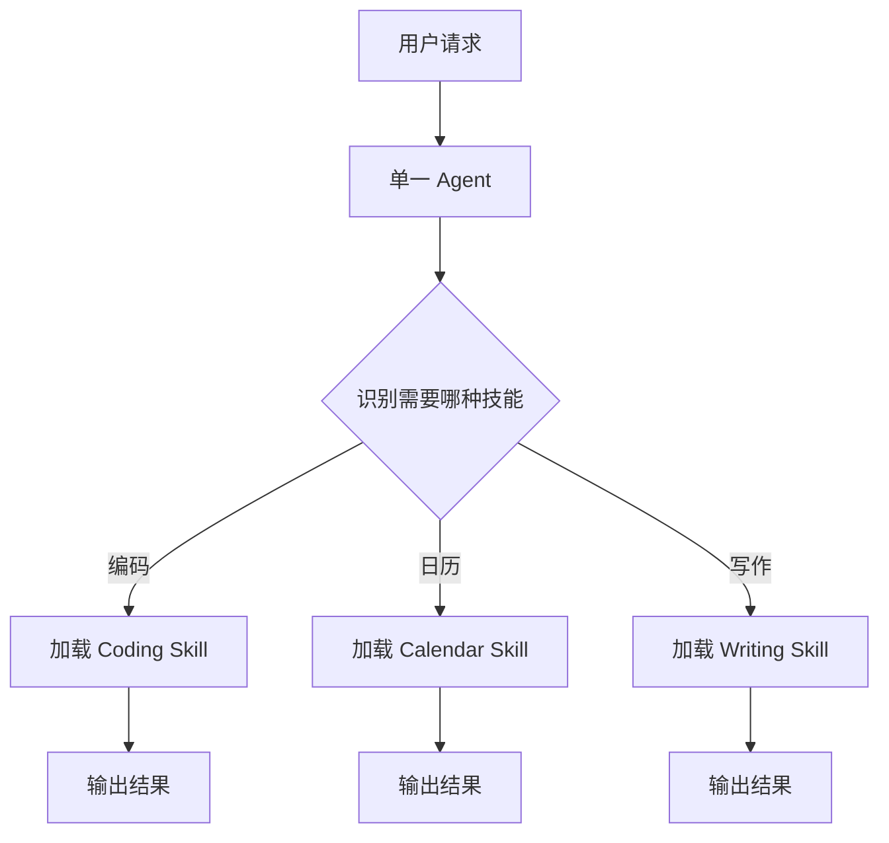
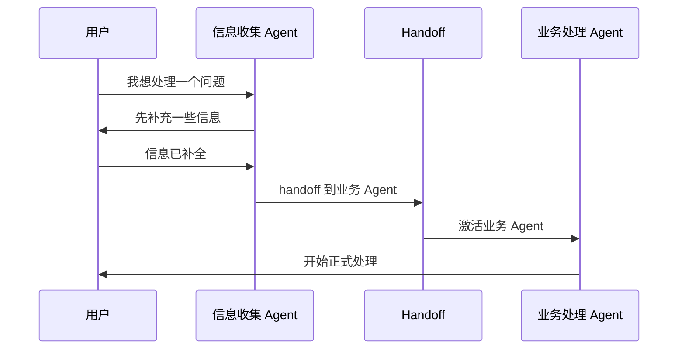
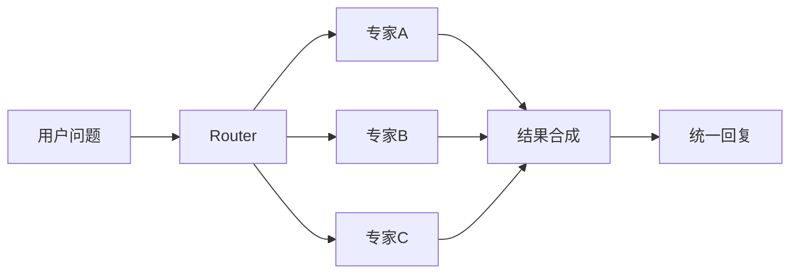
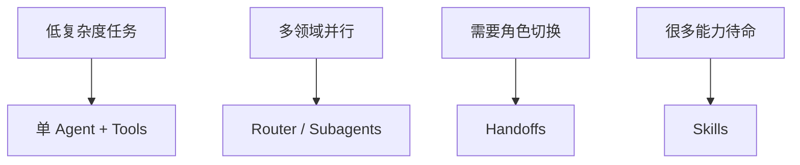

+++
title = "LangChain 多智能体架构怎么选？Subagents、Skills、Handoffs、Router 的决策框架"
date = 2026-05-16T22:02:19+08:00
draft = false
categories = ["AI Agent", "架构设计"]
tags = ["AI Agent", "LangChain", "多智能体", "架构模式", "Agent"]
+++

先说结论：**多智能体不是越多越好，关键是选对编排方式。**

LangChain 最新这篇技术文章最有价值的地方，不是它又讲了一遍“Agent 很强”，而是它把多智能体拆成了四个工程决策点：

- 你要不要把能力拆成多个独立角色
- 你要不要让能力按需加载
- 你要不要在流程中途切换主角
- 你要不要先分发，再统一汇总

换句话说，这篇文章讲的不是“怎么堆 Agent”，而是“**什么时候该用哪一种架构**”。

<!-- more -->

## 为什么这篇文章值得看

很多团队一上来就想做“多智能体系统”，结果常见问题只有三个：

1. 上下文越堆越长，模型开始忘事。
2. 工具越来越多，主 Agent 反而更容易乱。
3. 每个团队都想维护自己的能力，最后一个大 Prompt 失控。

LangChain 的判断很务实：**先单 Agent + 工具，只有碰到明显边界时，再上多智能体。**

这个边界通常来自两类压力：

- **上下文压力**：一个 Prompt 装不下所有专业知识。
- **组织压力**：不同能力由不同团队独立维护，单体 Agent 很难稳定协作。

如果你在做研究助手、企业知识系统、代码代理、客服流转，下面这四种模式基本就够用了。

## 四种模式总览

先看一张总图，后面会逐个拆。

你可以把它理解成一张工程选型图：

- **Subagents**：像总控台，主 Agent 统一调度多个子代理。
- **Skills**：像插件化能力包，按需加载。
- **Handoffs**：像接力赛，当前角色把流程交给下一个角色。
- **Router**：像分诊台，先分类，再并行派发，最后汇总结果。

## 1. Subagents：集中式编排

Subagents 是最像“传统多智能体”的模式。

主 Agent 负责思考、路由和汇总，子 Agent 只负责自己的专业工作，而且子 Agent 通常是**无状态**的。

### 它的核心价值

- 主控权集中，路由策略清晰
- 子代理彼此隔离，不容易污染上下文
- 适合并行调用多个专长模块

### 工作流长这样

### 适合什么场景

- 个人助理：日历、邮件、待办、CRM 统一调度
- 研究系统：把不同领域问题拆给不同专家
- 工程代理：代码、测试、文档、审查分工明确

### 代价是什么

Subagents 的代价很直接：**多一跳模型调用**。

因为结果要先回到主 Agent 再返回给用户，所以它会比更轻量的模式多一点延迟和 token 成本。

但换来的好处是：

- 控制更强
- 隔离更好
- 更适合复杂组织协作

### 你可以怎么理解它

一句话：**这不是“多个脑子一起想”，而是“一个总指挥调多个专员”。**

## 2. Skills：渐进式披露

Skills 其实很有意思。

它表面上是单 Agent，但行为上又很像多智能体，因为它允许主 Agent 在需要的时候加载专门的知识和指令。

你可以把它理解成：

- 平时只知道技能名
- 真正需要时，再把技能包展开
- 技能内部还能继续加载更细的资源

### 它的优势

- 结构轻量，不需要显式管理多个 Agent 实例
- 用户始终和一个主角对话
- 适合“能力很多，但不一定同时用到”的场景

### 它的工作方式

### 适合什么场景

- coding agent
- 创作助手
- 需要很多专业模式，但单次只会用到其中一种

### 关键风险

Skills 最大的问题不是“不会用”，而是**上下文会累积**。

一旦一个会话加载了多个技能，后续对话的上下文就可能越来越肥，导致 token 成本上升。

所以它更像“轻量插件系统”，而不是严格意义上的多代理编排。

### 你可以怎么理解它

一句话：**Skills 是“一个代理长出很多可按需打开的专业模块”。**

## 3. Handoffs：状态驱动交接

Handoffs 更像“流程编排”。

当前活跃 Agent 不是把任务拆出去，而是把“现在谁来负责”这件事交给系统来切换。

### 它最适合什么

- 客服或支持流程
- 多阶段表单式对话
- 需要前置条件满足后再解锁下一步能力的场景

### 它的核心特点

- 状态能跨轮次保留
- 用户对话体验自然
- 能力按阶段切换，不需要所有角色同时在线

### 流程图

### 代价是什么

Handoffs 的代价是**状态管理复杂度**。

因为流程是连续的，状态一旦设计不好，就会出现：

- 当前阶段不清楚
- 交接条件不明确
- 角色切换后忘了前面的约束

它不是最灵活的，但很适合“先收集，再处理，再确认”的线性流程。

### 你可以怎么理解它

一句话：**这不是“谁都能插一脚”，而是“当前轮到谁，就由谁负责到底”。**

## 4. Router：并行分发与合成

Router 是我觉得最容易被低估的模式。

它的逻辑是：

1. 先把问题分类
2. 再把任务并行派给对应角色
3. 最后把结果合成一份可读答案

这特别适合多垂直领域问题。

### 它的优点

- 支持并行分发
- 适合跨多个信息源的合成
- 对静态任务很高效

### 它的工作方式

### 适合什么场景

- 企业知识库问答
- 多来源信息聚合
- 横跨多个业务线的查询

### 关键代价

Router 的弱点在于：

- 如果每次都要重新路由，重复成本会增加
- 如果问题本身是强对话型场景，它不如 Handoffs 自然

所以它很适合“每次都是一次性查询”，但不一定适合长对话里反复切换角色。

### 你可以怎么理解它

一句话：**Router 是“先分诊，再会诊，再开统一结论”。**

## 怎么选：一张工程选型表

如果你不想读太多理论，就直接看这张表。

| 场景特征 | 更适合的模式 | 原因 |
|---|---|---|
| 多个独立领域，需要统一调度 | Subagents | 中央控制最清晰 |
| 能力很多，但单次只用一部分 | Skills | 轻量、按需加载 |
| 流程需要阶段性交接 | Handoffs | 状态自然延续 |
| 多来源问题，需要并行聚合 | Router | 分发和合成最直接 |

再补一条实战建议：

- **先从单 Agent 开始**
- **工具不够再加 Router**
- **需要强隔离再上 Subagents**
- **需要流转体验再上 Handoffs**
- **能力包很多、但不会同时用时，优先考虑 Skills**

## 性能上的真实差异

LangChain 这篇文章还有一个很实用的点：它不是只讲概念，还讲了不同模式在调用次数上的差别。

可以把它粗暴理解成：

- **Subagents**：控制最好，但会多一跳
- **Skills**：单次任务便宜，但上下文会膨胀
- **Handoffs**：适合重复对话，状态可以复用
- **Router**：并行派发效率高，但路由成本固定存在

### 一个简单的心智模型

### 我自己的落地经验

如果把工程风险排个序，我会这么看：

1. **最容易失控**的是把所有能力塞进一个大 Prompt
2. **最容易过度设计**的是一开始就上多智能体
3. **最稳定的起点**是单 Agent + 工具
4. **最值得升级的节点**是上下文、团队边界或并行需求开始明显出现

这也是 LangChain 这篇文章真正想传达的工程思路：

> 不是先问“我能不能做多智能体”，而是先问“我现在的约束，是否真的需要它”。

## 最后总结

这篇文章最有价值的地方，不是给了你一个“最强架构”，而是给了你一个**选型框架**。

如果你正在做 Agent 系统，建议你把这四句话记住：

- **Subagents** 适合集中式编排
- **Skills** 适合按需加载能力
- **Handoffs** 适合阶段性交接
- **Router** 适合并行分发与合成

真正成熟的 Agent 架构，不是堆更多角色，而是把角色边界划清，把状态流转理顺，把上下文控制住。

参考资料：<https://www.langchain.com/blog/choosing-the-right-multi-agent-architecture>
