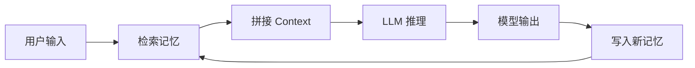
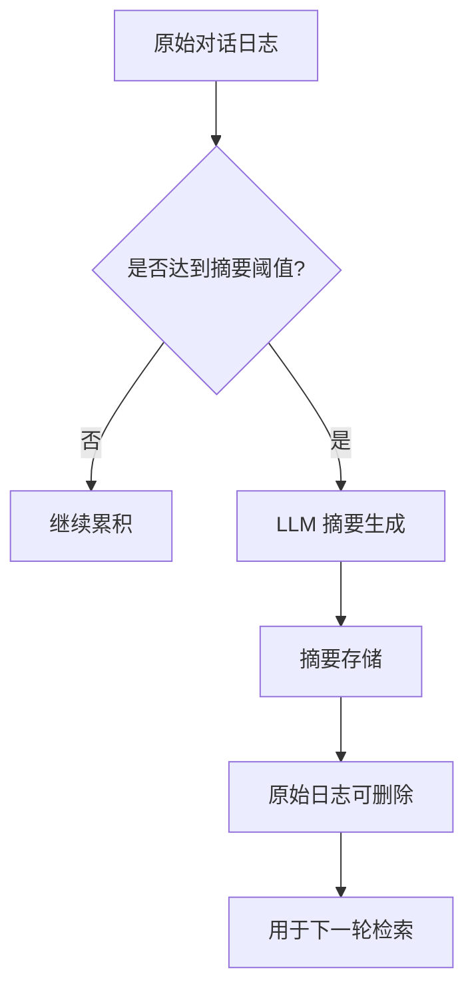
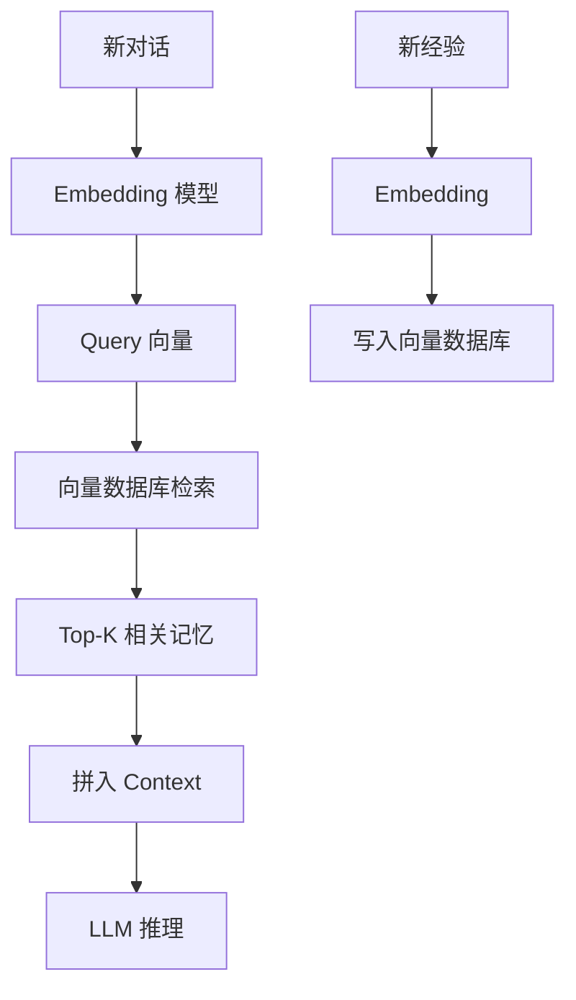
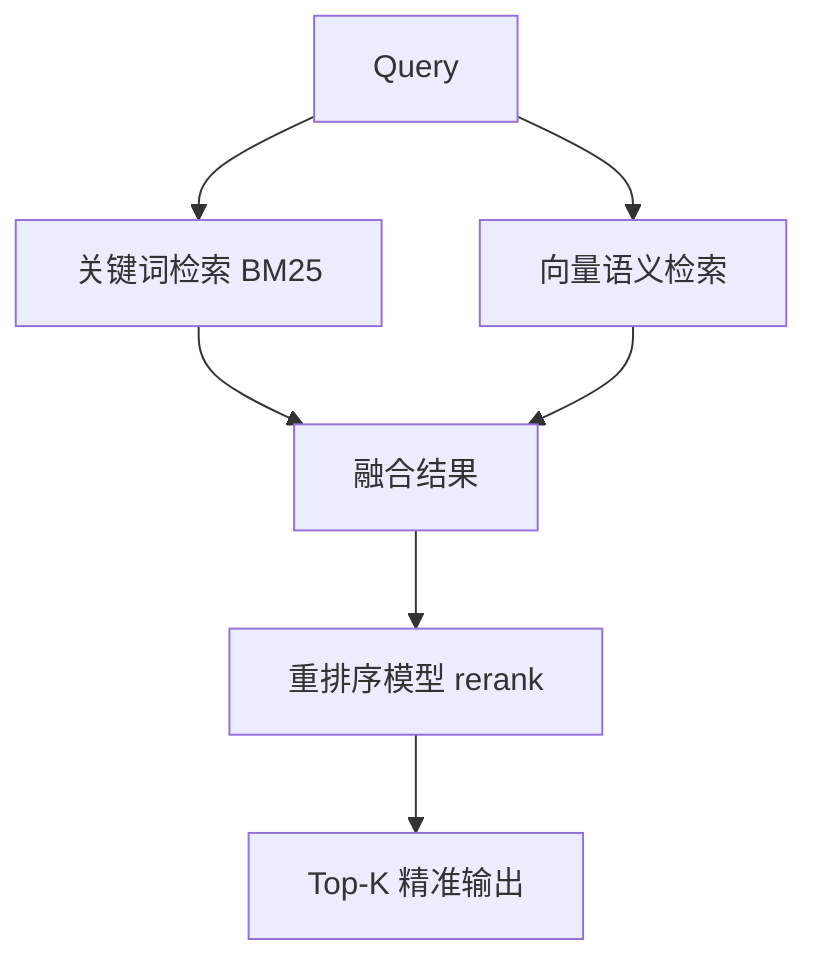

+++
date = '2026-05-05T21:08:51+08:00'
draft = false
title = 'LLM Agent 记忆系统设计指南：让AI拥有"记忆"的技术原理与实战'
mermaid = true
+++

## 痛点：为什么你的AI Agent总是"失忆"？

用过 AI Agent 的同学一定遇到过这种情况：

> 上一轮对话你告诉它「我的项目叫 XXX」，下一轮它就忘了。
>
> 你让它先查文件、再写代码、再测试，它全做完了，但最后问你「测试结果是什么」时，它一脸茫然——因为它不记得自己刚才做了什么。

这不是 Bug，这是**记忆缺失**。

大模型（LLM）本身是**无状态的**（Stateless）：每一次 API 调用都是独立的，模型不会「记住」之前发生的事。

那么问题来了——**如何让 AI Agent 拥有记忆？**

今天我们从原理到实现，系统性地拆解 LLM Agent 的记忆系统设计。

---

## 一、记忆系统的本质：让模型「看到」历史

先厘清一个核心概念：所谓 AI Agent 的「记忆」，本质上就是**把历史上下文塞进下一轮 Prompt 里**。

模型自己没有记忆，我们要做的是：



整个流程闭环：**检索 → 拼接 → 推理 → 写入 → 下一轮检索**。

所以记忆系统的核心模块只有三个：

1. **记忆存储**（Memory Storage）—— 记忆怎么存？
2. **记忆检索**（Memory Retrieval）—— 需要用时怎么找？
3. **记忆写入**（Memory Write）—— 新信息怎么记录？

---

## 二、记忆存储：三种主流方案

### 2.1 方案一：全量上下文（Full Context）

最暴力的方案——把历史对话全部塞进 Context Window。

```python
messages = [
    {"role": "system", "content": "你是助手"},
    {"role": "user", "content": "第一轮对话"},
    {"role": "assistant", "content": "第一轮回复"},
    {"role": "user", "content": "第二轮对话"},
    # ... 所有历史
]
response = chat(messages)
```

**优点**：实现简单，零额外逻辑
**缺点**：Context 长度有限（4K~128K），对话一长就爆；每次调用都重复发送历史，成本线性增长

**适用场景**：短期单轮对话、演示 Demo

### 2.2 方案二：摘要式记忆（Summarized Memory）

对话过程中定期对历史做摘要，保留「要点」丢弃「细节」：



```python
def summarize_if_needed(conversation_history: list, threshold: int = 10):
    if len(conversation_history) >= threshold:
        summary_prompt = f"""请摘要以下对话的核心要点，保留关键信息：
        {conversation_history}"""
        summary = llm.chat([{"role": "user", "content": summary_prompt}])
        return {"summary": summary, "original_count": len(conversation_history)}
    return None
```

**优点**：控制 Context 长度，适合长对话
**缺点**：摘要损失信息；摘要本身也消耗 Token；摘要时机难以把握

**适用场景**：长程对话（客服、长文档分析）

### 2.3 方案三：向量数据库 + RAG（推荐方案）

这是目前最主流的 Agent 记忆架构——用向量数据库做语义检索：



**核心流程**：

1. **写入时**：对话内容 → Embedding → 向量存储
2. **读取时**：当前问题 → Embedding → 相似度搜索 → Top-K 召回 → 拼入 Prompt

```python
from langchain.vectorstores import Chroma
from langchain.embeddings import OpenAIEmbeddings

# 写入记忆
def write_memory(text: str, vectorstore: Chroma):
    vectorstore.add_texts([text])

# 检索记忆
def retrieve_memory(query: str, vectorstore: Chroma, k: int = 5) -> list[str]:
    docs = vectorstore.similarity_search(query, k=k)
    return [doc.page_content for doc in docs]
```

**优点**：语义检索准确、可扩展、支持多种向量数据库
**缺点**：引入额外组件（Milvus/Chroma/Pinecone）；检索质量依赖 Embedding 模型

**适用场景**：生产级 Agent、需要长期记忆的场景

---

## 三、记忆分层架构：MOS Memory Architecture

一个完善的 Agent 记忆系统通常采用**三层记忆结构**：

```mermaid
graph TD
    subgraph 注意力记忆 "Attention Memory（最近对话）"
        A1["当前 Session\n最近 5-10 轮"] 
    end
    
    subgraph 语义记忆 "Semantic Memory（核心知识）"
        B1["向量数据库\n长期存储"]
        B2["RAG 检索"]
    end
    
    subgraph 程序记忆 "Procedural Memory（系统配置）"
        C1["AGENTS.md"]
        C2["SKILL.md"]
        C3["工具定义"]
    end
    
    A1 --> D["Context 组装"]
    B2 --> D
    C1 --> D
    C2 --> D
    C3 --> D
    D --> E["LLM 推理"]
```

### 3.1 注意力记忆（Attention Memory）

**定义**：当前对话窗口内、模型直接「能看到」的内容

通常保留**最近 N 轮对话**或**最近 M Token**，实现最简单：

```python
class AttentionMemory:
    def __init__(self, max_turns: int = 10):
        self.messages: list[dict] = []
        self.max_turns = max_turns
    
    def add(self, role: str, content: str):
        self.messages.append({"role": role, "content": content})
        # 超过阈值，删除最早的回合
        if len(self.messages) > self.max_turns * 2:
            self.messages = self.messages[2:]
    
    def get_context(self) -> list[dict]:
        return self.messages
```

### 3.2 语义记忆（Semantic Memory）

**定义**：长期存储的核心知识，通过向量检索召回

通常按**记忆类型**分类存储：

| 记忆类型 | 说明 | 召回场景 |
|---------|------|---------|
| `user_profile` | 用户基本信息、偏好 | 个性化回复 |
| `project_context` | 当前项目/任务背景 | 技术决策、代码风格 |
| `conversation_summary` | 对话摘要 | 长程任务状态恢复 |
| `tool_output` | 工具执行结果缓存 | 避免重复调用 |

```python
class SemanticMemory:
    def __init__(self, vectorstore: Chroma):
        self.store = vectorstore
        self.metadata_filter = {}  # 可按 type 过滤
    
    def write(self, text: str, memory_type: str, session_id: str):
        self.store.add_texts(
            texts=[text],
            metadatas=[{"type": memory_type, "session_id": session_id}]
        )
    
    def retrieve(self, query: str, memory_types: list[str] | None = None, k: int = 5) -> list[dict]:
        return self.store.similarity_search_with_score(
            query, k=k, filter={"type": {"$in": memory_types}} if memory_types else None
        )
```

### 3.3 程序记忆（Procedural Memory）

**定义**：Agent 的「本能」——系统Prompt、工具定义、工作流配置

这部分**不需要检索**，直接写入 System Prompt：

```python
SYSTEM_PROMPT = """你是一个专业的 AI 编程助手。

## 系统能力
- 可以使用 Read/Edit/Write 工具操作本地文件
- 可以使用 Exec 工具执行 Shell 命令
- 可以使用 Browser 工具控制浏览器

## 工作流程
当用户提出需求时，你应该：
1. 理解需求并拆解任务步骤
2. 按步骤执行，及时反馈进度
3. 完成后总结做了什么、结果是什么

## 约束
- 不要执行删除、格式化等危险操作
- 遇到错误先分析原因，再尝试修复
"""
```

---

## 四、记忆检索策略：不是召回越多越好

### 4.1 基础相似度检索的问题

naive 的向量检索有两个典型问题：

**问题1：召回「多」但不「准」**

比如问「上次那个Python项目的测试怎么跑」，检索可能召回一堆关于「Python」和「测试」的内容，但具体是哪个项目、哪个测试文件，模型还是分不清。

**问题2：召回内容「打架」**

不同记忆片段对同一件事的说法不一致，模型不知道该信哪个。

### 4.2 解决方案：混合检索 + 重排序



```python
from langchain.retrievers import EnsembleRetriever

# 混合检索
retriever = EnsembleRetriever(
    retrievers=[
        bm25_retriever,  # 关键词
        vectorstore.as_retriever(search_kwargs={"k": 10})  # 向量
    ],
    weights=[0.3, 0.7]  # 权重分配
)
results = retriever.get_relevant_documents(query)
```

### 4.3 Context 压缩：让每条记忆更「精」

检索回来的记忆可能很长，直接塞 Context 会浪费 Token。用「Context 压缩器」精简每条记忆：

```python
from langchain.compressors import LLMChainExtractor

compressor = LLMChainExtractor.from_llm(llm)

from langchain.retrievers import ContextualCompressionRetriever
compression_retriever = ContextualCompressionRetriever(
    base_compressor=compressor,
    base_retriever=retriever
)
# 返回的是压缩后的精简片段
compressed_docs = compression_retriever.get_relevant_documents(query)
```

---

## 五、记忆写入时机：什么时候该「记」？

### 5.1 被动写入 vs 主动写入

| 类型 | 触发方式 | 示例 |
|------|---------|------|
| 被动写入 | 对话轮次达到阈值 | 每 10 轮对话后写入摘要 |
| 被动写入 | Session 结束时 | 对话关闭前统一摘要 |
| 主动写入 | 关键操作完成后 | 「已创建文件 `/src/main.py`」 |
| 主动写入 | 用户明确告知 | 「记住，我的名字叫张三」 |
| 主动写入 | 检测到重要实体 | 「识别到项目名 `code-minions`」 |

### 5.2 主动写入的触发规则

一个实用的规则引擎：

```python
class MemoryWritePolicy:
    def should_write(self, message: dict, context: dict) -> bool:
        content = message["content"]
        
        # 规则1：用户明确声明
        if re.match(r"记住，.*", content):
            return True
        
        # 规则2：执行了外部操作
        if message.get("role") == "system" and "tool_output" in content:
            return True
        
        # 规则3：识别到关键实体（项目名、人名、技术栈）
        entities = extract_entities(content)  # 用 NER 或规则
        if len(entities) > 2:
            return True
        
        # 规则4：对话涉及长期项目上下文
        if context.get("task_type") == "project_work":
            return True
        
        return False
```

---

## 六、实战：实现一个简易记忆系统

完整代码示例：

```python
from langchain.llms import OpenAI
from langchain.vectorstores import Chroma
from langchain.embeddings import OpenAIEmbeddings
from langchain.memory import ConversationBufferMemory
from langchain.agents import AgentExecutor, ZeroShotAgent
from langchain.prompts import PromptTemplate

class SimpleAgentMemory:
    def __init__(self, llm, vectorstore_path: str = "./memory_db"):
        self.llm = llm
        self.embeddings = OpenAIEmbeddings()
        self.vectorstore = Chroma(
            persist_directory=vectorstore_path,
            embedding_function=self.embeddings
        )
        # 注意力记忆：最近 10 轮
        self.attention = ConversationBufferMemory(memory_key="chat_history", k=10)
    
    def retrieve(self, query: str, k: int = 5) -> str:
        """从向量数据库检索相关记忆"""
        docs = self.vectorstore.similarity_search(query, k=k)
        return "\n".join([f"- {d.page_content}" for d in docs])
    
    def write(self, text: str, memory_type: str = "general"):
        """写入记忆到向量数据库"""
        self.vectorstore.add_texts(
            texts=[text],
            metadatas=[{"type": memory_type}]
        )
        self.vectorstore.persist()
    
    def chat(self, user_input: str) -> str:
        # Step 1: 检索相关记忆
        relevant_memory = self.retrieve(user_input)
        
        # Step 2: 构建 Prompt（注意力记忆 + 语义记忆）
        attention_context = self.attention.load_memory_variables({})["chat_history"]
        
        prompt = f"""你是 AI 助手。以下是相关记忆：
{relevant_memory}

当前对话历史：
{attention_context}

用户：{user_input}
助手："""
        
        # Step 3: LLM 推理
        response = self.llm(prompt)
        
        # Step 4: 更新注意力记忆
        self.attention.save_context(
            {"input": user_input},
            {"output": response}
        )
        
        # Step 5: 关键内容写入语义记忆
        if self._is_important(user_input) or self._is_important(response):
            self.write(f"用户问：{user_input}\n助手答：{response}")
        
        return response
    
    def _is_important(self, text: str) -> bool:
        # 简单规则：包含项目名、技术决策、用户偏好等
        keywords = ["项目", "记住", "偏好", "配置", "名字", "我的"]
        return any(kw in text for kw in keywords)

# 使用
memory = SimpleAgentMemory(llm=OpenAI(temperature=0))
response = memory.chat("我叫张三，在做一个叫code-minions的项目")
print(response)
```

---

## 七、生产级注意事项

### 7.1 记忆存储的分桶策略

不要把所有记忆存在一个 collection 里，按**会话**和**主题**分桶：

```python
# 索引结构设计
collection_name = f"{user_id}_{topic}_{session_id}"
# 例如：user123_code-minions_session-001
```

### 7.2 记忆的 TTL（过期策略）

| 记忆类型 | TTL | 说明 |
|---------|-----|------|
| 用户偏好 | 30天 | 长期有效，定期确认 |
| 项目上下文 | Session级 | 项目结束后可删除 |
| 对话摘要 | 7天 | 定期清理过时的摘要 |
| 工具输出 | 24小时 | 及时清理陈旧状态 |

### 7.3 记忆一致性

多 Agent 共享记忆时，要处理并发写入和版本冲突：

```python
# 乐观锁写入
def write_with_version(vectorstore, text, expected_version):
    current = vectorstore.get_version()
    if current != expected_version:
        raise MemoryConflictError("记忆已被其他 Agent 修改")
    vectorstore.add_texts([text])
    vectorstore.set_version(current + 1)
```

---

## 八、总结

LLM Agent 的记忆系统设计，本质上是三个问题：

1. **存什么** → 分层记忆（注意力/语义/程序）
2. **怎么存** → 向量数据库 + 元数据分类
3. **怎么用** → 混合检索 + 重排序 + Context 压缩

一个好的记忆系统，能让 Agent 从「每轮都失忆的金鱼」，变成「理解上下文的专业助手」。

核心实践经验：

- **向量检索是基础**，但纯相似度召回不够用，必须配合混合检索和重排序
- **记忆写入要克制**，不是所有对话都需要记住，避免向量数据库膨胀
- **分层设计是关键**，注意力记忆管短期，向量数据库管长期，System Prompt 管本能
- **遗忘也是一种智慧**，定期清理过时记忆，让 Agent 保持「清醒」

---

## 延伸阅读

- [LangChain Memory Documentation](https://docs.langchain.com/docs/memory/)
- [Lilian Weng - LLM Agent Memory](https://lilianweng.github.io/posts/2024-07-07-hybrid-agent/)
- [Pinecone - Vector Database for AI](https://www.pinecone.io/)

---

> 原文引用：[Lilian Weng - LLM Agent Memory Architecture](https://lilianweng.github.io/posts/2024-07-07-hybrid-agent/)  
> 欢迎关注收藏我，获取更多硬核技术干货！
