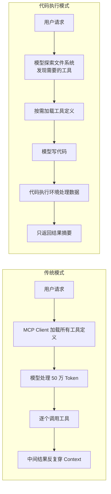
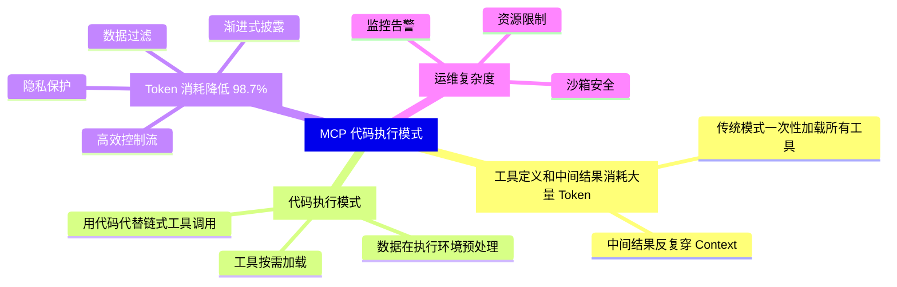

+++
title = "MCP + 代码执行：让 AI Agent 节省 98.7% Token 的秘密"
date = 2026-05-06T22:00:00+08:00
draft = false
description = "深入解析 Anthropic 最新博文：如何通过代码执行模式与 MCP 协议结合，让 AI Agent 在处理大量工具时将 Token 消耗降低 98.7%。"
categories = ["AI Agent", "MCP", "架构设计"]
tags = ["AI Agent", "MCP", "Claude", "Anthropic", "代码执行", "Token 优化"]
slug = "mcp-code-execution-agents"
+++

## 开门见山

聊个硬核的。

最近在看 Anthropic 工程师博客的一篇新文章，讲的是**如何用代码执行模式让 MCP 协议的 Agent 效率爆炸提升**——具体数字是：Token 消耗降低 **98.7%**。

这个数字是怎么来的？背后的原理是什么？老哥给你拆干净。

---

## 背景：MCP 是个好协议，但有个坑

MCP（Model Context Protocol）是 Anthropic 主导的开放标准，定位是 AI Agent 连接外部工具和数据的「USB-C」——一套协议搞定所有集成，不用每次都写定制代码。

自 2024 年 11 月推出以来，社区已经建了数千个 MCP Server，SDK 覆盖所有主流语言，业界基本把它当成 Agent 连接工具的实施标准。

但问题来了：**当工具数量爆炸时，传统模式会吃掉大量 Token。**

### 问题一：工具定义塞满 Context Window

大多数 MCP Client 会把所有工具定义一次性加载到 Context 里：

```typescript
// 传统模式：一次性加载所有工具定义
const tools = await mcp.listTools();
// 1000 个工具 × 平均每个工具定义 500 Token = 50万 Token！
```

假设你有 1000 个工具，光加载定义就要处理几十万 Token，模型还没开始干活就已经「累」了。

### 问题二：中间结果反复穿 Context

举个例子：用户说「把我 Google Drive 里的会议记录下载下来，附到 Salesforce 线索上」。

模型会这样调用：

```
1. getDocument() → 返回 2 小时会议记录（50,000 Token）
2. updateRecord() → 把记录附到 Salesforce
```

这个 50,000 Token 的中间结果**要穿过 Context两次**——一次传入，一次传回。对于更大文档甚至可能直接撑爆 Context 限制。

---

## 解决方案：代码执行模式

核心思路很简单：**把 MCP Server 暴露成代码 API，而不是直接的工具调用**。

 Agent 不再是「我要用 getDocument 工具」，而是「我来写一段代码操作 MCP Server」。

### 工作原理图解



### 实际代码长这样

**工具以文件形式呈现：**

```typescript
// 文件系统结构
./servers/
├── google-drive/
│   ├── getDocument.ts      # 获取文档
│   └── listFiles.ts        # 列出文件
└── salesforce/
    ├── updateRecord.ts     # 更新记录
    └── queryLeads.ts       # 查询线索

// 每个工具对应一个文件
// agent 可以像探索代码库一样探索工具
```

**Agent 的工作流程：**

```typescript
// 1. Agent 先探索可用服务器
const servers = await listDir('./servers');
// ['google-drive', 'salesforce']

// 2. 按需读取需要的工具
const getDocTool = await readFile('./servers/google-drive/getDocument.ts');
const updateRecTool = await readFile('./servers/salesforce/updateRecord.ts');

// 3. 模型写代码（而不是调用工具）
const code = `
const doc = await googleDrive.getDocument({ id: 'mtg-123' });
const short = doc.content.slice(0, 500);  // 数据在执行环境里预处理
await salesforce.updateRecord({ 
  object: 'Lead', 
  id: '00Q5i00000XYZ', 
  notes: short 
});
`;

// 4. 执行，结果回流
```

### 98.7% Token 节省怎么算的？

以「Google Drive 下载文档附到 Salesforce」为例：

| 模式 | Token 消耗 |
|------|-----------|
| 传统模式（全部工具定义 + 完整中间结果） | ~150,000 |
| 代码执行模式（按需加载 + 摘要回流） | ~2,000 |
| **节省** | **98.7%** |

---

## 代码执行模式的四大好处

### 1. 渐进式披露（Progressive Disclosure）

模型擅长探索文件系统。把工具定义按需加载，Agent 可以像探索代码库一样发现和加载需要的工具，而不是一口气读完几千个工具的说明文档。

```typescript
// 给工具加搜索能力
const searchTools = await search_tools({ 
  query: 'salesforce', 
  detail_level: 'name_and_description'  // 只加载必要的
});
```

### 2. 数据过滤在执行环境完成

对于大数据集，Agent 可以在代码里预处理，不用把原始数据扔给模型：

```typescript
// 假设要处理 10,000 行的表格
const summary = await spreadsheet.getData({ id: 'xxx' });
// 在代码里先聚合
const top5 = summary.rows
  .sort((a, b) => b.value - a.value)
  .slice(0, 5);
// 模型只看到 5 行，而不是 10,000 行
```

### 3. 控制流更高效

循环、条件判断、错误处理都可以用熟悉的代码模式，而不是把一堆 `sleep` 和工具调用串成一条长链：

```typescript
// 比反复调用 MCP 工具 + 等待高效得多
const results = await Promise.all(
  services.map(s => s.healthCheck())
);
const failed = results.filter(r => !r.ok);
if (failed.length > 0) {
  await slack.notify({
    channel: '#deployments',
    message: `Failed: ${failed.map(s => s.name).join(', ')}`
  });
}
```

### 4. 隐私保护

中间结果默认留在执行环境里，只有明确 `log` 或 `return` 的数据才会进入模型 Context。

更进一步的，对于敏感数据（身份证号、手机号），可以在执行环境里自动 Tokenize：

```typescript
// MCP Client 拦截敏感数据
const tokenized = await mcp.importContacts({
  source: 'google-sheets',
  contacts: rawData,  // 真实邮箱、手机号在这里
  pii_policy: 'tokenize'  // 自动替换成占位符
});
// 模型只看到 [EMAIL_1], [PHONE_1]
// 真实数据直接从 Google Sheets 流到 Salesforce，不经过模型
```

---

## 代码即 Skills

执行环境带文件系统访问，Agent 可以把中间结果写文件、跨任务保持状态：

```typescript
// Agent 写中间进度
await writeFile('./progress/summarize-01.txt', summary);

// 下次任务开始时读取，继续工作
const progress = await readFile('./progress/summarize-01.txt');
```

更进一步，Agent 可以把成功的代码保存为可复用函数，逐渐积累出高层次的工具箱：

```typescript
// Agent 发现一种高效的写法
const skill = `
/**
 * @skill analyze-sales-data
 * 用于分析销售数据并生成洞察报告
 */
async function analyzeSalesData(spreadsheetId: string) {
  const data = await spreadsheet.getData({ id: spreadsheetId });
  // ... 分析逻辑
  return generateReport(data);
}
`;

// 写回文件系统，下次遇到类似任务直接加载
await writeFile('./skills/analyze-sales-data.ts', skill);
```

---

## 代价：引入的复杂度

说了这么多好处，也要客观提一下代价。

代码执行引入了自己的复杂度：

- 需要**安全的沙箱执行环境**
- 需要**资源限制**和**监控**
- 需要处理 Agent 生成代码的**超时和错误**

这些基础设施要求增加了运维开销和安全考虑，直接用工具调用反而没有这些烦恼。

**所以结论是：收益要权衡成本。** 如果你的 Agent 只连三五个工具，传统模式就够了；如果要连几十上百个工具，代码执行模式的效率提升值得投入。

---

## 总结



**核心洞察**：很多 Agent 领域的问题——Context 管理、工具组合、状态持久化——在传统软件工程里早就有了成熟解法。代码执行就是把这些成熟模式应用到 Agent 系统，让 Agent 用熟悉的编程构造来更高效地操作 MCP Server。

---

欢迎关注收藏我，获取更多硬核技术干货 🐱

---

**参考资料：**

- [Code execution with MCP - Anthropic Engineering](https://www.anthropic.com/engineering/code-execution-with-mcp)
