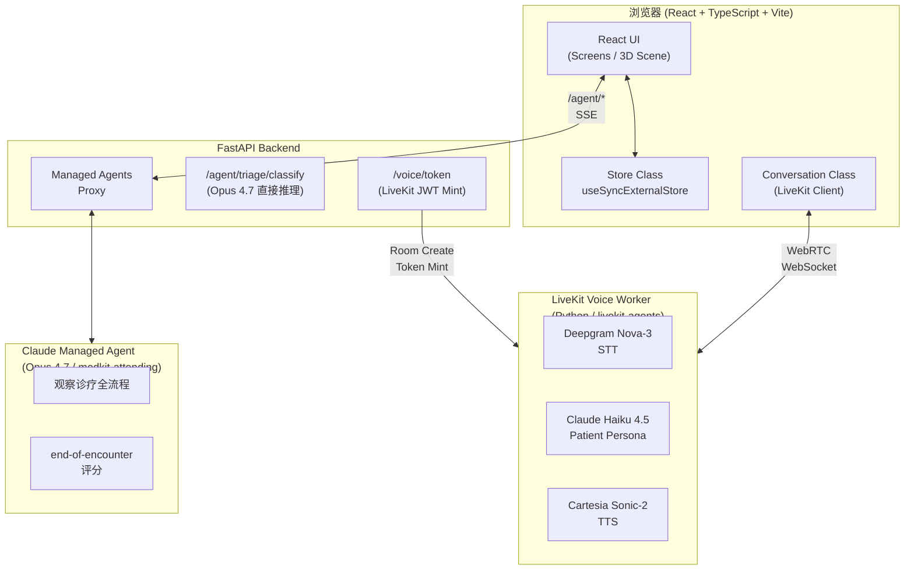
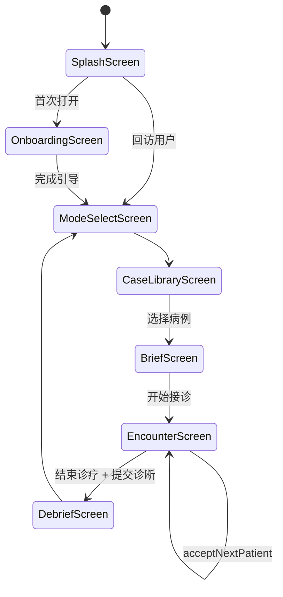
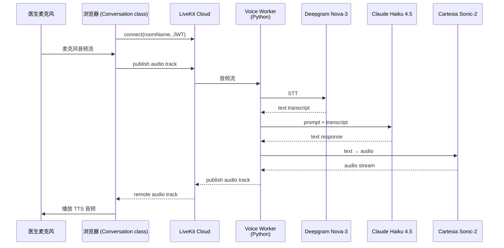
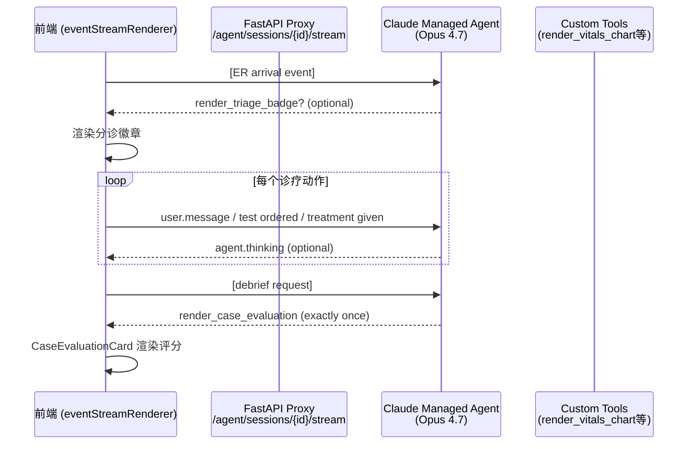
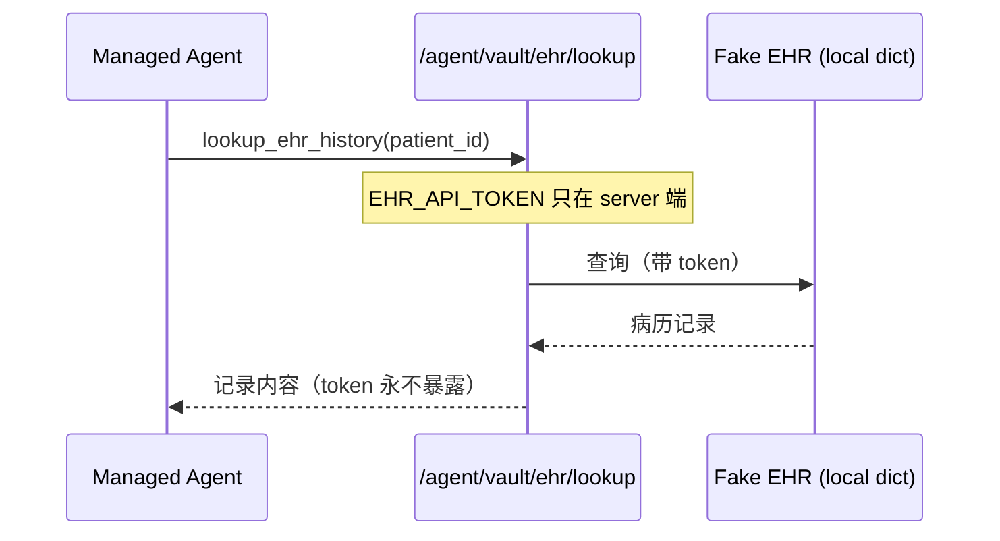

+++
title = "3天Hackathon打造AI陪练诊所：medkit技术架构全解析"
date = 2026-05-07T22:00:00+08:00
draft = false
type = "posts"
+++

# 3天Hackathon打造AI陪练诊所：medkit技术架构全解析

**你扮演医生，Claude Opus 4.7 扮演你的上级——这是一个能实时观察你诊疗决策、打分、给出临床指南引用的全科训练模拟器。**

---

## 背景：用一个周末做一件疯狂的事

medkit 起源于 Opus 4.7 Hackathon。一个由医转软的工程师（@bedriyan），用 **3天时间** 把一个「浏览器里的全科/急诊训练模拟器」从想法变成了可以跑起来的完整项目。

核心玩法很简单：**你扮演医生，新患者不断到达分诊台，你实时语音问诊、开检查、下诊断、开药，最后由一位上级医生（Claude Opus 4.7）给你打分。**

这个上级医生不是静态的——他会引用真实的临床指南（NICE、ESC、AHA、GINA、GOLD），会在你遗漏关键信息时保持沉默，在你提交诊断后给你一份详细的 OSCE 风格 debrief 报告。

整个系统的技术实现涉及：
- 实时语音对话（WebRTC + Deepgram + Cartesia）
- AI 患者人格（Haiku 4.5 驱动）
- AI 上级评分（Opus 4.7 Managed Agent）
- React + Three.js 3D 诊所场景
- 一个极简的状态管理层（不用 Redux/Zustand）

本文深入解析这套系统的核心架构。

---

## 系统全景



**数据流向：**

- 语音：医生麦克风 → LiveKit → Deepgram STT → Haiku 4.5（患者人格） → Cartesia TTS → 医生扬声器
- 评分：诊疗事件（问诊/检查/用药） → Managed Agent 事件流 → 前端渲染评分工具 → DebriefScreen
- JWT 鉴权：前端 → `/voice/token` → LiveKit Cloud 创建 Room → 返回 JWT

---

## 核心一：极简状态管理 — 一个 Store class 走天下

medkit 没有用 Redux，没有用 Zustand，甚至没有用 Context 做全局状态。

它的状态管理核心是一个**单例 Store 类**，利用 React 官方提供的 `useSyncExternalStore` hook 接入 React 渲染流程。

```typescript
// src/game/store.ts
class Store {
  private state: GameState = {
    screen: 'splash',
    tweaks: { palette: 'sunshine', avatarStyle: 'portrait', intensity: 2, roomLayout: 'side' },
    onboardingStep: 0,
    endConfirm: { sum: false, safe: false, ice: false },
    selectedCaseId: 'im-001',
    hasOnboarded: readOnboarded(),
    polyclinic: { clinic: DEFAULT_CLINIC, patient: null },
    lastEncounter: null,
    viewedEvalHistoryId: null,
  };

  private listeners = new Set<() => void>();

  getState = (): GameState => this.state;

  subscribe = (l: () => void): (() => void) => {
    this.listeners.add(l);
    return () => this.listeners.delete(l);
  };

  private set(next: Partial<GameState>) {
    this.state = { ...this.state, ...next };
    for (const l of this.listeners) l();
  }

  // ── navigation ────────────────────────────────
  setScreen = (screen: Screen) => this.set({ screen });
  acceptNextPatient = (id?: string) => { /* ... */ };
  finishPolyclinicCase = () => { /* ... */ };
}
```

**为什么这样设计？**

1. **无外部依赖**：不需要 npm install redux 或 zustand，直接一个 TS class
2. **精确订阅**：React 组件用 `useStore(selector => selector(state))` 按需取状态子树，避免不必要的重渲染
3. **调试友好**：DEV 模式下挂到 `window.__store`，随时可以在控制台检查状态
4. **TS 类型安全**：整个游戏状态树是一个 `GameState` 接口，类型推导完整

```typescript
// React 组件中的用法
export function useScreen(): Screen {
  return useStore((s) => s.screen);
}

export function useTweaks(): Tweaks {
  return useStore((s) => s.tweaks);
}

export function useGameState(): GameState {
  return useStore((s) => s);
}
```

`useSyncExternalStore` 的工作原理：组件首次挂载时调用 `subscribe` 注册 listener，每次状态变化时所有 listener 被调用，触发组件重新渲染。整个订阅/取消订阅的闭环都在 Store class 内部处理。

---

## 核心二：游戏状态与患者流转

medkit 有两个主要模式：**急诊室（ER）** 和**全科门诊（Polyclinic）**。两者共享同一个 Store，但状态流转略有不同。



**关键数据结构：**

```typescript
// PatientCase — 病例完整数据（含诊断选项、用药指南引用）
interface PatientCase {
  id: string;
  name: string;
  age: number;
  gender: 'M' | 'F';
  severity: 'stable' | 'urgent' | 'critical';
  chiefComplaint: string;
  vitals: { hr: number; bp: string; spo2: number; temp: number; rr: number };
  correctDiagnosisId: string;
  acceptableTreatmentIds: string[];
  criticalTreatmentIds: string[];
  diagnosisOptions: DiagnosisOption[];
}

// ActivePatient — 患者在就诊过程中的实时状态
interface ActivePatient {
  case: PatientCase;
  bedIndex: number;
  status: 'in-bed' | 'seated' | 'discharged';
  askedQuestionIds: string[];    // 问诊历史
  orderedTestIds: string[];       // 已开检查
  testOrderedAt: Record<string, number>; // 检查时间戳（用于模拟分钟流逝）
  completedTestIds: string[];     // 已出结果
  givenTreatmentIds: string[];    // 已执行治疗
  prescriptions?: Prescription[];// 门诊处方
  submittedDiagnosisId: string | null;
  arrivedAt: number;
  deadlineMs: number;             // 时限（8分钟/急诊）
}
```

**Polyclinic 模式的接诊流程：**

```typescript
acceptNextPatient = (id?: string) => {
  const targetId = id ?? this.pickNextCaseId() ?? this.state.selectedCaseId;
  const c = getCase(targetId);
  // 预先激活 AudioContext（绕过浏览器自动播放策略）
  try { ensureAudioContext(); } catch { /* SSR */ }
  this.markAttempted(targetId);
  this.set({
    selectedCaseId: targetId,
    polyclinic: { ...this.state.polyclinic, patient: toActivePatient(c) },
    screen: 'encounter',
  });
};

// finishPolyclinicCase — 患者离开后才评分
finishPolyclinicCase = () => {
  const snapshot = this.state.polyclinic.patient;
  const keepSnapshot = snapshot && hasEncounterActivity(snapshot);
  // 只有真正有诊疗活动的快照才保留，避免空快照覆盖真实 encounter
  this.set({
    polyclinic: { ...this.state.polyclinic, patient: null },
    lastEncounter: keepSnapshot ? snapshot : this.state.lastEncounter,
  });
};
```

注意 `finishPolyclinicCase` 的语义：患者离开椅子后才触发评分。这是因为 Opus 4.7 上级需要看到完整的 encounter log，而语音对话（Conversation class）还在运行——评分请求在患者离场后才发送。

---

## 核心三：实时语音对话 — LiveKit + Deepgram + Cartesia

这是整个系统最复杂的部分之一。medkit 的语音架构经历了从"浏览器端推拉混合"到"纯 WebRTC 实时流"的演进。

### 架构概览



### Conversation class — 前端语音控制中枢

```typescript
// src/voice/conversation.ts
export class Conversation {
  private room: Room | null = null;
  private remoteAudioTrack: RemoteAudioTrack | null = null;
  private analyser: AnalyserNode | null = null; // 唇同步用

  async init() {
    // 1. 获取 LiveKit JWT 和房间信息
    const tok = await fetchVoiceToken({ caseId, systemPrompt, initialLine, gender });

    // 2. 连接 WebRTC 房间
    const room = new Room({ adaptiveStream: true, dynacast: true });
    this.wireRoomEvents(room);
    await room.connect(tok.url, tok.token);
    this.room = room;

    // 3. 打开麦克风（实时 —— 不需要按压触发）
    await room.localParticipant.setMicrophoneEnabled(true);
  }

  private wireRoomEvents(room: Room) {
    room.on(RoomEvent.TrackSubscribed, (track, pub, participant) => {
      if (track.kind === Track.Kind.Audio) {
        this.remoteAudioTrack = track as RemoteAudioTrack;
        this.attachAnalyser(this.remoteAudioTrack);
        // 附加到 DOM 供 LiveKit 自动播放
        const el = (track as RemoteAudioTrack).attach();
        document.body.appendChild(el);
      }
    });

    // 实时转写 — 来自患者的语音
    room.on(RoomEvent.TranscriptionReceived, (segments, participant) => {
      const isLocal = participant?.identity === room.localParticipant.identity;
      for (const seg of segments) {
        if (isLocal) {
          this.handleUserTranscription(seg);
        } else {
          this.handleAgentTranscription(seg);
        }
      }
    });
  }

  // 情绪检测 — 驱动 3D 角色的表情
  private handleAgentTranscription(seg: TranscriptionSegment) {
    if (!seg.final) {
      this.setEmotion(detectEmotion(seg.text));
      this.listeners.onSubtitle?.({ who: 'patient', text: seg.text, partial: true });
      return;
    }
    const final = seg.text.trim();
    this.messages.push({ role: 'assistant', content: final });
    this.emitMessages();
  }
}
```

**情绪检测**基于关键词匹配：

```typescript
function detectEmotion(text: string): PatientEmotion {
  const t = text.toLowerCase();
  if (/\b(hurts?|pain|ache|ow|ouch|sore|sharp|throb|stab)\b/.test(t)) return 'pain';
  if (/\b(scared|afraid|terrified|anxious|help me|dying)\b/.test(t)) return 'fear';
  if (/\b(okay|i'm fine|better|thanks|relieved)\b/.test(t)) return 'relief';
  if (/\b(i don't know|not sure|confused|what do you mean)\b/.test(t)) return 'confused';
  return 'neutral';
}
```

### 后端 Voice Worker — Python livekit-agents

```python
# backend/voice_agent.py
class PatientAgent(Agent):
    def __init__(self, persona_prompt: str, initial_line: str, voice_id: str):
        super().__init__(
            model=anthropic.LLM(model="claude-haiku-4-5"),
            voice=AgentVoice(
                voice_id=voice_id,
                model=LLM_VOICE_LATENCY,
            ),
            # STT → LLM → TTS 的 pipeline 配置
            fnc_ctx=None,
        )
        self.persona_prompt = persona_prompt
        self.initial_line = initial_line
        self.llm = anthropic.LLM(model="claude-haiku-4-5")

    async def on_session_started(self, session: AgentSession):
        # 房间元数据中存储了 caseId / systemPrompt / initialLine / voiceGender
        room_meta = json.loads(session.room.metadata or "{}")
        self.persona_prompt = room_meta.get("systemPrompt", DEFAULT_INSTRUCTIONS)
        self.voice_id = self._pick_voice(room_meta.get("voiceGender", "M"))
        # 用初始台词触发患者的开场白
        await session.generate_reply(
            instructions=f"Say exactly: '{self.initial_line}'"
        )
```

Pipeline 总结：**Deepgram Nova-3** 做低延迟 STT → **Claude Haiku 4.5** 根据患者人格 prompt 生成回复 → **Cartesia Sonic-2** 将文本转为自然语音。三个模型接力，全链路在 LiveKit Worker 内完成，延迟控制在通话可接受范围内。

---

## 核心四：Managed Agent — 上级医生的"灵魂"

medkit 最有技术含量的部分之一：**Claude Opus 4.7 以 Managed Agent（medkit-attending）的形式存在，观察整个诊疗过程，并在结束后给出基于循证医学指南的评分。**

### Managed Agent 事件流



### 事件流重连 + 去重模式

Managed Agent 的 SSE 流支持**重连后回填（backfill）**，保证事件不丢失：

```typescript
// src/agents/managedAgent.ts
export async function* openEventStream(
  sessionId: string,
  opts: StreamOptions = {},
): AsyncGenerator<ManagedAgentEvent, void, unknown> {
  const seen = new Set<string>();
  const backfillOnReconnect = opts.backfillOnReconnect !== false;

  while (!closed) {
    // 重连时：先拉历史事件
    if (backfillOnReconnect) {
      const history = await fetchHistory(sessionId);
      for (const ev of history) {
        if (!seen.has(ev.id)) {
          seen.add(ev.id);
          yield ev;
          if (isTerminal(ev)) return;
        }
      }
    }

    // 然后接入 live SSE 流
    const es = new EventSource(`${AGENT_BASE}/sessions/${sessionId}/stream`);
    // 处理 typed events ...
    // 每个 event 先检查是否已见过（dedupe），再 yield
  }
}
```

**backfill 机制解决的核心问题**：SSE 连接因网络波动断开时，丢失事件窗口内 Agent 可能已经处理了你的消息并做出了决策。回填确保重新连接后能补上遗漏事件，保持状态一致。

### Custom Tools — 临床评分可视化

Managed Agent 通过自定义工具渲染前端 UI，而不是简单返回文本：

```python
# backend/server.py — 自定义工具 schema
MEDKIT_CUSTOM_TOOLS = [
    {
        "type": "custom",
        "name": "render_vitals_chart",
        "description": "展示患者生命体征随时间的变化曲线",
        "input_schema": {
            "type": "object",
            "properties": {"patient_id": {"type": "string"}},
            "required": ["patient_id"],
        },
    },
    {
        "type": "custom",
        "name": "render_case_evaluation",
        "description": (
            "PLAB2 风格 end-of-encounter 评分。"
            "评分三个域：data_gathering、clinical_management、interpersonal。"
            "每个 criterion 必须有具体的引文引用registry中的指南。"
        ),
        "input_schema": {
            "type": "object",
            "properties": {
                "case_id": {"type": "string"},
                "global_rating": {
                    "type": "string",
                    "enum": ["clear-fail", "borderline", "satisfactory", "good", "excellent"],
                },
                "domain_scores": {
                    "type": "object",
                    "properties": {
                        "data_gathering": {
                            "type": "object",
                            "properties": {"raw": {}, "max": {}, "verdict": {}},
                            "required": ["raw", "max", "verdict"],
                        },
                        # clinical_management, interpersonal 同理
                    },
                    "required": ["data_gathering", "clinical_management", "interpersonal"],
                },
                "criteria": {
                    "type": "array",
                    "items": {
                        "type": "object",
                        "properties": {
                            "criterion_id": {},
                            "domain": {"enum": ["data_gathering", "clinical_management", "interpersonal"]},
                            "verdict": {"enum": ["met", "partially-met", "missed"]},
                            "evidence": {"type": "string"},
                            "guideline_ref": {"type": ["string", "null"]},  # 格式: 'guideline_id:rec_id'
                        },
                    },
                },
                "safety_breach": {"type": ["object", "null"]},
                "highlights": {"type": "array", "items": {"type": "string"}},
                "improvements": {"type": "array", "items": {"type": "string"}},
                "narrative": {"type": "string"},
            },
        },
    },
]
```

`render_case_evaluation` 的输入直接对应一个结构化评分卡。frontend 的 `CaseEvaluationCard` 组件将每个 `guideline_ref` 解析为对应的指南原文引用卡片——这是真正的**循证评分**，不是泛泛的"你做得不错"。

### Credential Vault — 隐私保护模式

Agent 有时需要查询患者历史病历（比如心脏病患者），但 EHR 系统的认证 token **永远不能进入 Claude 的 context window**。medkit 实现了 Michael 提出的 credential vault 模式：



```python
# backend/server.py — vault endpoint
@app.post("/agent/vault/ehr/lookup", response_model=EhrLookupResponse)
def vault_ehr_lookup(req: EhrLookupRequest):
    if not _vault_token_configured():
        raise HTTPException(503, detail="EHR_API_TOKEN not configured")
    record = FAKE_EHR_RECORDS.get(patient_id)
    if record is None:
        raise HTTPException(404, detail=f"patient_id not found: {patient_id}")
    # 日志不记录 token 内容
    _agent_log.info("vault: ehr lookup patient=%s", patient_id)
    return EhrLookupResponse(patient_id=patient_id, record=record, fetched_via="credential-vault")
```

---

## 核心五：Three.js 3D 诊所场景

medkit 的 3D 场景完全用 **@react-three/fiber** 构建，没有用任何现成的游戏引擎。

### Polyclinic 布局（门诊诊室）

场景被设计为一个**土耳其传统诊所（muayenehane）**：医生坐在靠墙的办公桌后，患者从门口走进，坐在对面的患者椅上，全程实时语音。

```
       z = −10  ┌─────────────────────────┐   背面墙（毕业证书）
                │   [书架]          [植物]  │
                │                          │
                │      ┌───────────┐       │   医生办公桌
                │      │   DESK    │       │
                │      └───────────┘       │
                │                          │
                │       [患者椅]          │   患者面向医生
        z = −2  ├──────── ⌐ ──────────────┤   门（走廊）
                │                          │
        z = +8  └──────────────────────────┘   玩家生成点
```

```tsx
// src/components/three/Polyclinic.tsx
// 医生椅位置（靠桌）
export const DOCTOR_CHAIR_POS: [number, number, number] = [0, 0, ROOM_BACK_Z + 0.55];
// 患者椅位置（对面）
export const PATIENT_CHAIR_POS: [number, number, number] = [0, 0, ROOM_BACK_Z + 4.5];

// 预制件：Canvas 纹理生成诊断证明书
function makeDiplomaTexture(institution, degree, name, year, sealColor): CanvasTexture {
  // 羊皮纸渐变 + 噪点 + 金色边框 + 封印 + 签名
  // 完全程序化，无外部图片依赖
}

// 动态 EMR 屏幕纹理
function makeMonitorTexture(patient: MonitorPatient | null): CanvasTexture {
  const c = document.createElement('canvas');
  // 根据当前接诊患者实时更新显示内容
}
```

**3D 场景的关键技术点：**

1. **Canvas Texture 替代外部图片**：文凭、解剖图谱、解剖图全部用 Canvas 程序化绘制，离线可用
2. **碰撞体（Colliders）**：诊室所有墙壁和家具都有 AABB 碰撞体，支持玩家（E/T 键交互）行走
3. **唇同步（Lip Sync）**：`getMouthAmplitude()` 从 LiveKit 远程音频 track 附加的 `AnalyserNode` 读取 RMS 振幅，直接驱动 3D 角色的嘴部动画
4. **情绪驱动表情**：`getCurrentEmotion()` 返回 `neutral | pain | fear | relief | confused`，3D 角色实时切换表情

---

## 模型路由策略：什么时候用什么模型

medkit 涉及 4 个不同的 AI 模型调用，路由策略经过仔细设计：

| 场景 | 模型 | 用途 | 成本/速度策略 |
|------|------|------|--------------|
| 患者语音人格 | **Claude Haiku 4.5** | 实时对话（STT→LLM→TTS），延迟敏感 | 最便宜、最快；医疗人格 prompt 足够 |
| 上级评分 | **Claude Opus 4.7** | 全 encounter 观察 + 结构化评分 + 指南引用 | 精度最高；托管 Agent 形式，事件驱动 |
| ER 分诊分类 | **Claude Opus 4.7** | 单次 ESI 分类，基于生命体征 | 直接推理，非流式，高精度 |
| 患者文字聊天 | **Claude Haiku 4.5** | 语音对话同时的文字输入兜底 | 同患者人格模型 |

**为什么要用 Haiku 4.5 而不是 Opus 4.7 做患者人格？**

患者对话需要的是**低延迟、高频次、相对简单的指令遵循**（"扮演一个胸痛患者，保持回复在1-2句"）。Haiku 的响应速度比 Opus 快一个数量级，成本低 10 倍。Opus 的能力在这里是浪费——它真正发挥价值的地方是观察整个诊疗流程后给出一份有深度临床见解的评分报告。

---

## FastAPI 后端：Managed Agent 代理 + Voice Token

后端只有两个职责：**Managed Agent 事件代理** 和 **LiveKit 房间 Token 铸造**。

```python
# backend/server.py — Managed Agent 代理核心
@app.get("/agent/sessions/{session_id}/stream")
async def stream_events(session_id: str, request: Request):
    """SSE 代理，保持 FastAPI 异步事件循环不被阻塞"""
    client = get_async_anthropic_client()  # AsyncAnthropic

    async def generator():
        yield ": connected\n\n"  # 小 preamble 防止代理缓存
        try:
            async with client.beta.sessions.events.stream(session_id=session_id) as stream:
                async for event in stream:
                    if await request.is_disconnected():
                        break
                    payload = event.model_dump(mode="json")
                    etype = payload.get("type", "message")
                    yield f"event: {etype}\ndata: {json.dumps(payload)}\n\n"
        except Exception as e:
            yield f"event: proxy_error\ndata: {json.dumps({'type':'proxy_error','message': str(e)})}\n\n"

    return StreamingResponse(
        generator(),
        media_type="text/event-stream",
        headers={"X-Accel-Buffering": "no"},  # 禁用 nginx 缓冲
    )
```

**安全设计：**

- `/agent/*` 端点受 `x-medkit-auth` 请求头保护（Vercel Edge Middleware 注入）
- `SHARED_SECRET` 相同来源（localhost 开发）跳过验证
- 速率限制：`SlowAPI Limiter`，120 req/min，足够日常使用

---

## 结语

medkit 是一个 Hackathon 产物，但它用到的技术栈一点都不"玩具"：

- **WebRTC 实时语音**（LiveKit + Deepgram + Cartesia），全链路延迟在秒级
- **Managed Agents**（Claude Opus 4.7）作为 AI 上级的载体，事件驱动架构
- **Credential Vault 模式**，在不暴露 token 的前提下实现安全的 EHR 集成
- **Three.js 3D 场景**完全程序化，无外部图片依赖
- **极简状态管理**（Store class + useSyncExternalStore），无 Redux 依赖

更难得的是，这个项目的**临床严谨性**。上级医生的评分不是简单给个分数，而是引用 NICE、ESC、AHA、GINA、GOLD 等真实指南的具体推荐，每一条评分都有引文支撑。这种设计让它超越了大多数"AI 陪练"玩具的范畴——它是一个真正有教学价值的临床训练工具。

如果你对 medkit 的实现细节感兴趣，欢迎参考 GitHub 仓库源码。所有核心技术点都在本文中有所涵盖，代码是最好的文档。

---

**参考资料：**

- [medkit GitHub 仓库](https://github.com/bedriyan/medkit-app)
- [LiveKit Agents Python SDK](https://github.com/livekit/agents)
- [Anthropic Managed Agents](https://docs.anthropic.com/en/docs/managed-agents)
- [React useSyncExternalStore](https://react.dev/reference/react/useSyncExternalStore)

**欢迎关注收藏我，获取更多硬核技术干货。**
