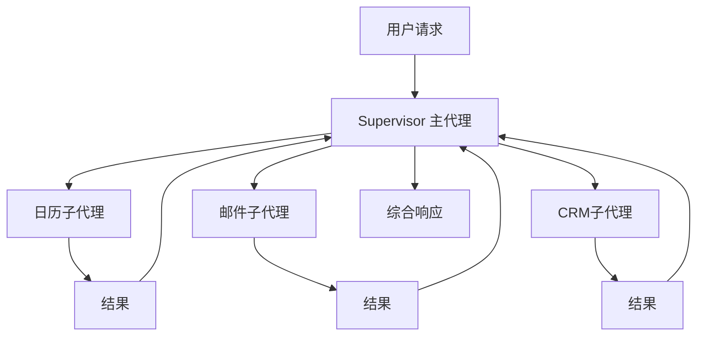
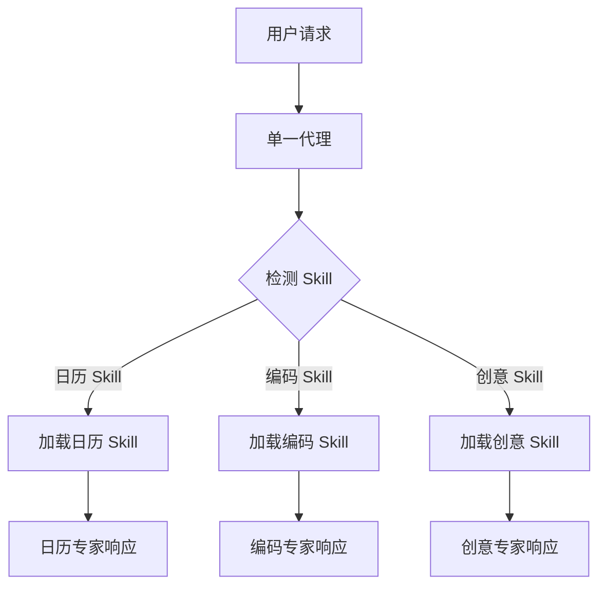
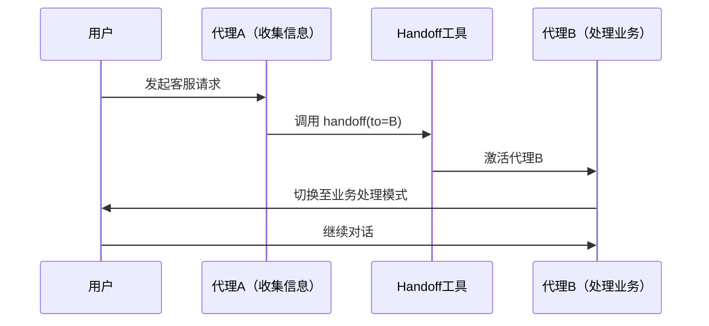
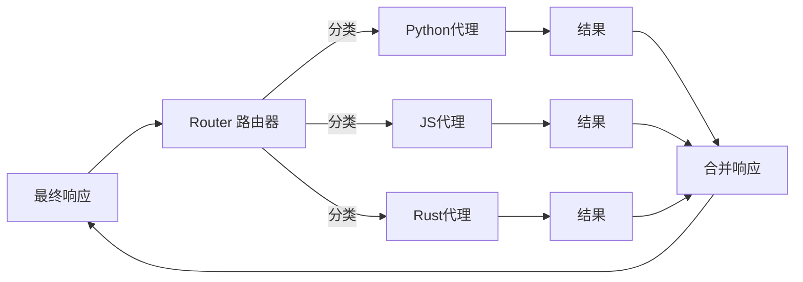
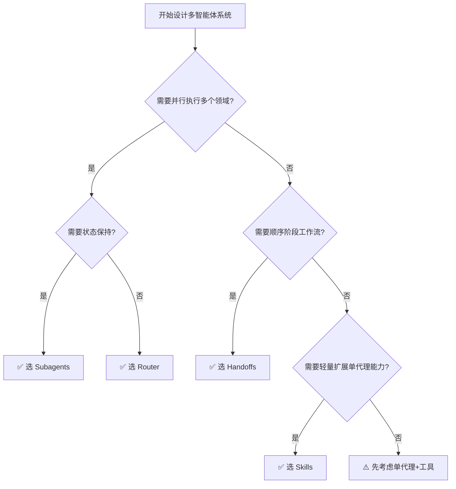

+++
title = "多智能体架构怎么选：Subagent、Skills、Handoffs、Router 深度对比"
date = 2026-05-14T22:00:00+08:00
draft = false
categories = ["AI Agent", "架构设计"]
tags = ["AI Agent", "LangGraph", "多智能体", "架构模式"]
+++

开门见山：多智能体（Multi-Agent）架构现在已经不是什么新鲜概念了，但真正要在生产项目中落地，很多团队其实还没想清楚「什么时候该用什么模式」。

今天我们深度解读 LangChain 官方博客的一篇重磅技术文章，结合实际场景，把 **Subagents（子代理）、Skills（技能）、Handoffs（交接）、Router（路由）** 四种核心模式讲透——包括各自的工作原理、适用场景、性能对比，以及实操代码示例。

读完这篇，你就知道下次遇到多智能体场景该选什么了。

<!-- more -->

## 背景：什么时候需要多智能体架构？

在聊四种模式之前，先说一个重要原则：**不要一上来就上多智能体**。

LangChain 官方博客的建议很明确：

> 先用单体代理 + 好的工具（Tools）。只有当你的应用真的遇到瓶颈了，再考虑多智能体。

那什么情况下会遇到瓶颈呢？主要两个约束：

1. **上下文管理问题**：每个子能力都需要大量专业知识，塞进一个 Prompt 里根本装不下。
2. **分布式开发问题**：不同团队独立维护不同能力，单体 Prompt 根本没法管。

当这两个问题变得尖锐时，多智能体架构就是正确答案。

> 顺便提一句，Anthropic 的多智能体研究系统（Claude Opus 4 主导 + Sonnet 4 子代理）比单代理 Opus 4 在内部评测中**性能提升 90.2%** ——这个数字足以说明多智能体的威力。

---

## 四种架构模式深度解析

### 1. Subagents：集中式编排

**一句话理解**：一个主代理（Supervisor）通过工具调用（Tool Calling）的方式调度多个专用子代理，子代理无状态、不记忆对话历史。

#### 工作原理



#### 核心特点

- **中心化控制**：所有路由都经过主代理，主代理决定调用哪个子代理、传什么参数、怎么合并结果。
- **强上下文隔离**：子代理 stateless，每次调用都是全新上下文，不存在记忆污染。
- **天然支持并行**：主代理可以同时触发多个子代理并行工作。

#### 适用场景

- 个人助手类应用（协调日历、邮件、CRM）
- 需要调用多个独立领域专家的研究系统
- 需要集中管控路由策略的企业应用

#### 关键权衡

| 优点 | 缺点 |
|------|------|
| 控制清晰、易调试 | 多一跳模型调用（结果要回到主代理再返回） |
| 强隔离，子代理互不干扰 | 子代理无法直接和用户对话 |
| 并行执行效率高 | |

#### 代码示例（LangChain Python）

```python
from langchain_core.tools import tool
from langchain_openai import ChatOpenAI
from langgraph.prebuilt import create_react_agent

# 子代理1：日历管理
@tool
def get_calendar_events(date: str):
    """获取指定日期的日历事件"""
    return [f"会议A {date} 10:00", f"评审 {date} 14:00"]

# 子代理2：邮件管理
@tool
def send_email(to: str, content: str):
    """发送邮件"""
    return f"已发送邮件给 {to}"

# 创建子代理（各自独立）
calendar_agent = create_react_agent(
    model=ChatOpenAI(model="gpt-4o"),
    tools=[get_calendar_events]
)

email_agent = create_react_agent(
    model=ChatOpenAI(model="gpt-4o"),
    tools=[send_email]
)

# 主代理通过 tool 调用调度子代理
# 这里省略主代理 prompt 定义，实际使用时通过 tool 绑定子代理
```

> **实战建议**：Subagents 模式是四种模式里最接近「多智能体」原始定义的一种。如果你需要强隔离、高可控，选这个。

---

### 2. Skills：渐进式披露

**一句话理解**：一个代理动态加载专用的 Prompt 和知识，按需「变身」成不同专家——不是多个代理，而是一个代理的多重人格。

#### 工作原理



> Skills 目录结构示例：
```
skills/
  calendar/
    instructions.md      # 核心指令
    date_utils.py        # 工具脚本
    event_schema.json   # 资源文件
  coding/
    instructions.md
    linter_rules.yaml
    ... 
```

#### 核心特点

- **单代理多人格**：本质上还是单代理，但能动态加载不同技能上下文。
- **轻量级**：不需要管理多代理通信，只需要管理 Prompt 和资源包。
- **上下文累积**：Skills 被加载后，对话历史会累积，可能带来 token 膨胀。

#### 适用场景

- 单代理有大量可能的专业方向
- 不同团队独立维护不同 Skills
- 想要轻量级扩展，不想引入多代理通信复杂度

#### 关键权衡

| 优点 | 缺点 |
|------|------|
| 架构最简单 | 上下文累积导致 token 膨胀 |
| 用户始终和一个代理对话 | 能力间没有强制边界 |
| 团队可以独立维护 Skills | 多技能同时使用时可能互相干扰 |

---

### 3. Handoffs：状态驱动交接

**一句话理解**：当前活跃的代理通过调用一个交接工具，动态切换到另一个代理，状态跨对话轮次保持。

#### 工作原理



#### 核心特点

- **状态持久**：交接后上下文自然延续，不丢信息。
- **顺序执行**：适合多阶段工作流，前一阶段的输出是后一阶段的输入。
- **代理可与用户直接对话**：不像 Subagents 那样所有结果都回到主代理。

#### 适用场景

- 客服场景：先收集信息（代理A），再处理问题（代理B）
- 需要顺序约束的多阶段对话
- 能力只有在满足前置条件后才解锁

#### 关键权衡

| 优点 | 缺点 |
|------|------|
| 状态自然延续 | 比其他模式更 stateful，需要小心状态管理 |
| 代理直接对话用户，体验流畅 | 无法利用并行执行 |
| 适合顺序流程 | 模型调用次数可能较多 |

---

### 4. Router：并行分发与合成

**一句话理解**：路由器先分类输入，然后**并行**调用多个专用代理，最后把结果合成一个响应返回用户。

#### 工作原理



#### 核心特点

- **并行分发**：零或多个代理同时执行，充分利用并发优势。
- **无状态**：每个请求独立处理，无状态累积。
- **结果合成**：最后一步将多代理结果聚合成统一输出。

#### 适用场景

- 企业知识库：需要从多个垂直领域并行查询
- 多数据源聚合：同时查文档、数据库、外部API
- 客服多分类：并行跑多个意图分类器，选择最优策略

#### 关键权衡

| 优点 | 缺点 |
|------|------|
| 并行执行效率高 | 无状态设计，重复路由有开销 |
| 适合多垂直领域 | 需要额外的合成逻辑 |
| 扩展性强（新增领域只加代理） | 代理之间没有直接通信 |

---

## 四种模式横向对比

### 核心特性对比

| 特性 | Subagents | Skills | Handoffs | Router |
|------|-----------|--------|----------|--------|
| 架构复杂度 | 中 | 低 | 中 | 中 |
| 上下文隔离 | ✅ 强 | ❌ 累积 | ✅ 阶段隔离 | ✅ 请求级隔离 |
| 并行执行 | ✅ | ❌ | ❌ | ✅ |
| 直接用户对话 | ❌ | ✅ | ✅ | ❌ |
| 状态管理 | 主代理持有 | 对话历史累积 | 显式交接 | 无状态 |
| 适用阶段 | 多领域并行 | 能力扩展 | 顺序工作流 | 多垂直领域 |

### 性能实测（LangChain 官方数据）

LangChain 对三种典型场景做了性能基准测试：

#### 场景一：单次请求（买咖啡）

| 模式 | 模型调用次数 | 说明 |
|------|-------------|------|
| Subagents | 4 | 结果需要回到主代理 |
| Skills | 3 | 直接执行 |
| Handoffs | 3 | 直接执行 |
| Router | 3 | 直接执行 |

**结论**：Subagents 因为多一跳模型调用，不适合简单单次请求场景。

#### 场景二：重复请求（同一对话轮次内）

| 模式 | 第2轮调用 | 总调用 | 节省 |
|------|---------|--------|------|
| Subagents | 4 | 8 | — |
| Skills | 2 | 5 | **40%** |
| Handoffs | 2 | 5 | **40%** |
| Router | 3 | 6 | 25% |

**结论**：有状态模式（Skills、Handoffs）对重复请求节省 40% 成本。

#### 场景三：多领域查询（对比 Python/JS/Rust）

| 模式 | 模型调用 | Token 消耗 | 特点 |
|------|---------|-----------|------|
| Subagents | 5 | ~9K | 并行，各代理只拿相关上下文 |
| Skills | 3 | ~15K | 上下文累积导致 token 高 |
| Handoffs | 7+ | ~14K+ | 顺序执行，无法并行 |
| Router | 5 | ~9K | 并行执行 |

**结论**：Subagents 和 Router 在多领域场景下 token 效率最优。

---

## 选型决策树

把上面的分析整理成一个实操决策树，下次遇到多智能体场景直接查：



---

## 生产落地避坑指南

### 坑1：过早引入多智能体

很多团队一看到「多智能体」这个词就兴奋，直接上 Subagents 架构，结果系统复杂度翻倍，收益却不大。

**正确做法**：先用单代理 + 好的 Tools，直到发现明确的上下文管理或团队协作瓶颈。

### 坑2：Subagents 结果全部经过主代理

如果你的子代理需要直接给用户反馈，不要用 Subagents——选 Handoffs。Subagents 所有结果必须回到主代理，额外一跳调用不说，还破坏了子代理的直接交互体验。

### 坑3：Skills 上下文膨胀

Skills 模式最大的问题是 token 累积。每个加载的 Skill 都会往对话历史里塞内容，多个 Skill 叠加载入后，上下文窗口很快就会被撑满。

**解法**：定期做上下文压缩，或者在 Skill 加载策略上做限制（比如最多同时加载 N 个 Skill）。

### 坑4：Router 无状态导致重复计算

Router 每个请求独立处理，如果你需要跨请求记忆某些状态（比如用户的长期偏好），Router 本身不帮你管这个。你需要在外面包一层有状态会话层。

### 坑5：Handoffs 状态管理复杂

Handoffs 的状态是跨交接点保持的，一旦状态出错（比如交接时丢了一个字段），调试起来非常痛苦。

**解法**：使用明确定义的状态 schema，并用事件溯源（Event Sourcing）代替简单的内存状态。

---

## 实战代码：用一个 Router 构建多源知识库

说了这么多，来个真正能跑的例子。下面的代码演示如何用 LangChain 的 Router 模式构建一个并行查询多个知识库的系统：

```python
from langchain_openai import ChatOpenAI
from langgraph.prebuilt import create_react_agent
from langchain_core.messages import HumanMessage

# 模拟多个知识库代理（实际场景替换为真实知识库retriever）
docs_agent = create_react_agent(
    model=ChatOpenAI(model="gpt-4o"),
    tools=[],  # 接入你的文档retriever
    state_modifier="你是一个技术文档专家..."
)

code_agent = create_react_agent(
    model=ChatOpenAI(model="gpt-4o"),
    tools=[],  # 接入你的代码库retriever
    state_modifier="你是一个代码搜索专家..."
)

wiki_agent = create_react_agent(
    model=ChatOpenAI(model="gpt-4o"),
    tools=[],  # 接入你的wiki retriever
    state_modifier="你是一个知识库专家..."
)

def router_node(state):
    """路由节点：分类用户查询并并行分发"""
    user_input = state["messages"][-1].content
    
    # 简单规则路由，生产环境用分类模型
    if "代码" in user_input or "function" in user_input:
        agents = [code_agent]
    elif "文档" in user_input or "doc" in user_input:
        agents = [docs_agent]
    else:
        agents = [docs_agent, code_agent, wiki_agent]
    
    # 并行执行
    results = {}
    import asyncio
    
    async def run_agents():
        tasks = [agent.astream({}) for agent in agents]
        return await asyncio.gather(*tasks)
    
    # 返回每个代理的结果，由后续合成节点处理
    return {"agent_results": results}

def synthesizer_node(state, agent_results):
    """合成节点：将多个代理结果合并成统一响应"""
    # 简化示例，实际需要更复杂的合并逻辑
    return {"messages": [HumanMessage(content=f"综合了 {len(agent_results)} 个来源的结果")]}

# 完整的 Router graph 省略...
# 核心思想：路由节点做分类 -> 并行调用代理 -> 合成节点合并结果
```

---

## 总结：模式没有银弹，场景决定选择

| 场景 | 推荐模式 | 原因 |
|------|---------|------|
| 多领域并行查询，单请求无状态 | **Router** | 并行效率高，无状态开销低 |
| 需要强隔离，多领域并行 | **Subagents** | 子代理 stateless，隔离强 |
| 多阶段顺序工作流，状态延续 | **Handoffs** | 状态自然交接，无需额外同步 |
| 轻量扩展单代理能力，不想引入多代理开销 | **Skills** | Prompt 驱动，最简单 |
| 不确定，先跑起来 | **单代理 + 工具** | 最小复杂度，先验证核心逻辑 |

最后送大家一句话：**多智能体架构是解决特定约束的工具，不是追求的技术目标**。选对模式的前提是对自己业务的约束有清晰认知。

---

参考资料：[LangChain Blog - Choosing the Right Multi-Agent Architecture](https://www.langchain.com/blog/choosing-the-right-multi-agent-architecture)

> 欢迎关注收藏我，获取更多硬核技术干货 🚀