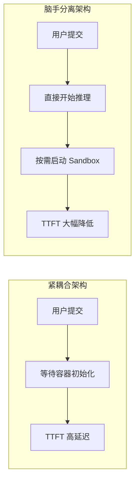

+++
title = "Anthropic 如何设计 Managed Agents：用「脑手分离」架构解锁长时 agent 可靠性"
date = 2026-05-06T22:00:00+08:00
draft = false
categories = ["AI", "Agent", "Architecture"]
tags = ["Claude", "Agent", "Architecture", "LLM", "Anthropic"]
+++

在构建 AI Agent 时，你是否遇到过这些问题：容器崩溃导致 Session 丢失、无法连接客户私有网络、长时间任务后期模型行为失控？

Anthropic 最近发布的工程博客系统性地介绍了他们如何解决这些问题。核心方案只有一个：**把「大脑」（Claude + harness）和「手」（Sandbox + Tools）彻底解耦**。

本文将深入解析这个架构的设计思路、实现细节，以及它如何让 Agent 系统从「宠物」变成「牛群」。

<!-- more -->

## 为什么需要「脑手分离」？

在介绍具体架构之前，我们需要理解问题的来龙去脉。

### 传统架构：一切耦合在一个容器里

早期的 Managed Agents 采用紧耦合设计，Session、Harness 和 Sandbox 三者共享同一个执行环境。这种设计的优点是：**文件编辑是直接 syscall，没有跨服务边界的性能损耗**。

但随之而来的问题是——**你养了一只「宠物」**。

> 这里的「宠物 vs 牛群」是基础设施领域的经典比喻：
> - **宠物（Pet）**：有名字、需要精心维护、不能丢失
> - **牛群（Cattle）**：无差别对待、可替换、丢失后直接启动新的

当容器成为那只宠物，任何故障都意味着 Session 丢失。更糟糕的是，你的调试窗口只有一个——WebSocket 事件流，但它无法告诉你问题出在 Harness 本身、网络丢包，还是容器本身离线。

### 第二个问题：Harness 假设了一切都在本地

当客户要求连接到自己私有的 VPC（Virtual Private Cloud）时，紧耦合设计遇到了硬墙：Harness 假设所有资源都在它旁边。要么客户把自己的网络和 Anthropic 的网络 peering，要么让客户在自己的环境里跑 Harness——这已经超出了服务本身的设计边界。

## 核心架构：三个抽象解耦一切

Anthropic 的解决方案是把 Agent 的三个核心组件虚拟化成通用接口：

```mermaid
graph TB
    subgraph "Session（持久化上下文）"
        S[Session Log<br/>append-only event stream]
    end
    
    subgraph "Harness（Agent 循环）"
        H[Harness<br/>Claude 调用 + 路由]
    end
    
    subgraph "Sandbox（执行环境）"
        SB[Sandbox<br/>代码执行 / 文件编辑]
    end
    
    subgraph "外部工具"
        MCP[MCP Server]
        VA[Vault<br/>OAuth 等凭证]
    end
    
    H -->|execute(name, input) → string| SB
    H -->|emitEvent / getEvents| S
    H -.->|MCP 代理| MCP
    MCP -.->|凭证获取| VA
    
    S -->|wake(sessionId)| H
    SB -.->|execute 返回| H
```

### 1. Session：Agent 的外部记忆

Session 是** Append-only 的事件日志**，解决了长时任务超出模型 Context Window 的问题。

关键接口：
- `emitEvent(id, event)` — 持久化记录每个事件
- `getEvents()` — 按位置切片查询事件流

Session 不是 Claude 的 Context Window，而是**外部化的上下文对象**。Harness 可以：
- 从上次停止的地方恢复（pick up from where it left off）
- 回退几个事件查看「之前发生了什么」
- 在执行特定动作前重新阅读上下文

任何获取的事件还可以在 Harness 层做**预处理**——比如优化 prompt 缓存命中率、做上下文工程——而不影响 Session 本身的持久性。

### 2. Harness：变成了「牛群」

解耦后，Harness 不再存在于容器内。它通过 `execute(name, input) → string` 这个接口调用容器，就像调用其他工具一样。

**这一改变带来了巨大的运维收益：**

容器变成了「牛群」：如果容器挂了，Harness 捕获的是一次工具调用失败，直接重试即可——新容器用标准配方 `provision({resources})` 重新初始化，不需要「Nursing」。

Harness 本身也变成了「牛群」：因为 Session 日志独立于 Harness 存在，Harness 进程崩溃后，新的 Harness 可以用 `wake(sessionId)` + `getSession(id)` 恢复事件日志，从上一个事件点继续执行。

### 3. Sandbox：凭证永远不到达的地方

这是最关键的安全设计。

在紧耦合时代，Claude 生成的代码和凭证跑在同一个容器里。一次 Prompt Injection 只需要说服 Claude 去读自己的环境就够了——拿到 Token 后攻击者可以启动全新的、不受限制的 Session。

解耦后的设计：**凭证永远不会到达 Sandbox**。

Anthropic 使用两种模式处理这个问题：

1. **Auth Bundling**：Git 的访问 Token 在 Sandbox 初始化时就绑定到本地 git remote，push/pull 在 Sandbox 内工作，但 Agent 从不接触 Token 本身
2. **Vault + MCP Proxy**：OAuth Token 存在 Vault 里，Claude 通过专用 MCP Proxy 调用工具，Proxy 从 Vault 获取凭证再执行调用。Harness 完全不知道任何凭证的存在

## 性能收益：TTFT 下降 90%

「脑手分离」带来了一个意想不到的性能提升。

在紧耦合架构下，每个 Brain（推理单元）都需要一个独立容器来运行。这意味着：
- 每个 Session 在第一个 Token 产生之前，都必须经历完整的容器初始化
- 每个 Session（即使从不使用 Sandbox）都必须克隆代码仓库、启动进程、从服务器拉取待处理事件

这端延迟体现在 **TTFT（Time To First Token）**——即用户提交任务到产生第一个 Token 之间的时间，这是用户感知最敏感的延迟指标。

解耦后，容器通过工具调用按需启动：只有真正需要时才会初始化。Anthropic 实测：
- **P50 TTFT 下降约 60%**
- **P95 TTFT 下降超过 90%**



## Many Brains, Many Hands

「脑手分离」架构还解锁了两个扩展场景：

### Many Brains：连接到客户 VPC

当 Harness 不再需要存在于容器内，连接客户私有网络变得自然：Harness 只需要通过 `execute()` 调用连接到客户 VPC 的资源，而不需要把自己的整个环境搬过去。

### Many Hands：每个 Sandbox 都是一个工具

当 Brain 需要连接到多个执行环境（比如既要在 Web 环境操作，又要调用手机模拟器），解耦后每个环境都变成了一个 `execute(name, input) → string` 接口。Claude 可以自主决定把任务分配给哪个「手」。

更重要的是，因为没有任何 Hand 耦合到任何 Brain，**Brain 之间可以相互传递 Hand**——这让多 Agent 协作变得简单。

## 为什么这和 OS 设计如出一辙？

Anthropic 的工程师自己点出了这层关联：

> 操作系统在上世纪解决了「如何为尚未想到的程序设计系统」这个问题 —— 通过把硬件虚拟化成通用抽象（进程、文件）。`read()` 命令不关心读的是 1970 年代磁盘组还是现代 SSD，抽象层保持稳定，下层实现可以自由替换。

Managed Agents 遵循同样的思路：**为尚未出现的 Harness、Sandbox 和组件设计系统**。

Managed Agents 本身就是一个 **Meta-harness**——它不执着于具体某个 Harness 实现，而是提供通用接口来容纳各种不同的 Harness 方案。Claude Code 是一个优秀的 Harness，特定领域的专用 Harness 也能在其上运行良好，Managed Agents 可以随着 Claude 智能水平的提升匹配对应的架构。

## 总结

Anthropic 的「脑手分离」架构带来了几个关键收益：

| 维度 | 传统紧耦合 | 脑手分离 |
|------|-----------|---------|
| **容错性** | 容器崩溃 = Session 丢失 | 容器崩溃 = 一次重试 |
| **调试能力** | 只有 WebSocket 可视 | 每个组件独立调试 |
| **TTFT** | 完整容器初始化开销 | 按需启动，下降 90% |
| **网络安全** | 需要网络 peering | Harness 不在客户网络 |
| **凭证安全** | Token 在 Sandbox 内 | Token 永远不达 Sandbox |
| **扩展性** | 1 Brain = 1 Container | Many Brains, Many Hands |

这个架构的核心启示是：**Agent 的各个组件不需要同步演进**。当模型能力提升时，你可以换掉 Harness 而不影响 Session 和 Sandbox 的稳定性；当安全需求变化时，你可以升级 Vault 而不用动 Claude。

参考：[Scaling Managed Agents: Decoupling the brain from the hands](https://www.anthropic.com/engineering/managed-agents)
