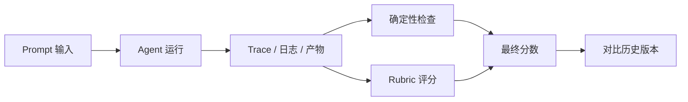
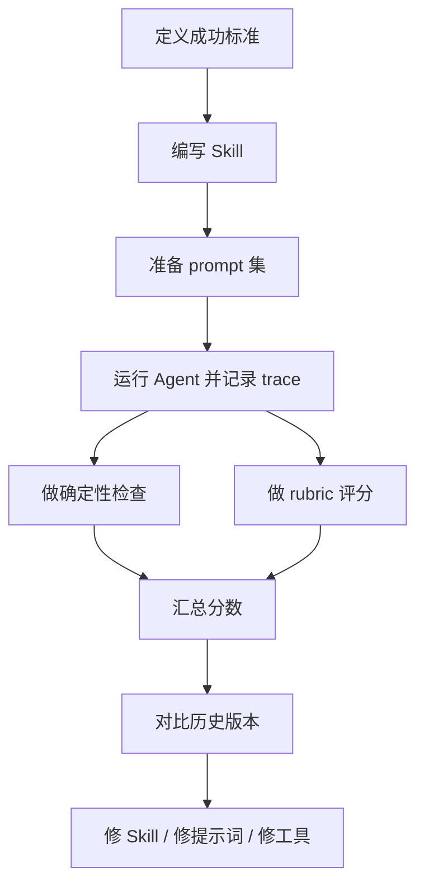

+++
date = 2026-06-10T22:04:22+08:00
draft = false
title = "如何系统化评估 Agent Skills：把感觉变成可重复的 Evals"
+++

当你开始给 Agent 配置 Skills，最容易掉进一个坑：功能看起来更聪明了，但你很难证明它真的变好了。

OpenAI 这篇文章的核心，不是讲怎么写 Skill，而是讲怎么把 Skill 变成可评估、可回归、可持续优化的工程对象。简单说，就是不要再靠感觉判断，而是把一次运行拆成输入、过程、产物和评分四层。

如果你在做 Codex、Claude Code、Agents SDK，或者任何会调用工具、会改文件、会长时间运行的 Agent，这套方法都能直接用。

## 为什么 Agent Skills 需要 Evals

普通软件测试，很多时候只要看最终输出对不对。

Agent 不一样，它是过程型系统。同一个 prompt，可能走不同路径；同一个任务，工具调用顺序可能不同；稍微改一下 Skill 文案，触发行为都可能变化。

所以在 Agent 世界里，“我觉得这版更好”几乎不算判断。你需要的是能回答下面这些问题：

- Skill 有没有被正确触发
- 有没有执行预期的工具
- 有没有遵守约束
- 有没有产生多余副作用

## 一个最实用的评估模型

一次 Agent 运行，可以理解成下面这条链路：



这张图里最关键的是两样东西：

1. Trace：记录 Agent 真正做了什么
2. Grader：判断它做得对不对

没有 Trace，你不知道它为什么得分；没有 Grader，你只是在存日志，不是在做评估。

## 第一步：先定义“成功”长什么样

OpenAI 给出的第一条建议很实在：在写 Skill 之前，先写成功标准。

别急着写提示词，先把成功拆成几类可检查目标：

- 结果目标：任务是否真的完成
- 过程目标：有没有按你期望的路径走
- 风格目标：输出是否符合约定
- 效率目标：有没有瞎忙活

一个好的评估集，不需要把所有偏好都编码进去，它只需要覆盖那些一旦退化就会影响交付的核心行为。

## 第二步：把 Skill 当成可测试单元

很多人写 Skill 的时候，喜欢写得很“哲学”，结果是漂亮但不可测。

更靠谱的做法，是把 Skill 看成一个带约束的模块：

- 它的入口是什么
- 它应该在什么场景触发
- 它允许做哪些动作
- 它的完成条件是什么

Skill 不是给人看的散文，是给 Agent 执行的说明书。最重要的部分通常只有四个：

- name 和 description 要足够明确
- 指令要短，但要可执行
- 如果有脚本，脚本要稳定复用
- 如果有输出约束，要明确写出来

## 第三步：先做小规模 prompt 集

不要一上来就做大而全的基准集。

先准备十几到二十条 prompt，就足够覆盖最关键的场景：

- 显式调用：用户直接点名 Skill
- 隐式调用：用户没点名，但语义明显匹配
- 噪声场景：加一点上下文干扰
- 负样本：不该触发 Skill 的输入

这套设计的价值，是同时验证两件事：

1. Skill 会不会被正确触发
2. Skill 会不会被错误触发

## 第四步：先上确定性检查

这是最省钱、最稳定的一层。

确定性检查回答的是：最基本的事情做对了吗？

比如：

- 有没有运行 npm install
- 有没有创建 package.json
- 有没有生成目标目录
- 有没有留下不该存在的临时文件

如果这些都不过关，后面的模型评分基本没意义。

下面是一个很轻量的检查脚本思路：

```js
// evals/checks.mjs
import fs from "node:fs";
import path from "node:path";

function readJsonl(filePath) {
  return fs.readFileSync(filePath, "utf8")
    .split("\n")
    .filter(Boolean)
    .map((line) => JSON.parse(line));
}

function ranCommand(events, keyword) {
  return events.some((event) => {
    const cmd = event?.item?.command;
    return typeof cmd === "string" && cmd.includes(keyword);
  });
}

const events = readJsonl("./artifacts/run.jsonl");
console.log({
  ranNpmInstall: ranCommand(events, "npm install"),
  hasPackageJson: fs.existsSync(path.join("./demo-app", "package.json")),
});
```

这种检查很朴素，但它的优点是快、稳定、可解释。

## 第五步：再加上 Rubric 评分

确定性检查只能回答“有没有做到”，但回答不了“做得好不好”。

比如这些问题：

- 结构是不是符合约定
- 代码是不是符合团队风格
- 文档语气是否一致
- 生成内容是否过于啰嗦

这类问题更适合用 rubric 评分，也就是把评价拆成多个小项，再由模型或人工来判断。

一个实用做法，是先定义结构化输出格式，再让评估器按这个格式返回结果：

```json
{
  "type": "object",
  "properties": {
    "overall_pass": { "type": "boolean" },
    "score": { "type": "integer", "minimum": 0, "maximum": 100 },
    "checks": {
      "type": "array",
      "items": {
        "type": "object",
        "properties": {
          "id": { "type": "string" },
          "pass": { "type": "boolean" },
          "notes": { "type": "string" }
        },
        "required": ["id", "pass", "notes"],
        "additionalProperties": false
      }
    }
  },
  "required": ["overall_pass", "score", "checks"],
  "additionalProperties": false
}
```

这样做的好处很直接：

- 结果统一，方便比较
- 可以放进 CI
- 可以长期追踪分数变化

## 一个更完整的评估流程

如果你要把这套方法真的用到工程里，可以按这个顺序走：



最重要的不是跑一次，而是持续跑。Evals 的价值，很多时候不是帮你第一次做对，而是帮你在后续迭代里不把已经做对的东西改坏。

## 实战建议

很多团队一开始就会犯一个错误：评估体系做得比产品还重。

我的建议是先保留一个最小闭环：

1. 10 到 20 条 prompt
2. 3 到 5 个确定性规则
3. 1 个 rubric 评分器
4. 1 个固定的对比基线

先把这个跑顺，再逐步增加命令数统计、token 使用量、构建检查、运行时 smoke test、仓库清洁度检查。

这比一口气上完整平台靠谱得多。

## 总结

Agent Skills 的难点，从来不只是“能不能做出来”，而是“怎么证明它长期稳定地做对”。

这篇文章给出的答案很清晰：

- 先定义成功
- 再记录行为
- 先做确定性检查
- 再做 rubric 评分
- 最后把结果接入持续回归

这套流程一旦建立起来，后面的每一次 Skill 迭代，都会比“凭感觉调参”可靠得多。

如果你在做 Agent 系统，我建议你直接把这套方法接到你的本地评估流程里。不要等功能复杂了才补测试，那个时候成本会更高。

参考资料：[Testing Agent Skills Systematically with Evals](https://developers.openai.com/blog/eval-skills)
