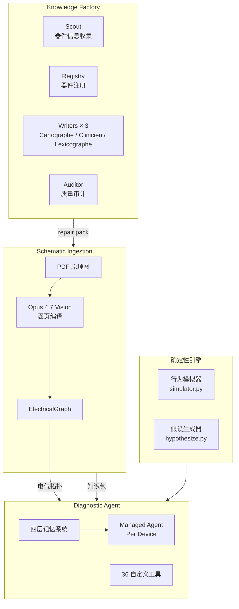
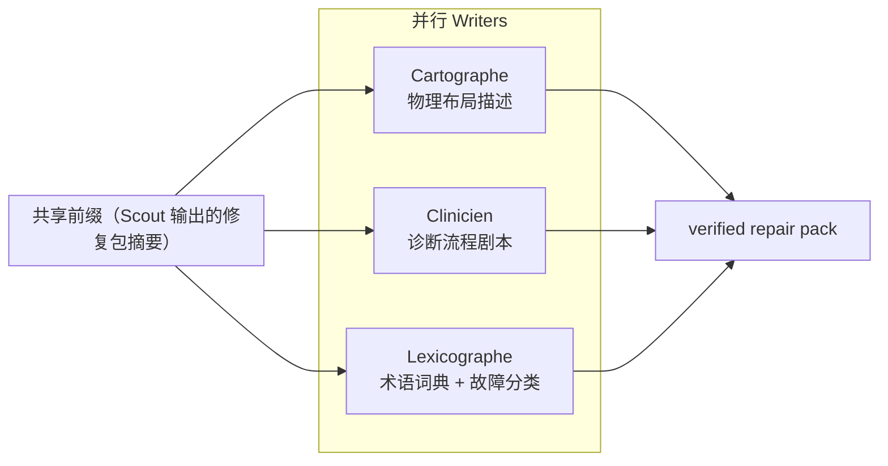
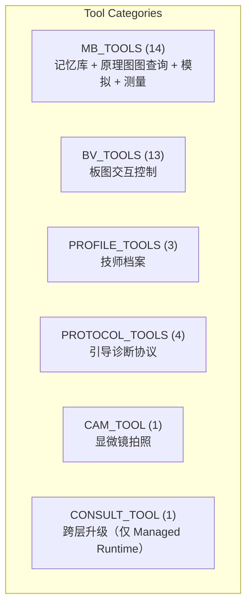
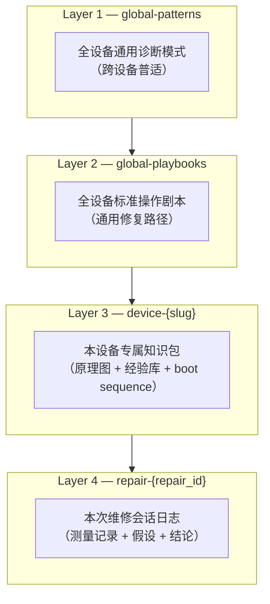
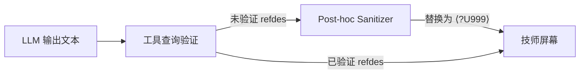

+++
title = "Wrench Board 架构解析：如何用 Claude Opus 4.7 构建板级电子修复智能体"
date = 2026-05-08T22:00:00+08:00
draft = false
type = "posts"
+++

## 前言

每年数亿吨电子垃圾中，有相当大一部分可以在板级修复。但微焊接技师是稀缺物种，经验靠时间堆出来，排查靠示波器和万用表一点点啃。普通人遇到主板级别的故障，基本就是换机或者扔掉。

[Wrench Board](https://github.com/Junkz3/wrench-board) 想改变这个现状。它是一个**智能体原生的板级诊断工作台**，由 Claude Opus 4.7 驱动，技师在操作烙铁的同时，AI 在旁边当第二双眼睛——读原理图、提假设、标可疑器件、引导下一步测量。2026 年 4 月在 Anthropic *Build with Opus 4.7* 黑客松获得**亚军**。

项目最大的技术特色是：**没有幻觉的 AI 诊断**。所有 refdes（器件标号）都必须来自工具查询，任何未经验证的 token 都会被后处理 sanitizer 兜底拦截。诊断引擎的底层是两个确定性算法——行为模拟器和反诊断假设生成器——完全不用 LLM，输出结果可验证。

本文深入解析 Wrench Board 的核心架构，从原理图 ingestion 到诊断智能体到防幻觉机制，全程配合代码和架构图。

---

## 系统总览



四个正交工作流：

| 工作流 | 核心输入 | 核心输出 | 主要依赖模型 |
|--------|----------|----------|-------------|
| Knowledge Factory | 器件标签（"MNT Reform"）| 验证后的修复包 | Sonnet 4.6 |
| Schematic Ingestion | PDF 原理图 | ElectricalGraph | Opus 4.7（视觉）|
| Diagnostic Agent | 修复包 + 原理图 | 诊断结论 + 修复建议 | Opus 4.7 + Sonnet 4.6 |
| microsolder-evolve | 基准测试 oracle | 代码补丁 | Haiku 4.5 |

---

## 知识工厂：2 分钟构建修复包

### 三角色并行写入

给定一个设备标签，Knowledge Factory 在约 2 分钟内构建完整修复包。核心是四个 Claude persona：

- **Scout**：网络搜索 + 经验库挖掘，收集该设备的已知故障模式、高峰器件、典型维修路径
- **Registry**：器件注册表，按 refdes 索引，建立诊断用的全局索引
- **Writers × 3**：三个 writer 并行运行，共享 cache-warmed prefix，**一次输入三次复用**



> Cache-warmed prefix 的意思是：三个 writer 共享同一段长前缀（Scout 输出的摘要），每个 writer 只消耗自己那份独有的后缀 token，极大降低总 token 消耗和延迟。

Writer 的输出经过 **Auditor** 审计后写入 `memory/{slug}/`，后续诊断会话直接读取。

---

## 原理图 Ingestion：Opus 4.7 视觉 + ElectricalGraph

### 为什么需要逐页编译

原理图 PDF 少则十几页，多则上百页。一次性把整本 PDF 丢给 Vision 模型会产生巨大上下文，页间空间关系（哪页连哪页、电源域如何跨页延伸）几乎必然丢失。

Wrench Board 采用**逐页编译策略**：

1. 逐页调用 Opus 4.7 视觉，提取该页的器件、网络、电源轨
2. 相邻页之间用接缝检测器（seam detector）对齐网络
3. 全页编译完成后，运行 Kahn 拓扑排序重建**电源引导顺序（boot sequence）**

编译输出是 `ElectricalGraph`（Pydantic v2 模型），包含：

```python
class ElectricalGraph(BaseModel):
    power_rails: dict[str, PowerRail]          # 电源轨：电压域、供电者、消费者
    components: dict[str, ComponentNode]         # 器件节点：类型、所属域、引脚
    depends_on: dict[str, list[str]]             # 依赖边：谁需要谁的电源
    boot_sequence: list[BootPhase]               # Kahn 拓扑排序后的启动顺序
    net_classes: dict[str, NetClass]             # 网络分类：HDMI / USB / PCIe / ...
```

这个 graph 是**纯数据**，可以按索引查询，可以交给确定性引擎跑模拟，不需要再调 LLM。

### Boot Sequence 分析

除了静态拓扑，Opus 4.7 还会输出每个器件的 `boot_phase`（该器件在哪一相启动）和触发条件 `from_refdes`（是什么器件激活了它）。这个分析后的 boot sequence 叫 `AnalyzedBootSequence`，比编译器基于纯拓扑推断的版本更准确（编译器只看电源依赖，分析器看的是逻辑控制链）。

---

## 确定性引擎：诊断的硬逻辑

这是 Wrench Board 最硬核的部分。诊断推理的底层有两个完全确定性的算法模块——**零 LLM 调用**，结果可复现、可审计。

### 行为模拟器（simulator.py）

给定一个"如果 X 器件坏了"的假设，模拟器沿着 boot sequence 逐相推进板级状态，输出每相结束时的快照。

三种核心状态枚举：

```python
# api/pipeline/schematic/simulator.py
RailState = Literal["off", "rising", "stable", "degraded", "shorted"]
ComponentState = Literal["off", "on", "degraded", "dead"]
SignalState = Literal["low", "high", "floating"]
```

模拟器从 boot phase 1 开始，按拓扑顺序推进：

```python
class BoardState(BaseModel):
    phase_index: int
    phase_name: str
    rails: dict[str, RailState]                  # 每条电源轨的状态
    rail_voltage_pct: dict[str, float]           # 降压轨的电压百分比（仅 degraded/shorted）
    components: dict[str, ComponentState]        # 每个器件的状态
    signals: dict[str, SignalState]              # 控制信号状态
    blocked: bool = False
    blocked_reason: str | None = None
```

当一个器件被 kill 掉，模拟器向后传播：下游消费者失去电源 → 进入 dead 状态 → 触发级联死亡链。输出是一个 `SimulationTimeline`，UI 可以逐相回放，Agent 可以推理"杀死 U12 → 在 Φ2 阶段被阻塞"。

### 反诊断假设生成器（hypothesize.py）

模拟器的逆问题：给定部分观测（哪些轨 dead，哪些器件 dead），找出最可能的一个或两个故障假设。

```python
# api/pipeline/schematic/hypothesize.py
ComponentMode = Literal[
    "dead", "alive", "anomalous", "hot",
    "open", "short",           # 被动器件（R/C/D/FB）
    "stuck_on", "stuck_off",    # 主动器件（MOSFET/BJT）
]
RailMode = Literal["dead", "alive", "shorted", "stuck_on"]
```

算法策略：

- **单故障穷举**：枚举所有 refdes × 所有适用模式，模拟器批量运行，输出各假设的解释力
- **双故障剪枝**：从单故障 top-K 幸存者出发，只配对与残余未解释观测有拓扑交集的候选对（`MAX_PAIRS` 安全上限）
- **F1 风格软惩罚评分**：`penalty_weights` 控制 FP（假正）与 FN（假负）的权重，`score_visibility` 衰减拓扑弱级联（Phase 4 被动器件）
- **确定性叙事**：假设结论附带一段确定性法语描述（源于创始人 Alexis 的法国背景），诊断结论更正式可查

```python
def hypothesize(
    observations: Observations,
    graph: ElectricalGraph,
    boot_seq: AnalyzedBootSequence | None,
    max_results: int = 5,
) -> list[HypothesisResult]:
    ...
```

---

## 诊断智能体：Opus 4.7 驾驶舱

### Anthropic Managed Agent

Wrench Board 使用 **Anthropic Managed Agent** 作为诊断智能体运行时。Managed Agent 在 Anthropic 服务端运行诊断逻辑，session 状态持久化，支持多轮 WebSocket 通信。

同时保留了 **Direct Runtime**（本地 FastAPI 直接调用 `messages.create`）作为降级方案。两种运行时的 WebSocket 协议完全一致，切换对前端透明。

### 36 个自定义工具

所有工具声明在 `api/agent/manifest.py`，按功能分为六大类：



#### MB_TOOLS（14 个，始终启用）

```python
# api/agent/manifest.py
MB_TOOLS: list[dict] = [
    {
        "name": "mb_get_component",
        "description": "按 refdes 查器件，返回聚合信息：found/canonical_name/memory_bank/board",
        # unknown refdes → {found: false, closest_matches: [...]}
    },
    {
        "name": "mb_schematic_graph",
        "description": (
            "查询编译后的电气图（电源轨/IC/使能信号/启动顺序）。"
            "query 支持: rail / component / downstream / boot_phase / "
            "list_rails / list_boot / critical_path / net / net_domain"
        ),
    },
    {
        "name": "mb_hypothesize",
        "description": (
            "生成解释观测结果的假设（refdes, mode）。"
            "返回 `discriminating_targets`：当 top-N 候选分数相同时，"
            "这些 refdes/rails 的下一轮测量最能分割嫌疑候选。"
        ),
    },
    # ... 共 14 个
]
```

#### BV_TOOLS（13 个，加载板图后启用）

板图控制工具，让 Agent 能够在 UI 上"动手"：

- `bv_highlight_component(refdes)` / `bv_highlight_net(label)`：高亮器件或网络
- `bv_focus(refdes)`：放大特定器件区域
- `bv_flip_board(axis)`：翻转板图视角（维修时经常需要看背面）
- `bv_add_arrow(from_refdes, to_refdes, label)`：标注信号流向
- `bv_filter_layer(layer_name)`：按层筛选（顶层/底层/电源层/信号层）
- `bv_set_layer_visibility(layer, visible)`：控制单层显示

### 四层记忆系统



每层优先级递增：Agent 查询时从 L4 往上找到最早匹配的记录。诊断会话结束后，L4 数据合并回 L3（如果是确认的修复结论）。

---

## 防幻觉：两层兜底机制

这是 Wrench Board 最关键的安全设计。LLM 生成文本时，refdes 标注是最容易出错的环节——模型可能把 `U12` 记成 `U13`，或者凭空捏造一个不存在的器件标号。

### 第一层：工具返回 `found: false + closest_matches`

所有查询类的工具（`mb_get_component`、`mb_schematic_graph` 等）在查不到结果时，**不返回空，而是返回最近邻候选**：

```python
# api/tools/hypothesize.py
def _closest_matches(candidates: list[str], needle: str, k: int = 5) -> list[str]:
    ...

# 工具响应示例（未知 refdes）
{
    "found": false,
    "closest_matches": ["U7", "U8", "U12"]   # 韵母/字形最近的已知 refdes
}
```

Agent 拿到 `found: false` 后应该停止使用该 refdes，转而询问技师确认。

### 第二层：Post-hoc Sanitizer

即使 Agent 没有严格遵守 `found: false` 提示、仍然在回复文本中使用了未经工具验证的 refdes，**服务器端 sanitizer 在文本送达屏幕之前将其拦截并替换**：

```
U13（未验证） → ⟨?U999⟩（加噪标记，技师一眼识别）
```



这个双层机制把"Agent 自由发挥"的空间压缩到最小——工具层劝退一次，sanitizer 层兜底一次。

---

## 板图系统：13 种格式解析器

诊断过程中，技师需要**实时看到板图上的位置标注**。Wrench Board 支持 13 种电路板数据格式，全部解析为统一内部格式后喂给 D3 v7 可视化：

| 格式 | 来源 |
|------|------|
| `.kicad_pcb` | KiCad |
| `.brd` | OpenBoardView |
| `.asc` `.bdv` `.bv` `.bvr` | Altium / Eagle 兼容 |
| `.cad` | Cadence |
| `.cst` | CST PCB Studio |
| `.f2b` `.fz` `.gr` `.pcb` `.tvw` | 多种国产/小众 EDA |

13 个清洁室解析器（clean-room parsers），每个解析器只负责一种格式，互不依赖。解析结果统一成：

```python
class BoardViewData(BaseModel):
    components: list[ComponentPlaced]
    nets: list[NetSegment]
    layers: list[LayerDef]
    refdes_positions: dict[str, (x, y, layer)]
```

D3 v7 在前端渲染，Agent 通过 BV_TOOLS 控制高亮、缩放、翻转、标注，全程不需要重新加载页面。

---

## 技术栈一览

| 层级 | 技术选型 |
|------|----------|
| 后端 | Python 3.11+ / FastAPI / 原生 WebSocket / Pydantic v2 |
| 原理图解析 | pdfplumber（文本提取）+ Opus 4.7 Vision（图形理解）|
| 数据库 | 文件系统（`memory/` 目录下的 JSON 文件）|
| 前端 | 原生 HTML + CSS + JS，无框架依赖 |
| 设计系统 | OKLCH 色彩空间，CSS 自定义属性 |
| 可视化 | D3 v7（板图 + 知识图谱）|
| 智能体运行时 | Anthropic Managed Agent（默认）/ Direct（降级）|
| 构建 | 无构建步骤，`uv run` 直接启动 |

架构上完全放弃了现代前端框架的便利，换来的是**零依赖、零构建、零版本兼容地狱**。FastAPI 服务启动时直接 serve 前端静态文件，一个 `uv run api.main` 全启动。

---

## 模型分工策略

Wrench Board 在不同任务上调用不同的模型，形成一条成本/能力梯度：

| 模型 | 任务 |
|------|------|
| **Opus 4.7** | 原理图视觉编译、Heavy pipeline writer、Deep diagnostic tier |
| **Sonnet 4.6** | Scout、Registry、Mapper、Lexicographe、Normal tier |
| **Haiku 4.5** | Intent classifier、Phase narrator、Coverage gate、Fast tier |

分层的好处是：简单任务（intent 分类、测量记录）用 Haiku 4.5，毫秒级响应；复杂推理（多步诊断、原理图理解）用 Opus 4.7，按需调用。

---

## 总结

Wrench Board 展示了一条有别于"通用 LLM 诊断"的技术路径：**把 AI 能力限定在它真正擅长的领域（理解、推理、生成），而在确定性最高的环节（模拟、假设枚举、格式解析）直接用硬逻辑**。

核心架构亮点：

1. **双层防幻觉**：工具层 `found: false` + 后处理 sanitizer，refdes 准确性有保障
2. **确定性引擎**：simulator + hypothesize，两个纯函数，不调用 LLM，结果可复现
3. **四层记忆**：跨会话积累维修经验，从通用模式到本次会话日志，渐进式学习
4. **Opus 4.7 视觉逐页编译**：原理图理解不丢页间关系，ElectricalGraph 可查询可复用
5. **零构建前端**：原生 HTML/JS + D3 v7，极简部署，技师在局域网内直接访问

如果你对板级修复或 AI+硬件这个交叉方向感兴趣，项目的 GitHub 仓库 [Junkz3/wrench-board](https://github.com/Junkz3/wrench-board) 完全开源，demo 视频在 [YouTube](https://youtu.be/OZ2D_p82z6w)，欢迎 star、提 issue、甚至一起贡献。

---

*欢迎关注收藏我，获取更多硬核技术干货。*
